# 碎知识点

## 数字反转
```js
const reverseNumber = n =>parseFloat(`${n}`.split('').reverse().join('')) * Math.sign(n);
reverseNumber(123); // 321
```
## 判断对象的属性是否空
```js
    var queryParams= {
        pageNum: 1,
        pageSize: 15,
        starttime: null,
        endtime: null,
        aid: null,
        cid: null,
        startgd: "", 
        endgd: "" 
      }
     for (var key in this.queryParams) {
        if (!this.queryParams[key]) {
          this.$message.error("请同时选择监测点、设备编号、液位高度、采集时间");
          return;
        }
      }
```
[类型转换](https://1loc.dev/array/check-if-an-array-is-empty/)

## 将值强制转换成数组
```js
// `arr` is an array
const isEmpty = (arr) => !Array.isArray(arr) || arr.length === 0;
```
##  数组的使用方法

### 1.数组求和
#### 方法一:Array.prototype.forEach()
```js
var total=0;
var arr=[1,2.3,4,5];
arr.forEach(function(num){
   total+=num;
})
```
图1:<br>
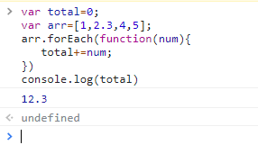

#### 方法二:Array.prototype.reduce()
```js
var total;
var arr=[1,2,3,5,6,8,7,4,9];
total=arr.reduce(function(sum,curr){
  return sum+curr;
});
```
图2:<br>
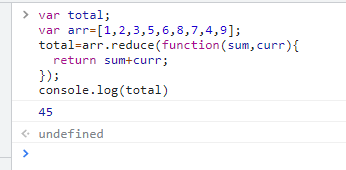


### 2.排序
#### 方法一:sort()
```js
var arr=[4,2,3,6,5];
let a= arr.sort((a,b)=>a-b);
let b=arr.sort((a,b)=>b-a);
```
图3:<br>
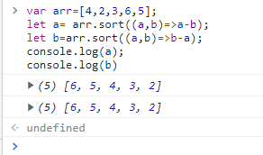
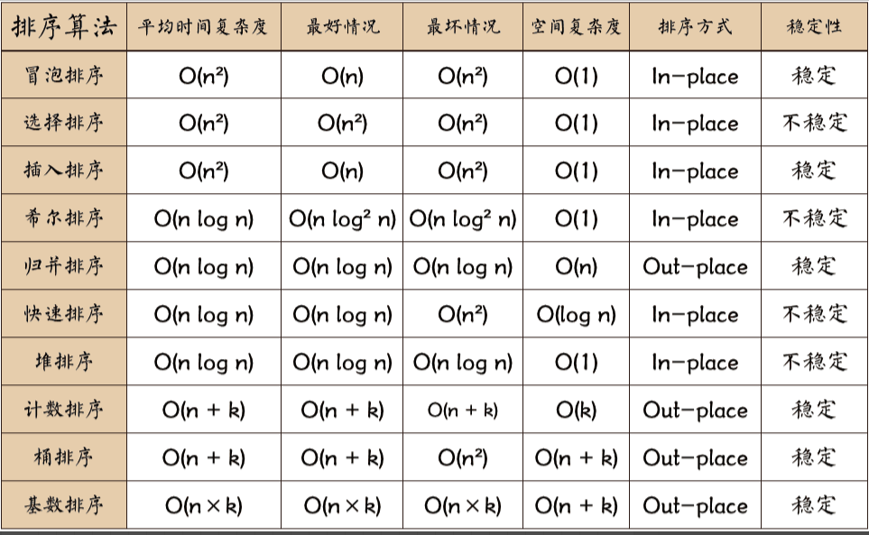

 ### 参考文献
 [十大经典排序算法 - Git Book](https://sort.hust.cc/) <br>
 [JavaScript 数据结构与算法之美 - 十大经典排序算法 - 天明夜](https://juejin.cn/post/6844903902484103182#heading-5)

 ### 3.取最大值
 #### 方法一:Math.max()
 
 ```js
Math.max() // -Infinity，即 -∞

Math.max(Infinity, -Infinity) // Infinity，即 ∞

Math.max(...[1, 2, 3, 4]) // 4

Math.max.apply(this, [1, 2, 3, 4]) // 4

[1, 2, 3, 4].reduce( (prev, cur,curIndex,arr)=> {
 return Math.max(prev,cur);
},0) // 4

 ```
 图4:<br>
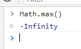<span>   </span>
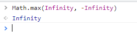<span>   </span>
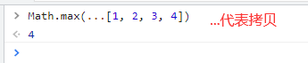<span>   </span>
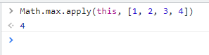<span>   </span>
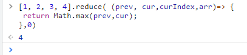<span>   </span>

 ### 4.判断数组中是否包含某值
 #### 方法一:Array.includes()
```js
var arr=[7, 8, 9];
arr.includes(4);
```
 图5:<br>
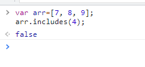

 #### 方法二:Array.indexOf()

```js
var arr=[4,2,5,6,3,6];
arr.includes(1)
//结果:false
```
 图6:<br>
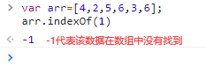

 #### 方法三:Array.find() <br>
这个函数当在数组中没有找到数时，获取undefind;若有，输出该数在数组中下标。
```js
var arr=[4,2,5,6,3,6];
arr.find((item)=>item===7) //undefined
arr.find((item)=>item===2) //2
```
 图7:<br>
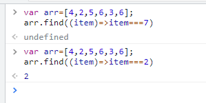

 #### 方法四:Array.findIndex() <br>
这个函数当在数组中没有找到数时，获取undefind;若有，输出该数在数组中下标。
```js
var arr=[4,2,5,6,3,6];
arr.findIndex((item)=>item===4)//0
arr.findIndex((item)=>item===1)//-1
```
 图7:<br>
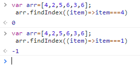

 ### 5.某一项设置值
 #### 方法一:Array.splice()
 设置某一个数组中的元素的值
 ```js
var arr = ['aaa', 'bbbb', 'cccc', 'dddd']
arr.splice(3, 0, 3)
arr // ['aaa', 'bbbb', 'cccc', 3, 'dddd']
 ```
  图7:<br>
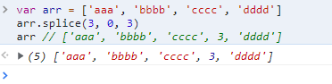

 ### 6.每一项设置值
 #### 方法一:Array.fill()
 设置某一个数组中的元素的值
 ```js
var arr = ['aaa', 'bbbb', 'cccc', 'dddd'];
arr.fill();//[undefined, undefined, undefined, undefined]
arr.fill(7) //[7, 7, 7, 7]
arr.fill(2,2,4) //['aaa', 'bbbb', 2, 2]
 ```
  图7:<br>
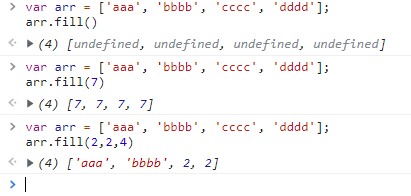

 #### 方法二:Array.map()
 设置某一个数组中的元素的值
 ```js
var  arr=[1,25,32,65,45,63,78,62];
arr.map((item)=>item % 2) //[1, 1, 0, 1, 1, 1, 0, 0],整除结果为0 ，不整除结果1
arr.map((item,i)=>i) //[0, 1, 2, 3, 4, 5, 6, 7]
 ```
  图8:<br>
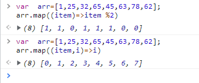

 ### 7.判断数组中每一项是否符合满足条件
 #### 方法一:Array.every()
 只要有一项的不符合条件，返回就false
```js
var arr=[8,9,6,5,7,4,5,1,2,36,6,4,6];
arr.every(item=>{return item<10})
//false
```
  图9:<br>


### 8.数组中有一项符合条件
#### 方法一:Array.some()
 只要有一项的符合条件，返回就true
```js
var arr=[8,9,6,5,7,4,5,1,2,36,6,4,6];
arr.some(item=>{return item<10});
//true
```
  图9:<br>
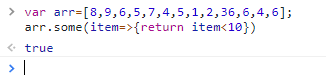

### 9.清空数组
#### 方法一:Array.length
直接把数组的长度设置为0,清空数组的速度最快
```js
var arr=[1,7,5,8,6,6,7];
arr.length=0;  //长度为0
```
#### 方法二:Array.splice()
```js
var arr=[7,5,9,6,5,7,58,5];
arr.splice(0)
console.log(arr)
```
图10:<br>
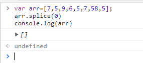

#### 方法三：直接赋予新数组[]
清空数组的速度最慢，且占用内存
```js
var arr=[7,5,86,9,23,52];
arr=[]
```
### 10.扁平化
扁平化是把一个嵌套多层数组直接转换成一维数组
#### 方法一:Array.prototype.flat()
```js
var arr=[1, [2, [3, [4, 5]]], 6];
let a=arr.flat(Infinity)
```
图11:<br>
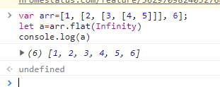

####  方法二:new RegExp()
使用正则表达式转换数组，但是这个方法有一个缺点：就是转换出来的数组的元素都是字符串。
```js
var arr=[1, [2, [3, [4, 5]]], 6];
const res1=JSON.stringify(arr).replace(/\[|\]/g,'').split(',')
res1//['1', '2', '3', '4', '5', '6']
// 改良版
const res3 = JSON.parse('[' + JSON.stringify(arr).replace(/\[|\]/g, '') + ']');
res3 //[1, 2, 3, 4, 5, 6]
```
图12:<br>
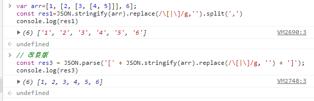

####  方法三:Array.prototype.reduce()
使用reduce函数
```js
var arr=[1, [2, [3, [4, 5]]], 6];
const flateen=arr=>{
return arr.reduce((pre,cur)=>{
  return pre.concat(Array.isArray(cur)?flateen(cur):cur);
},[])
}
const res1=flateen(arr)
console.log(res1)
```
##### 函数定义
reduce() 方法接收一个函数作为累加器，数组中的每个值（从左到右）开始缩减，最终计算为一个值。
reduce() 可以作为一个高阶函数，用于函数的 [compose](https://blog.csdn.net/zxl1990_ok/article/details/90049466)。
[concat()](https://www.runoob.com/java/java-string-concat.html) 方法用于将指定的字符串参数连接到字符串上。相当于把俩个数组合并。
[Array.isArray()](https://developer.mozilla.org/zh-CN/docs/Web/JavaScript/Reference/Global_Objects/Array/isArray) 用于确定传递的值是否是一个 `Array`。

图13:<br>
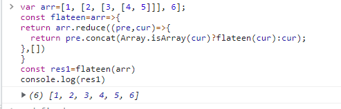
####  方法四：函数递归
```js
const res5 = [];
const fn = arr => {
  for (let i = 0; i < arr.length; i++) {
    if (Array.isArray(arr[i])) {
      fn(arr[i]);
    } else {
      res5.push(arr[i]);
    }
  }
}
fn(arr);
```

#### 方法五：while() + some()
```js
function flatten(arr) {
    while(arr.some(item=>Array.isArray(item))) {
        arr = [].concat(...arr);
    }
    return arr;
}
```
### 11.合并
两个数组合并一块。
#### 方法一：Array.push()
push()函数直接把另一个数组添加到另一个数组的后面里面
```js
const arr = ['aaa', 'bbbb', 'cccc', 'dddd']
arr.push(1, 2, 3,[4, 5, 6])
//输出的arr [5, 6, 8, 6, 2, 3, 85, 96, 58,[1, 2, 3,[4, 5, 6]]]
```
图14:<br>
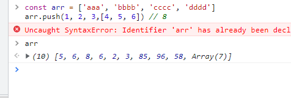


#### 方法二：Array.concat()
```js
arr1.concat([5,1,2,5],[7,8,9,6]);
arr1//[8, 9, 7, 5, 6, 5, 6]
```
图15:<br>
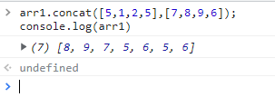

#### 方法二：扩展运算符
```js
[...[5,8,6,9,2],...[14,25,63,78]]
//合并之后的[5, 8, 6, 9, 2, 14, 25, 63, 78]
```
图16:<br>
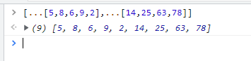

### 12.去重
#### 方法一：new Set()
```js
[...new Set([5,1,2,3,5,6,8,5,4,5,1,2,3,5,4,5,7,8,9,5,4,1,5,6])]
//去重之后的 [5, 1, 2, 3, 6, 8, 4, 7, 9]
```
图17:<br>
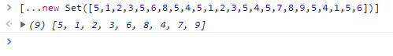

#### 方法二：filter() + indexOf()
```js
const arr2 = arr => {
  return arr.filter((item, index) => {
    return arr.indexOf(item) === index;
  });
}
```

#### 方法三：new Map()
```js
const arr3 = arr => {
  const map = new Map();
  const res = [];
  for (let i = 0; i < arr.length; i++) {
    if (!map.has(arr[i])) {
      map.set(arr[i], true)
      res.push(arr[i]);
    }
  }
  return res;
}
```
#### 方法四：includes()
```js
const arr4 = arr => {
  const res = [];
  for (let i = 0; i < arr.length; i++) {
    if (!res.includes(arr[i])) res.push(arr[i]);
  }
  return res;
}
```
### 13.删除虚值
#### 方法一：Array.prototype.filter()
这是直接在数组中的有空值，undefind,NaN，false,
```js
const array = [0, 'blue', '', NaN, 9, true, undefined, 'while', false]
const rea = array.filter(Boolean)
console.log(rea) //输出 ['blue',9,true,'while']
```
图18:<br>
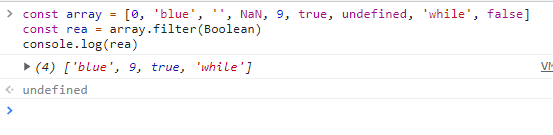

### 14.数组重组
#### 方法一：解构赋值
```js

```
#### 方法二：Array.splice()
```js
arr = ['aaa', 'bbbb', 'cccc', 'dddd', 'eee', 'fff', 'ggg', 'hhh', 'iii']
arr.splice(1, 3, ...arr.splice(4, 4, arr[1], arr[2], arr[3]))
```
图19:<br>
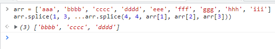

#### 方法三：引入中转变量
```js
temp = arr[1]
arr[1] = arr[2]
arr[2] = temp
```

### 15.类数组转换数组（类数组-->数组）
什么是类数组？<br>
  答：arguments（实参列表）看着像是数组，能通过下标输出对应的数据，但数组能调用的方法它都不能调用，且其数据结构也和数组不同，数据类型为object，实际上arguments是类数组。例如：对象。
##  类数组的组成部分
*  类数组是可以当作数组来使用的对象
    *  索引（数字）属性，利用属性名（相当于数组下标）模拟数组的特性
    *  必须有length属性，可以动态增长，相当于数组的length属性
    *  最好加上push方法，根据length属性值的位置进行属性的扩充
    *  还可以加上数组的其他方法，如splice、pop、shift…（不加则不能调用）

####  方法一：Array.prototype.from()
```js
const asArr = { 0: 'aaa', '1': 'bbb', '二': 'ccc', 4: 'eee', length: 6 };
Array.from(asArr)
 asArr //['aaa', 'bbb', undefined, undefined, 'eee', undefined]
```
图20:<br>
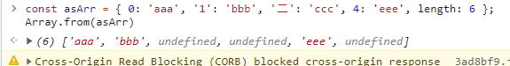

#### 方法二：Array.prototype.slice.call()
```js
const a={0:'tgs',name:1,'er1':'fs0',length:9};
Array.prototype.slice.call(a)
//结果：['tgs', empty × 8]
// empty 不可枚举
```
图21:<br>
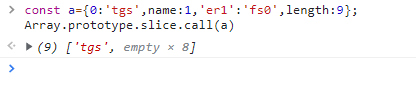
::: tip 提示
在类数组中，如想要转换数组。类数组中一定要有字段length,不然转换出来的数组是空数组

PS:其他产生 empty 的情况
```js
// 也会产生 empty 空位，不会改变 length 属性
delete arr[2]
// 直接删掉元素，且改变 length 属性
arr.splice(2, 1)
```
:::

#### 方法三：扩展运算符
这个方法目前不知道如何练习。
```js
[...document.querySelectorAll('div')]
```
### 16.数组转换对象（ 数组 --> 对象）

####  方法一：扩展运算符
数组使用扩展运算符转换成对象
```js
arr = ['aaa', 'bbbb', 'cccc', 'dddd']
console.log({...arr})
```
::: tip 注意
这个方法目前没有转换成功，转换出来的的undefind的类型。
:::

#### 方法二：while()

```js
 leti = 0 ,
s = {},
arr = ['aaa', 'bbbb', 'cccc', 'dddd'];
while (arr[i]) {
    s[i] = arr[i++]
}

s// {0: 'aaa', 1: 'bbbb', 2: 'cccc', 3: 'dddd'}
```
图22:<br>
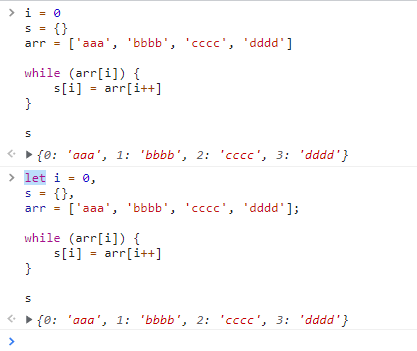

#### 方法三：Object.fromEntries()
关于这个函数转换的数组是一个错误的
```js
Object.keys({name:'张三',age:21}) //(2) ['name', 'age']
Object.values({name:'张三',age:22}) //['张三', 22]
Object.entries({name:'张三',age:23}) //[['name', '张三'],['age', 23]]
```
图23:<br>
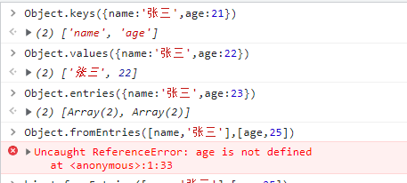

### 17.浅拷贝
#### 方法一：Array.slice()
```js
arr = ['aaa', 'bbbb', 'cccc', 'dddd']
arr1 = arr.slice(0)
arr[1] = 2333 // 2333
arr // ['aaa', 2333, 'cccc', 'dddd']
arr1 // ['aaa', 'bbbb', 'cccc', 'dddd']
```
图24:<br>
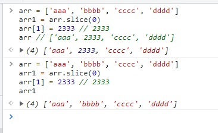

#### 方法二：展开操作符
```js
arr=['wrwr','rhae','ghsn','hrstjr'];
arr5=[...arr];//['wrwr', 'rhae', 'ghsn', 'hrstjr']
```
图25:<br>
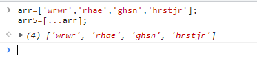

#### 方法三：Array.concat()
```js
abc=['rhe','hnjtd','ttt','xgn'];
bck=[].concat(abc)
bck[2]=345;
abc //['rhe', 'hnjtd', 'ttt', 'xgn']
bck //['rhe', 'hnjtd', 345, 'xgn']
```
图26:<br>
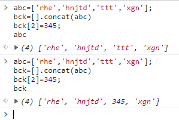

#### 方法四：直接赋值
```js
arr = ['aaa', 'bbbb', 'cccc', 'dddd']
arr1 = arr
arr[1] = 2333 // 2333
arr // ['aaa', 2333, 'cccc', 'dddd']
arr1 // ['aaa', 2333, 'cccc', 'dddd']
```
### 18.Array.from 达到 .map 的效果
```js
bb=[{name:'张三',age:21},{name:'李四',age:21},{name:'王五',age:21},{name:'张六',age:21}];
namebb=bb.map(v=>v.name); //['张三', '李四', '王五', '张六']
bb=[{name:'张三',age:21},{name:'李四',age:21},{name:'王五',age:21},{name:'张六',age:21}];
namebb=Array.from(bb,({name})=>name) //['张三', '李四', '王五', '张六']
```
图27:<br>
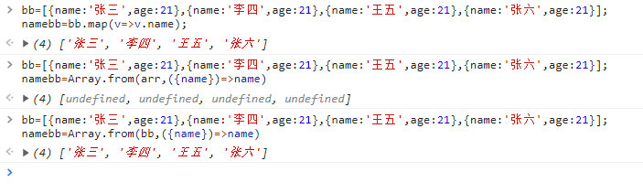

### 19.获取最后 n 个元素
在使用这个slice函数，splice函数时，函数中splice的参数的代表取到几位。取的位置从最后一个开始。
```js
ab=['aaa','bbb','ccc','ddd'];
ab.slice().splice(-1)
//['ddd']

ab=['aaa','bbb','ccc','ddd'];
ab.slice().splice(-2)
//['ccc', 'ddd']
```
图26:<br>
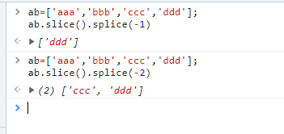

## 循环的性能与小优化

### 优化一：优化 for 循环
* 当循环复杂度为 O(n) 时，减少每次迭代的工作量是最有效的方法。
* 当复杂度大于 O(n) 时，建议着重减少迭代次数。
#### a. 减少每次取length的次数
这样避免了每次执行循环都要先去找array.length
```js
for (let i = 0; i < array.length; i++) {
    console.log(i) // 0 1 2
}
```
// 优化后
```js
for (let i = 0, len = array.length; i < len; i++) {
    console.log(i) // 0 1 2
    // do sth...
}
```
#### b. 倒序循环
```js
for (let i = array.length; i > 0; i--) {
    console.log(i) // 3 2 1
}
```
// 优化后
```js
for (let i = array.length - 1; i >= 0; i--) {
    console.log(i) // 2 1 0
}
```
// 优化后
```js
for (let i = array.length; i--;) {
    console.log(i) // 2 1 0
    // do sth...
}
```
#### 优化二：不要使用 for-in 来遍历数组
在JavaScript提供的循环类型中，只有for-in循环比其他几种明显要慢。
由于每次迭代操作会同时搜索实例或原型属性，for-in循环的每次迭代都会产生更多开销，所以比其他循环类型要慢。
因此，除非你明确需要迭代一个属性数量未知的对象，否则应避免使用for-in循环。
#### 优化三：慎用基于函数的迭代
例如：forEach
基于函数的迭代提供了一个更为便利的迭代方法，但它仍然比基于循环的迭代要慢一些。对每个数组调用外部方法所带来的开销是速度慢的主要原因。在所有情况下，基于循环的迭代比基于函数的迭代快8倍，因此在运行速度要求严格时，基于函数的迭代不是更好的选择。
#### 优化四：尽量使用 switch-case 条件语句
除非在非真既假的判断中，其余条件判断时多用 switch-case 语句，少用 if/else-if/else 语句。原因如下：
* 支持关联操作，即不写 break 语句
* 本质是汇编时生成的跳转表来指示 case 的地址，所以每一个 case 的执行时间基本是相同的，执行效率不会受先后顺序的影响
* 代码更清晰，可读性和可维护性要高很多
#### 优化五：查找表
当有大量离散数据的时候，使用查找表比使用if-else和switch-case快得多。
// 将返回值集合存入数组
```js
const results = [result0, result1, result2, result3, result4]
// 返回结果
return results[value]
```