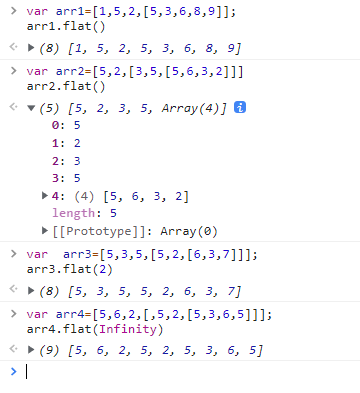
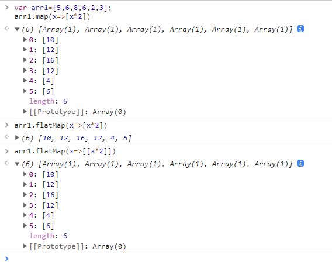
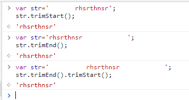
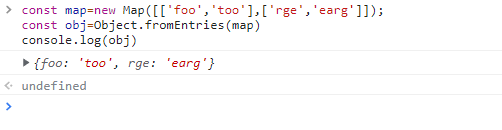
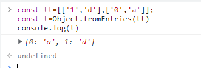

# ES10 新特性
## 1.行分隔符（U + 2028）和段分隔符（U + 2029）符号现在允许在字符串文字中，与JSON匹配
以前，这些符号在字符串文字中被视为行终止符，因此使用它们会导致SyntaxError异常。

## 2.更加友好的 JSON.stringify
如果输入 Unicode 格式但是超出范围的字符，在原先JSON.stringify返回格式错误的Unicode字符串。现在实现了一个改变JSON.stringify的第3阶段提案，因此它为其输出转义序列，使其成为有效Unicode（并以UTF-8表示）
## 3.新增了Array的flat()方法和flatMap()方法
flat()和flatMap()本质上就是是归纳（reduce） 与 合并（concat）的操作。
### 3.1 Array.prototype.flat()
 flat() 方法会按照一个可指定的深度递归遍历数组，并将所有元素与遍历到的子数组中的元素合并为一个新数组返回。
   * flat()方法最基本的作用就是数组降维
   ```js
   var arr1=[1,5,2,[5,3,6,8,9]];
   arr1.flat()
   //结果：[1, 5, 2, 5, 3, 6, 8, 9]
   var arr2=[5,2,[3,5,[5,6,3,2]]]
   arr2.flat()
   //结果：[5,2,3,5,[5,6,3,2]]
   var  arr3=[5,3,5,[5,2,[6,3,7]]];
   //参数--->代表深度
   arr3.flat(2)
   //结果：[5, 3, 5, 5, 2, 6, 3, 7]
   var arr4=[5,6,2,[,5,2,[5,3,6,5]]];
   arr4.flat(Infinity)
   //结果：[5, 6, 2, 5, 2, 5, 3, 6, 5]
   ```
效果：   


  * 还可以利用flat()方法的特性来去除数组的空项
  ```js
  var  arr=[5,2,3,,,,5,6,2,3];
  arr.flat()
  //结果：[5, 2, 3, 5, 6, 2, 3]
  ```
### 3.2 Array.prototype.flatMap()
`flatMap()`方法首先使用映射函数映射每个元素，然后将结果压缩成一个新数组。它与 `map` 和 深度值1的 `flat` 几乎相同，但 `flatMap` 通常在合并成一种方法的效率稍微高一些。 这里我们拿map方法与flatMap方法做一个比较。

```js
  var arr1=[5,6,8,6,2,3];
  arr1.map(x=>[x*2])
  //结果:[[10], [12], [16], [12], [4], [6]]

  arr1.flatMap(x=>[x*2])
  //结果：[10, 12, 16, 12, 4, 6]

  // 只会将 flatMap 中的函数返回的数组 “压平” 一层
  arr1.flatMap(x=>[[x*2]])
  //结果:[[10], [12], [16], [12], [4], [6]]
```
效果：  


## 4.新增了String的trimStart()方法和trimEnd()方法
新增的这两个方法很好理解，分别去除字符串首尾空白字
效果：  


## 5.Object.fromEntries()
`Object.entries()`方法的作用是返回一个给定对象自身可枚举属性的键值对数组，其排列与使用 for...in 循环遍历该对象时返回的顺序一致（区别在于 for-in 循环也枚举原型链中的属性）。
而`Object.fromEntries()` 则是 `Object.entries()` 的反转。

`Object.fromEntries()` 函数传入一个键值对的列表，并返回一个带有这些键值对的新对象。这个迭代参数应该是一个能够实现@iterator方法的的对象，返回一个迭代器对象。它生成一个具有两个元素的类似数组的对象，第一个元素是将用作属性键的值，第二个元素是与该属性键关联的值。
* 通过 Object.fromEntries， 可以将 Map 转化为 Object:

效果：  
  

* 通过 Object.fromEntries， 可以将 Array 转化为 Object: 

效果：  
  

## 6.Symbol.prototype.description
通过工厂函数Symbol（）创建符号时，您可以选择通过参数提供字符串作为描述：

const sym = Symbol('The description'); 复制代码
以前，访问描述的唯一方法是将符号转换为字符串：
```js
assert.equal(String(sym), 'Symbol(The description)'); 
```
现在引入了getter Symbol.prototype.description以直接访问描述：
```js
assert.equal(sym.description, 'The description'); 
```
## 7.String.prototype.matchAll
`matchAll() `方法返回一个包含所有匹配正则表达式及分组捕获结果的迭代器。 在 matchAll 出现之前，通过在循环中调用regexp.exec来获取所有匹配项信息（regexp需使用/g标志：
```js
const regexp = RegExp('foo*','g'); 
const str = 'table football, foosball';  
while ((matches = regexp.exec(str)) !== null) {   
    console.log(`Found ${matches[0]}. Next starts at ${regexp.lastIndex}.`);   
    // expected output: "Found foo. Next starts at 9."   
    // expected output: "Found foo. Next starts at 19." 
    }
```
## 8.Function.prototype.toString()现在返回精确字符，包括空格和注释
```js

```
## 9.修改 catch 绑定
在 ES10 之前，我们必须通过语法为 catch 子句绑定异常变量，无论是否有必要。很多时候 catch 块是多余的。 ES10 提案使我们能够简单的把变量省略掉。

不算大的改动。

之前是
```js
try {} catch(e) {} 
```
现在是
```js
try {} catch {} 
```

## 10.新的基本数据类型BigInt
现在的基本数据类型（值类型）不止5种（ES6之后是六种）了哦！加上BigInt一共有七种基本数据类型，分别是： String、Number、Boolean、Null、Undefined、Symbol、BigInt    
## 参考文献
> [ES6、ES7、ES8、ES9、ES10新特性一览](https://www.cnblogs.com/miaSlady/p/10955729.html)