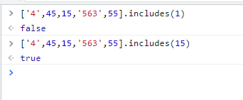
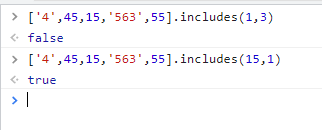
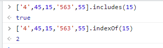
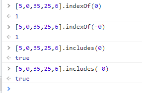
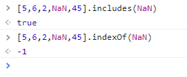
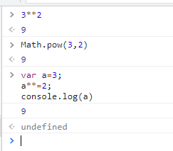

# ES7的用法
摘抄的[原文链接](https://www.jianshu.com/p/13c5d002478b)
## ES7详解
###  1.Array.prototype.includes()
::: tip  作用
 includes()作用,是查找一个值在不在数组里,若是存在则返回true,不存在返回false.
:::
#### 1.基本用法，接受一个参数
```js
['4',45,15,'563',55].includes(1) //返回false
['4',45,15,'563',55].includes(15) //返回true
```
效果：<br>


#### 2.接收两个参数：第一个参数代表搜索的值，第二参数代表从下标几开始搜索。
```js
['4',45,15,'563',55].includes(1,3) //返回alse
['4',45,15,'563',55].includes(15,1) //返回true
```
效果：<br>


#### 3.与es6的indexOf()对比

* 在一些效果中，两个函数的作用是等效的。
   * 比如判断数组中是否包含一个元素。
   ```js
   ['4',45,15,'563',55].includes(15) //接收判断这个数组是否包含元素，如包含，返回的是true，反之，返回的值是false
   ['4',45,15,'563',55].indexOf(15) //返回的值是该元素的下标 2
   ```
   效果：<br>
  

::: tip  提示
 若只判断数组中是否包含要判断的元素，那就使用includes()函数。若想要返回的下标，就使用indexOF()函数。
:::
   * 判断+0与-0时，被认为是相同的。
   ```js
   [5,0,35,25,6].indexOf(0) //结果：1
   [5,0,35,25,6].indexOf(-0) //结果：1
   [5,0,35,25,6].includes(0)   //结果：true
   [5,0,35,25,6].includes(-0) //结果：true
   ```
   效果：<br>
  

   * 这两个函数只能判断简单的类型的数据，对于复杂类型的数据，比如对象类型的数组、二维数组等这些都是无法判断的。

   * 对于NaN的判断，
     js中NaN==NaN的结果是false,indexOF()的结果也是一样。但是includes的结果不一样。
     ```js
     [5,6,2,NaN,45].includes(NaN)  //结果:ture
     [5,6,2,NaN,45].indexOf(NaN)  //结果:-1 ,-1代表数组中没有NaN
     ```
      效果：<br>
     

###  优缺点比较

* 简便性

includes()返回的是布尔值，能直接判断数组中存不存在这个值，而indexOf()返回的是索引，这一点上前者更加方便。

* 精确性

两者都是采用===的操作符来作比较的，不同之处在于：对于NaN的处理结果不同。


### 2.求幂运算符
1.基本用法：
```js
 3**2  //结果:9
 //等效于
 Math.pow(3,2) //结果:9
```
因为`**`也是属于运算符，所以与`+=`是同一个用法
```js
var a=3;
a**=2;
console.log(a)

```
效果：<br>



