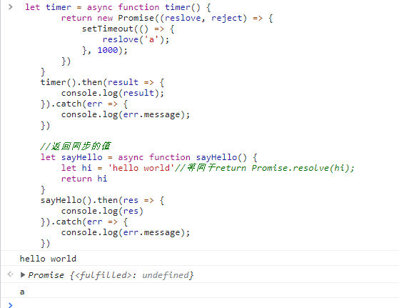
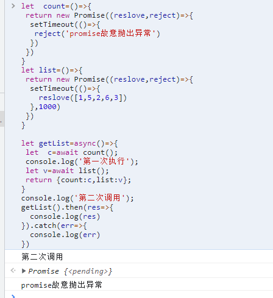
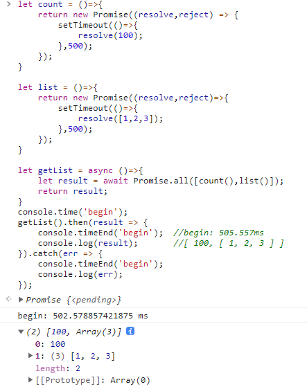
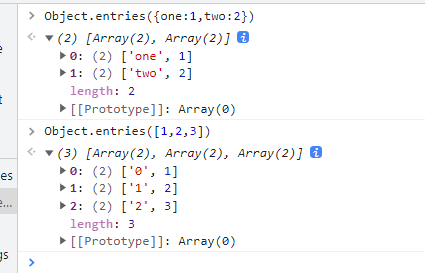
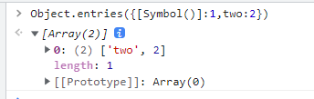
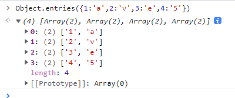
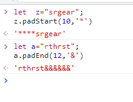
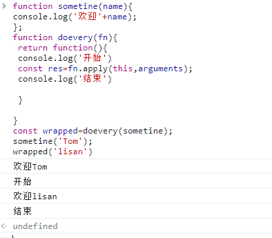
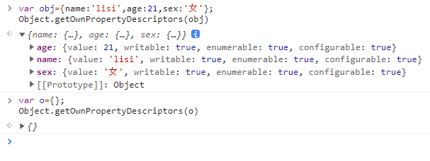

# ES8的用法

## 1.async await
异步函数` async function()`
### 1.1 作用
   避免有更多的请求操作，出现多重嵌套，也就是俗称的‘回调地狱’。如下：
   ```js
   //调用仓库的接口函数，然后再请求另一个接口
    this.$store.dispatch("global/getTime")
      // 自动获取时间，并且每十分钟自动更新一次时间
      .then(() => {
          this.$store.dispatch("global/getData");
      });
   ```
   所以提出了ES6的Promise，将回调函数的嵌套，改成链式调用：
   ```js
   var promise = new Promise((resolve, reject) => {
       this.$store.dispatch("global/getTime")
   })
   .then(() => {
       this.$store.dispatch("global/getData");
   })
   .catch(() => {
        console.log('Error')
   })
   ```
### 1.2声明方式
   异步函数存在以下四种使用形式：

   * 函数声明： `async function foo() {}`
   * 函数表达式： `const foo = async function() {}`
   * 对象的方式： `let obj = { async foo() {} }`
   * 箭头函数： `const foo = async () => {}`

### 1.3支持返回Promise和同步的值

async用于定义一个异步函数，该函数返回一个Promise。
如果async函数返回的是一个同步的值，这个值将被包装成一个理解resolve的Promise，等同于return Promise.resolve(value)。
await用于一个异步操作之前，表示要“等待”这个异步操作的返回值。await也可以用于一个同步的值。
```js
 let timer = async function timer() {
        return new Promise((reslove, reject) => {
            setTimeout(() => {
                reslove('a');
            }, 1000);
        })
    }
    timer().then(result => {
        console.log(result);
    }).catch(err => {
        console.log(err.message);
    })

    //返回同步的值
    let sayHello = async function sayHello() {
        let hi = 'hello world'//等同于return Promise.resolve(hi);
        return hi
    }
    sayHello().then(res => {
        console.log(res)
    }).catch(err => {
        console.log(err.message);
    })
```
效果：<br>


这段代码在执行`timer()`,`sayHello()`是同步执行。不过在执行时，timer有一个延迟时间，所以在时间的执行顺序上是'hello world'-->返回一个Promise-->'a'。

### 1.4对异常处理
异常处理有三个方法：使用reject,使用new Error(),使用reject(new Error('提示语'))。
#### 1.4.1使用reject
```js
let promise=new Promise((reslove,reject)=>{
   setTimeout(()=>{
       reject('promise的使用reject抛出异常')
   },1000)
}   
promise().then(res=>{
 console.log(res)
}).catch(err=>{
 console.log(err)
})
 ```
#### 1.4.2使用new Error()
```js
let promise=new Promise((reslove,reject)=>{
   throw new Error('promise抛出异常');
})
promise().then(res=>{
 console.log(res)
}).catch(err=>{
 console.log(err)
})
```
#### 1.4.2使用reject(new Error())
```js
let promise=new Promise((reslove,reject)=>{
    setTimeout(()=>{
    reject(new Error('promise抛出异常'));
    },1000)
})
promise().then(res=>{
 console.log(res)
}).catch(err=>{
 console.log(err)
})
```
::: tip 提示
async对异常的处理也可以直接用.catch()捕捉到。

和Promise对比，async函数可以包含多个异步操作，它的异步操作和Promise链有相同之处。如果有一个Pormise被reject(),那么后面的操作将不会再进行。
:::
```js
let  count=()=>{
 return new Promise((reslove,reject)=>{
  setTimeout(()=>{
   reject('promise故意抛出异常')
  })
 })
}
let list=()=>{
 return new Promise((reslove,reject)=>{
  setTimeout(()=>{
    reslove([1,5,2,6,3])
  },1000)
 })
}

let getList=async()=>{
 let  c=await count();
 console.log('第一次执行');
 let v=await list();
 return {count:c,list:v};
}
console.log('第二次调用');
getList().then(res=>{
  console.log(res)
}).catch(err=>{
  console.log(err)
})

```
效果：<br>


代码由上往下执行。代码的执行顺序，先执行同步，再执行异步。所以,'第二次调用'选输出。然后执行异步操作，输出Promise对象,然后延迟1s执行了`reject()`函数，输出了'promise故意抛出异常'

#### 1.5 并行
多个请求并行执行，就是多个请求没有关联和先后的顺序的性可以使用Promise.all()
```js
let res = await Promise.all([count(), list()])
return res
//返回的res
//[100,[1,2,5,3,6]]
```
案例详情：
```js
let count = ()=>{
    return new Promise((resolve,reject) => {
        setTimeout(()=>{
            resolve(100);
        },500);
    });
}

let list = ()=>{
    return new Promise((resolve,reject)=>{
        setTimeout(()=>{
            resolve([1,2,3]);
        },500);
    });
}

let getList = async ()=>{
    let result = await Promise.all([count(),list()]);
    return result;
}
console.time('begin');
getList().then(result => {
    console.timeEnd('begin');  //begin: 505.557ms
    console.log(result);       //[ 100, [ 1, 2, 3 ] ]
}).catch(err => {
    console.timeEnd('begin');
    console.log(err);
});
```
效果：<br>


::: tip 提示

我们将count()和list()使用Promise.all()“同时”执行，这里count()和list()可以看作是“并行”执行的，所耗时间将是两个异步操作中耗时最长的耗时。
:::

## 2.Object.entries()
### 2.1作用
:::  tip 作用：
将一个对象中可枚举属性的键名和键值按照二维数组的方式返回。

若对象是数组，则会将数组的下标作为键值返回。
:::
```js
Object.entries({one:1,two:2}) //[['one', 1],['two', 2]] 
Object.entries([1,2,3]) //[['0', 1],['1', 2],['2', 3]]
```
效果：<br>


### 2.2要点
#### 1.若是键名是Symbol，编译时会被自动忽略
```js
Object.entries({[Symbol()]:1,two:2}) //['two',2]
```
效果：<br>


#### 2.entries()返回的数组顺序和for循环一样，即如果对象的key值是数字，则返回值会对key值进行排序，返回的是排序后的结果

```js
Object.entries({1:'a',2:'v',3:'e',4:'5'}) 
//[['1', 'a'],['2', 'v'],['3', 'e'],['4', '5']],
```
效果：<br>


#### 3.利用Object.entries()创建一个真正的Map

```js
    var obj = { foo: 'bar', baz: 42 };
    
    var map1 = new Map([['foo', 'bar'], ['baz', 42]]); //原本的创建方式
    var map2 = new Map(Object.entries(obj));    //等同于map1

    console.log(map1);// Map { foo: "bar", baz: 42 }
    console.log(map2);// Map { foo: "bar", baz: 42 }

```
## 3.Object.values()

### 3.1作用

::: tip  作用
只返回自己的键值对中属性的值。它返回的数组顺序，也跟Object.entries()保持一致
:::

```js

Object.values({ one: 1, two: 2 })            //[1, 2]
Object.values({ 3: 'a', 4: 'b', 1: 'c' })    //['c', 'a', 'b']

```

### 3.2与Object.keys()比较
::: tip 比较
ES6中的Object.keys()返回的是键名
:::

```js
   var obj = { foo: 'bar', baz: 42 };
    console.log(Object.keys(obj)) //["foo", "baz"]
    console.log(Object.values(obj)) //["bar", 42]
    
    //Object.keys()的作用就类似于for...in
    function myKeys() {
        let keyArr = []
        for (let key in obj1) {
            keyArr.push(key)
            console.log(key)
        }
        return keyArr
    }
    console.log(myKeys(obj1)) //["foo", "baz"]
```

### 3.3entries()、values()总结

 ```js
    var obj = { foo: 'bar', baz: 42 };
    console.log(Object.keys(obj)) //["foo", "baz"]
    console.log(Object.values(obj)) //["bar", 42]
    console.log(Object.entries(obj)) //[["foo", "bar"], ["baz", 42]]
 ```

## 4 字符串填充
### 4.1 padStart()和padEnd()

`padStart()`在字符串前面填充,`padEnd()`是在字符串后面填充。
`padStart()`,`padEnd()`的两个参数的意思是一样的。第一个设置字符串的长度，第二个代表是剩余的长度由参数代替
```js
let  z="srgear";
z.padStart(10,'*')
//'****srgear'

let a="rthrst";
a.padEnd(12,'&')
//'rthrst&&&&&&'
```
效果：<br>


## 5.函数参数支持尾部逗号
<!-- ::: tip  提示 -->
>开发过程中，如果忘记删除尾部逗号也没关系，ES8已经支持这种写法。比如
>`foo(1, 3, 4, )`
<!-- ::: -->
## 6.修饰器Decorator


如上操作：其实就是一个函数包装成另一个函数,这样的方式我们称之为“修饰器”

## 7.Object.getOwnPropertyDescriptors()
Object.getOwnPropertyDescriptors()函数用来获取一个对象的所有自身属性的描述符，如果对象没有任何自身属性，则返回空对象。
```js
var obj={name:'lisi',age:21,sex:'女'};
Object.getOwnPropertyDescriptors(obj)
//结果
//age: {value: 21, writable: true, enumerable: true, configurable: true}
//name: {value: 'lisi', writable: true, enumerable: true, configurable: true}
//sex: {value: '女', writable: true, enumerable: true, configurable: true}
//如下图所示
var o={};
Object.getOwnPropertyDescriptors(o)
//结果:{}
```
效果：<br>


## 8.SharedArrayBuffer对象
SharedArrayBuffer 对象用来表示一个通用的，固定长度的原始二进制数据缓冲区，类似于 ArrayBuffer 对象，它们都可以用来在共享内存（shared memory）上创建视图。与 ArrayBuffer 不同的是，SharedArrayBuffer 不能被分离。

## 9.Atomics对象
* Atomics 对象提供了一组静态方法用来对 SharedArrayBuffer 对象进行原子操作。

>这些原子操作属于 Atomics 模块。与一般的全局对象不同，Atomics 不是构造函数，因此不能使用 new 操作符调用，也不能将其当作函数直接调用。Atomics 的所有属性和方法都是静态的（与 Math 对象一样）。

>多个共享内存的线程能够同时读写同一位置上的数据。原子操作会确保正在读或写的数据的值是符合预期的，即下一个原子操作一定会在上一个原子操作结束后才会开始，其操作过程不会中断。

* Atomics.add()
>将指定位置上的数组元素与给定的值相加，并返回相加前该元素的值。

* Atomics.and()
>将指定位置上的数组元素与给定的值相与，并返回与操作前该元素的值。

* Atomics.compareExchange()
>如果数组中指定的元素与给定的值相等，则将其更新为新的值，并返回该元素原先的值。

* Atomics.exchange()
>将数组中指定的元素更新为给定的值，并返回该元素更新前的值。

* Atomics.load()
>返回数组中指定元素的值。

* Atomics.or()
>将指定位置上的数组元素与给定的值相或，并返回或操作前该元素的值。

* Atomics.store()
>将数组中指定的元素设置为给定的值，并返回该值。

* Atomics.sub()
>将指定位置上的数组元素与给定的值相减，并返回相减前该元素的值。

* Atomics.xor()
>将指定位置上的数组元素与给定的值相异或，并返回异或操作前该元素的值。

>wait() 和 wake() 方法采用的是 Linux 上的 futexes 模型（fast user-space mutex，快速用户空间互斥量），可以让进程一直等待直到某个特定的条件为真，主要用于实现阻塞。

* Atomics.wait()
>检测数组中某个指定位置上的值是否仍然是给定值，是则保持挂起直到被唤醒或超时。返回值为 "ok"、"not-equal" 或 "time-out"。调用时，如果当前线程不允许阻塞，则会抛出异常（大多数浏览器都不允许在主线程中调用 wait()）。

* Atomics.wake()
>唤醒等待队列中正在数组指定位置的元素上等待的线程。返回值为成功唤醒的线程数量。

* Atomics.isLockFree(size)
>可以用来检测当前系统是否支持硬件级的原子操作。对于指定大小的数组，如果当前系统支持硬件级的原子操作，则返回 true；否则就意味着对于该数组，Atomics 对象中的各原子操作都只能用锁来实现。此函数面向的是技术专家。

## 参考文献
> [Javascript之ES7详解](https://www.jianshu.com/p/13c5d002478b)   
> [ES6、ES7、ES8、ES9、ES10新特性一览](https://www.cnblogs.com/miaSlady/p/10955729.html)