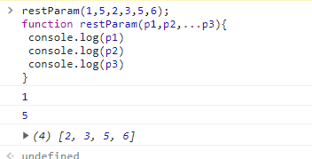
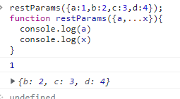

# ES9的新特
## 1.异步迭代
在 `async/await`的某些时刻，你可能尝试在同步循环中调用异步函数。比如：
```js
async function process(array){
 for(let i of array){
   await doSomething(i);
 }
}
async function process(array){
  array.forEach(async i => {await doSomething(i);});
}
```
上面这些的代码是不能正常执行的。这些代码中，循环本身依旧保持同步，并在在内部异步函数之前全部调用完成。

ES2018引入异步迭代器（asynchronous iterators），这就像常规迭代器，除了next()方法返回一个Promise。因此`await`可以和`for...of`循环一起使用，以串行的方式运行异步操作。如下：
```js
async function process(array) {   
    for await (let i of array) {    
         doSomething(i);  
    } 
}
```
## 2.Promise.finally()
一个Promise调用链要么成功到达最后一个.then()，要么失败触发.catch()。在某些情况下，你想要在无论Promise运行成功还是失败，运行相同的代码，例如清除，删除对话，关闭数据库连接等。

`.finally()`允许你指定最终的逻辑:
```js
function doSomething() {  
     doSomething1().then(doSomething2).then(doSomething3).catch(err => {
          console.log(err)
     }).finally(() => { 
           // finish here!   
        }); 
} 
```
如上所示，在调动异步请求时，在异步请求成功或者失败的都要执行的代码函数，可以在链接后面添加一个`finally()`,然后在`{}`调用函数。当然，除了这方法以外，也可以直接成功(失败)中调用函数，这个方法让函数写了两遍。

## 3.Rest/Spread 属性
### 3.1 ES2015引入了Rest参数和扩展运算符。三个点（...）仅用于数组。Rest参数语法允许我们将一个不定数量的参数表示为一个数组。
```js
restParam(1,5,2,3,5,6);
function restParam(p1,p2,...p3){
 console.log(p1)
 console.log(p2)
 console.log(p3)
}
//结果：
//1
//5
//[2,3,5,6]
```
效果:  


### 3.2 展开操作符以相反的方式工作，将数组转换成可传递给函数的单独参数。例如Math.max()返回给定数字中的最大值.
```js
const value=[88,66,98,74,65,63];
console.log(Math.max(...value))
//结果：98
```
### 3.3 ES2018为对象解构提供了和数组一样的Rest参数（）和展开操作符
```js
const myop={a:1,b:2,c:3,d:4};
const{a,...x}=myop;
//结果：
//a:1
//x:{b:2,c:3,d:4}
```
或者可以当做参数传递过去
```js
restParams({a:1,b:2,c:3,d:4});
function restParams({a,...x}){
  console.log(a)
  console.log(x)
}
```
效果:  

跟数组一样，Rest参数只能在声明的结尾处使用。此外，它只适用于每个对象的顶层，如果对象中嵌套对象则无法适用。

扩展运算符可以在其他对象内使用。比如:
```js
const a={a:2,b:3,v:4,f:7};
const b={...a,z:122};
```
扩展运算符可以拷贝数组，对象。合并对象，数组。
## 4.正则


## 参考文献
  
> [ES6、ES7、ES8、ES9、ES10新特性一览](https://www.cnblogs.com/miaSlady/p/10955729.html)