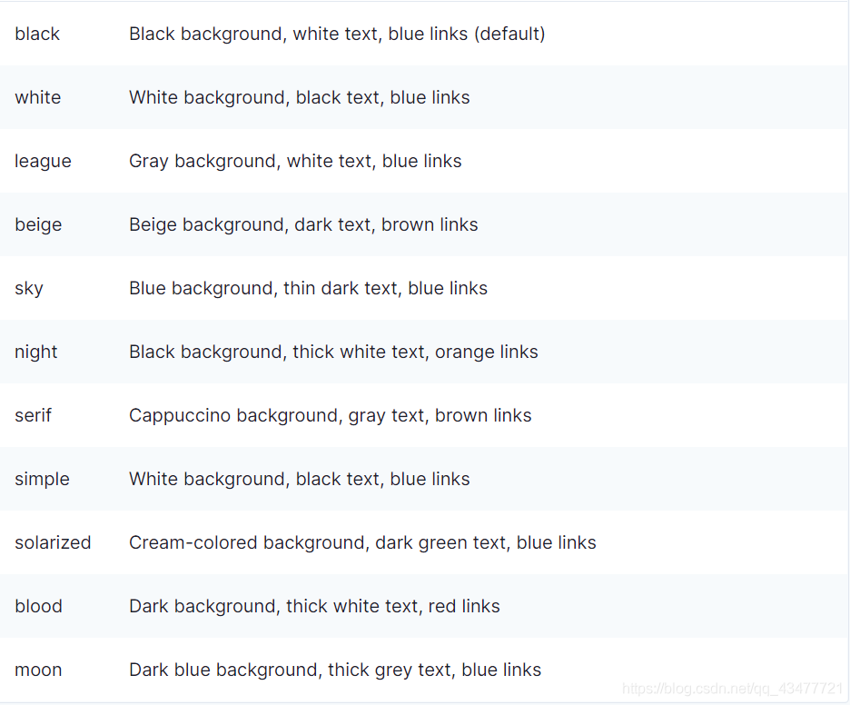

# 网页版PPT

## reveal.js
 
 [reveal.js](https://github.com/hakimel/reveal.js)是用来制作网页版的ppt,可以制作根据精致的ppt,也可以放置视频，动图等。
 

 ## Reveal.js 优势


    ▪ 制作灵活、不限应用，只需修改 HTML 文件

    ▪ 发布灵活、不限平台，只需打开 HTML 文件

    ▪丰富的特性，支持过渡动画、代码高亮、视频背景、Markdown 语法、导出 PDF 等

    ▪ 极度轻量，占用空间和内存少
    

 ## 初始化案例

 ```js
 <html>
  <head>
    <title>map.js</title>
  </head>
  <!-- reveal基本的css  -->
  <link rel="stylesheet" href="./lib/reveal/dist/reveal.css" />
  <!-- 引入淡蓝色主题 -->
  <link rel="stylesheet" href="./lib/reveal/dist/theme/sky.css" />
  <!-- 用于显示代码高亮 -->
  <link rel="stylesheet" href="./lib/reveal/dist/reset.css" />

  <!-- 引入样式 -->
  <link rel="stylesheet" href="./css/map.css" />
  <script src="./lib/reveal/plugin/notes/notes.js"></script>
  <script src="./lib/reveal/plugin/markdown/markdown.js"></script>

  <!--三、引入高德地图的js-->
  <script
    type="text/javascript"
    src="https://webapi.amap.com/maps?v=1.4.8&key=您申请的key值"
  ></script>
  <body>
    <!-- reveal基本的js，里面集成了一些转场动画 -->
    <script src="./lib/reveal/dist/reveal.js"></script>
    <script src="./lib/reveal/plugin/"></script>
    <div class="reveal">
      <div class="slides">
        <section>
          <h6>nihao1</h6>
        </section>
        <section>
          <!-- 添加地图 -->
          <h6>显示地图</h6>
          <!-- 一、新建一个容器 -->
          <div id="container"></div>
        </section>
        <section
          data-transition="concave"
          data-markdown="11.md"
          data-separator="^\n\n\n"
          data-separator-vertical="^\n\n"
          data-separator-notes="^Note:"
          data-charset="iso-8859-15"
        >
          <h6>markdown文件使用</h6>
        </section>
        <section data-markdown>
          <textarea data-template>
              ```js [1-2|3|4]
              let a = 1;
              let b = 2;
              let c = x => 1 + 2 + x;
              c(3);
              ```
            </textarea
          >
        </section>
      </div>
    </div>

    <!-- 这里省略引入js代码，记得加上 -->
    <script type="text/javascript">
      Reveal.initialize({
        controls: true, // 是否显示左下角的控制键，默认为true
        progress: true, // 是否显示进度条，默认为true
        center: true, // 是否在中间显示，默认为true
        markdown: {
          smartypants: true,
        },
        //ppt每一页的转换的样式   none/褪色/滑动/凸面的/凹面的/放大
        transition: "convex", // none/fade/slide(default)/convex/concave/zoom
        //添加reveal.js自带的内容部插件
        plugins: [RevealNotes, RevealMarkdown],
      });
    </script>
  </body>
</html>
```

效果：


#### reveal.js的属性
表格内容：
        <table>
            <thead>
              <tr>
                <th>参数</th>
                <th>描述</th>
                <th>默认值</th>
              </tr>
            </thead>
            <tbody>
              <tr>
                <td>controls</td>
                <td>是否显示右下角展示控制台</td>
                <td>true</td>
              </tr>
              <tr>
                <td>progress</td>
                <td>是否显示演示的进度条</td>
                <td>true</td>
              </tr>
              <tr>
                <td>slideNumber</td>
                <td>
                  是否显示当前幻灯片的页数编号，也可以使用代码slideNumber:'c/t',表示当页/总页数
                </td>
                <td>false</td>
              </tr>
                <tr>
                <td>history</td>
                <td>
                  是否将每个幻灯片改变加入到浏览器的历史记录中去
                </td>
                <td>false</td>
              </tr>
                <tr>
                <td>keyboard</td>
                <td>
                  是否启用键盘快捷键来导航
                </td>
                <td>true</td>
              </tr>
              <tr>
                <td>overview</td>
                <td>
                  是否启用幻灯片的概览模式，可使用'ESC'或'o'键来切换概览模式
                </td>
                <td>true</td>
              </tr>
             <tr>
                <td>center</td>
                <td>
                  是否将幻灯片垂直居中
                </td>
                <td>true</td>
              </tr>
            <tr>
                <td>touch</td>
                <td>
                  是否在触屏设备上启用触摸滑动切换
                </td>
                <td>true</td>
              </tr>
              <tr>
                <td>loop</td>
                <td>
                  是否循环演示
                </td>
                <td>false</td>
              </tr>
            <tr>
                <td>rtl</td>
                <td>
                  是否将演示的方向变成RTL,即从右往左
                </td>
                <td>false</td>
              </tr>
              <tr>
                <td>fragments</td>
                <td>
                  全局开启和关闭碎片
                </td>
                <td>true</td>
              </tr>
              <tr>
                <td>autoSlide</td>
                <td>
                  两个幻灯片之间自动切换的时间间隔（毫秒），当设置成0的时候则禁止自动切换，该值可以被幻灯片上的'data-autoSlide'属性覆盖
                </td>
                <td>0</td>
              </tr>
              <tr>
                <td>transition</td>
                <td>
                  切换过渡效果，有none/fade/slide/convex/concave/zoom
                </td>
                <td>'default'</td>
              </tr>
              <tr>
                <td>transitionSpeed</td>
                <td>
                  过渡速度，default/fast/slow
                </td>
                <td>'default'</td>
              </tr>
            <tr>
                <td>mouseWheel</td>
                <td>
                  是否启动通过鼠标滚轮来切换幻灯片
                </td>
                <td>true</td>
              </tr>
            </tbody>
          </table>


#### 主题样式


1. 一个`<section>`标签就是一张ppt。
2. reveal的动画有grow，shrink，fade-out，fade-right，fade-up，fade-down，fade-left，fade-in-then-out，fade-in-then-semi-out
3. Markdown支持需要加载Markdown.js插件，并且在section标签中加入data-markdown属性。
4. 代码高亮需要加载插件highlight.js
5. 可以单独给每个section设置背景，包括背景颜色，背景图片，视频

### reveal.js的[第三方插件](https://github.com/hakimel/reveal.js/wiki/Plugins,-Tools-and-Hardware)


