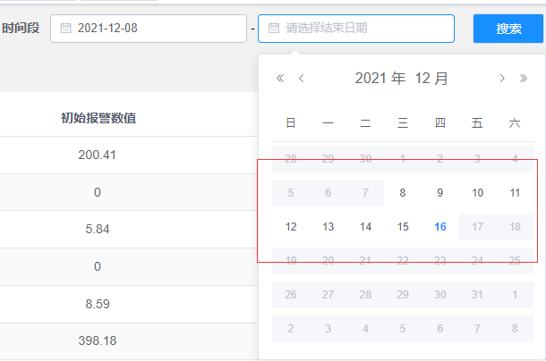
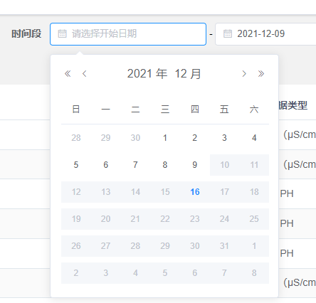
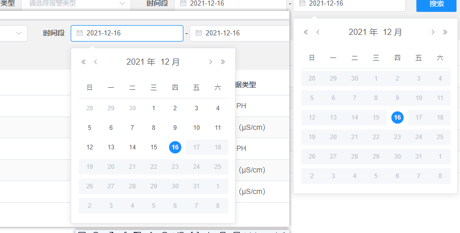

# UI 组件的问题
## [element UI在全屏下面组件不显示](/accumulate/element-UI/FullScreen.html)

## 如何在组件-日期时间选择器中限制用户的时间选择
* 条件：当用户选择了开始时间，那么结束时间的时间范围：开始时间到当前时间.显示如图1所示。 
* 条件：当用户选择了结束时间，那么开始时间的时间范围：结束时间之前，显示如图2所示。 
* 条件：当开始时间、结束时间都有一个默认的初始值(一般默认当前时间，年-月-日),开始时间的选择范围为当前默认事件之前，结束时间选择范围一般是开始时间~结束时间范围。显示如图3所示。 

  
<center>
 <br>
图1
</center>
<center>
 <br>
图2
</center>
<center>
 <br>
图3
</center>
代码如下： 

```js
<template>
  <div>
    <el-date-picker
    v-model="queryParams.startTime"
    size="small"
    placeholder="请选择开始日期"
    :clearable="false"
    :editable="false"
    format="yyyy-MM-dd"
    value-format="yyyy-MM-dd"
    :picker-options="pickerOptionsStart"
    >
  </el-date-picker>
  -
  <el-date-picker
    v-model="queryParams.endTime"
    size="small"
    placeholder="请选择结束日期"
    :clearable="false"
    :editable="false"
    format="yyyy-MM-dd"
    value-format="yyyy-MM-dd"
    :picker-options="pickerOptionsEnd"
  >
  </el-date-picker>
 </div>
<template>
<script type="text/babel">       
export default {
  name: "historicalAlarm",
  components: {
    TimeHorizon,
  },
  data() {
    return {
      // 日期选择判断
      pickerOptionsStart: {
        disabledDate: time => {
          if (this.queryParams.endTime) {
            // 存在结束时间时，时间不可大于结束时间
            return (
              time.getTime() > new Date(this.queryParams.endTime).getTime(this.queryParams.endTime)
            );
          } else {
            // 不能小于当前日期
            return time.getTime() > this.$store.state.global.time;
          }
        },
      },
      // 日期选择判断
      pickerOptionsEnd: {
        disabledDate: time => {
          if (this.queryParams.startTime) {
            return (
              time.getTime() > this.$store.state.global.time ||
              time.getTime() <
                new Date(this.queryParams.startTime).getTime(this.queryParams.startTime) -
                  24 * 60 * 60 * 1000
            );
          } else {
            return time.getTime() > this.$store.state.global.time;
          }
        },
      },
    };
  },
};
</script>
```


## 修改表格的左边边框的距离
如果想要修改表格中行内的样式，除了使用css修改以外，可以使用element表格组件自带的事件`cell-style`,`header-cell-style`,一个是修改表格的行内，一个是修改表格表头的行内，直接把需要修改的样式返回就行。
```js
<template>
<el-table :cell-style="cellStyle" :header-cell-style="headerCellStyle" >
    ...
</el-table>
</template>
<script>
export default {
  methods: {
    //改表格单元格的样式
    cellStyle() {
      return "padding-left:30px";
    },
    //修改表格表头的样式
    headerCellStyle() {
      return "padding-left:30px";
    },
  },
};
   
</script>
```