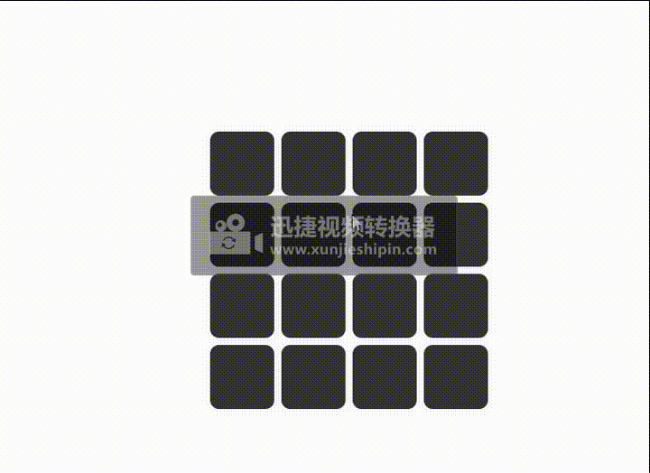

# html游戏

## 图片对比游戏
html文件
```js
<!DOCTYPE html>
<html>
	<head>
		<meta charset="utf-8" />
		<title>图片对比游戏</title>
		<link rel="stylesheet" type="text/css" href="css/index.css" />
	</head>
	<body>
		<script src="http://libs.baidu.com/jquery/2.0.0/jquery.min.js"></script>
		<div id="container">
			<div class="ullist">
			</div>
		</div>
		<script type="text/javascript">
			//预备图片
			var getSet = [];
			//步数
			var count = 0;
			console.log(getSet.length)
			//确定图片
			var determineImg = [];
			//创建标签
			let arr = [1, 5, 2, 3, 6, 2, 5, 1, 4, 5, 2, 3, 6, 5, 2, 4];
			arr.sort(() => Math.random() - 0.5);
			for (var i = 0; i < 16; i++) {
				var num = './img/' + arr[i] + '.png';
				$('.ullist').append(`<div class='img'></div>`);
			}

			$(".ullist .img").on("click", function(e) { //只需要找到你点击的是哪个ul里面的就行
				// if ($('.intro').length > 0) {
				// 	console.log((99))
				// 	$('.ullist .img').unbind('click');
				// 	console.log((9922))

				// } else {
				// 	console.log(3)
				// 	// $(this).bind('click');
				// 	$('.ullist .img').bind('click');
				// }
				if (getSet.length == 2) {
					getSet = [];
				}
				let num = $(this).find('img').attr('src');
				getSet.push(num);
				$(this).addClass("intro");
				setTimeout(() => {
					if (getSet.length == 2) {
						count++;
						if (getSet[0] == getSet[1]) {
							console.log(777)
							determineImg = [...getSet, ...determineImg]
							getSet = [];
							$('.intro').addClass('deterImg');
							$('.deterImg').removeClass('intro');
							$('.deterImg').unbind('click');
							if (determineImg.length >= 16) {
								alert("游戏成功，步数总计:" + count + 1)
							}
							return;
						} else {
							console.log(222)
							$('.intro').removeClass('intro').removeAttr('style')
							
						}
						$('.ullist .img').off('click');
					}
				}, 2000)
			});
		</script>
	</body>
</html>
```
css文件
```js
body,
html {
	margin: 0 auto;
	padding: 0;
	width: 100%;
	height: 100%;
	background: linear-gradient(30deg, '#99ADF9', '#9141EE');
}

#container {
	height: 100%;
	display: flex;
	justify-content: center;
	align-items: center;
	position: relative;
}


.ullist {
	display: grid;
	width: 500px;
	height: 500px;
	grid-template-columns: 80px 80px 80px 80px;
	grid-template-rows: 80px 80px 80px 80px;
	margin: 0 auto;
}

.ullist .img {
	margin: 4px;
	background-color: #333;
	border-radius: 10px;
	box-shadow: 1px 1px 10px #eee;
}
/* 翻转 */
.intro {
	transform: perspective(800px) rotateY(360deg);
	transition: .7s;
	transform-style: preserve-3d;
	opacity: 1;
}
/*  */
.deterImg{
	box-shadow: 1px 1px 10px #F80000;
	
}
.ullist .deterImg img,.ullist .intro img{
	opacity: 1 !important;
	background-color:#9CC4EE;
	border-radius: 10px;
}
.ullist .intro img{
	background-color:#9CEDEE;
}
.ullist .img img{
	width: 100%;
	height: 100%;
	opacity: 0;
}
```
效果：<br>

但是，在这个小游戏中，如果我的连续点击三个以上的图片，那么就可能不能对比，最后全部重新点击。想要点击第三个图片禁止点击事件，但是发现后面的都不能点击了。