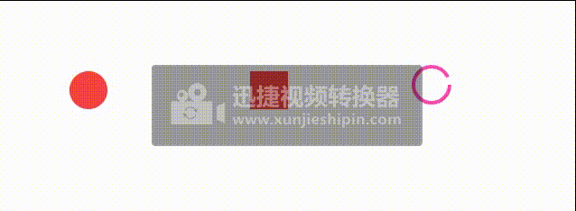
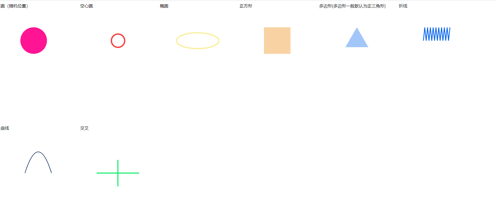
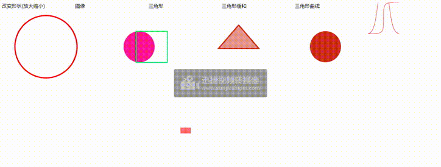
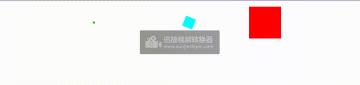

# mo.js
### 什么是mo.js？

   Mo.js是一个"简洁、高效"图形动画库，拥有流畅的动画和惊人的用户体验，在任何设备上，屏幕密度独立的效果都很好，你可以绘制内置的形状或者自定义形状，随便，只要你喜欢，你还可以绘制多个动画，再让它们串联在一起，逼话不多说详细的请浏览[Mo.js官方网站](https://mojs.github.io/)

### 安装
   若是在HTML5中使用mojs。可以使用CDN引入方法：
   ```js
   <script src="https://cdn.jsdelivr.net/npm/@mojs/core"></script>
   ```
   若是在项目中使用mojs。可以使用命令：

   ```js
   npm i @mojs/core
   ```
   或者
   ```js
   yarn add @mojs/core
   ```

  在main.js文件引入
   ```js
  import mojs from '@mojs/core'
  ```
###  案例1

  使用mojs创建矩形，圆形，多边形等形状的图形。

  ```js
  <link rel="stylesheet" href="./css/dmo.css" />
  <body>
    <div class="contaier">
      <div id="circle" class="item"></div>
      <div id="rect" class="item"></div>
      <div id="hollow-circle" class="item"></div>
    </div>

    <!-- 引入mo.js的cdn两种不同的路径 -->
    <script src="http://cdn.jsdelivr.net/mojs/latest/mo.min.js"></script>
    <!-- <script src="https://cdn.jsdelivr.net/npm/@mojs/core"></script> -->
    <script>
      //圆形
      let circle = new mojs.Shape({
        parent: "#circle", //父元素
        shape: "circle",
        fill: { "#F64040": "#F9F0A3" }, //参数只能两个
        radius: { 20: 80 }, //显示两个圆点半径
        duration: 2000, //设置动画的持续时间(单位：毫秒),默认0
        isYoyo: true, //动画在达到最终状态后向后播放,默认为false
        isShowStart: true,
        left: 100, //left/right/top/bottom是对于图形的中心点为定位
        top: 100,
        easing: "elastic.inout",
        repeat: 10, //动画的循环次数，默认为0
      });
      // 开始动画
      circle.play();
      //矩形
      let rect = new mojs.Shape({
        parent: "#rect", //父元素
        shape: "rect",
        left: 300,
        top: 100,
        fill: { "#F64040": "#F9F0A3" }, //参数只能两个
        radius: { 20: 80 }, //显示两个圆点半径
        duration: 2000, //设置动画的持续时间(单位：毫秒),默认0
        isYoyo: true, //动画在达到最终状态后向后播放,默认为false
        isShowStart: true,
        easing: "elastic.inout",
        repeat: 10, //动画的循环次数，默认为0
      });
      // 开始动画
      rect.play();

      //空心圆形
      const spinner = new mojs.Shape({
        parent: "#hollow-circle",
        shape: "circle",
        stroke: "#FC46AD",
        strokeDasharray: "125, 125",
        strokeDashoffset: { 0: "-125" },
        strokeWidth: 4,
        fill: "none",
        left: "25%",
        top: "10%",
        rotate: { "-90": "270" },
        radius: 20,
        isShowStart: true,
        duration: 2000,
        easing: "back.in",
      }).then({
        rotate: { "-90": "270" },
        strokeDashoffset: { "-125": "-250" },
        duration: 3000,
        easing: "cubic.out",
      });

      spinner.play();
    </script>
  </body>

  ```
  效果：<br>



## 形状（Shape & ShapeSwirl）
   Shape和ShapeSwirl模块，它们可以帮助你引导运动效果。

### Shape
   在Mojs中创建形状，需要实例化mojs Shape对象以创建不同的形状。该对象将接收不同的参数，这些参数可用于控制所创建形状的颜色、大小、角度等。
   在默认的情况下，如果创建的形状没有指定的父元素的情况下，那么整个dom元素都将作为这个形状的父元素。有指定的元素的`className`会被赋给属性`parent`
   Mojs内置了八个不同的形状，因此您可以通过为shape属性设置一个值来直接创建它们。（Shape的属性： 'circle' | 'rect' | 'polygon' | 'line' | 'cross' | 'equal' | 'curve' | 'zigzag' | '自定义名称'）

## Shape的属性：
 ```js
const shape = new mojs.Shape({

  /* SHAPE PROPERTIES */

  // Parent of the module. {String, Object} [selector, HTMLElement]
  parent:           document.body,

  // Class name. {String}
  className:        '',

  // Shape name. {String} [ 'circle' | 'rect' | 'polygon' | 'line' | 'cross' | 'equal' | 'curve' | 'zigzag' | '*custom defined name*' ]
  shape:            'circle',

  // ∆ :: Stroke color. {String} [color name, rgb, rgba, hex]
  stroke:           'transparent',

  // ∆ :: Stroke Opacity. {Number} [ 0..1 ]
  strokeOpacity:    1,

  // Stroke Line Cap. {String} ['butt' | 'round' | 'square']
  strokeLinecap:    '',

  // ∆ :: Stroke Width. {Number} [ number ]
  strokeWidth:      2,

  // ∆ , Units :: Stroke Dash Array. {String, Number}
  strokeDasharray:  0,

  // ∆ , Units :: Stroke Dash Offset. {String, Number}
  strokeDashoffset: 0,

  // ∆ :: Fill Color. {String} [color name, rgb, rgba, hex]
  fill:             'deeppink',

  // ∆ :: Fill Opacity. {Number} [ 0..1 ]
  fillOpacity:      1,

  // ∆ , Units :: Left position of the module. {Number, String}
  left:             '50%',

  // ∆ , Units :: Top position of the module. {Number, String}
  top:              '50%',

  // ∆ , Units :: X shift. {Number, String}
  x:                0,

  // ∆ , Units :: Y shift. {Number, String}
  y:                0,

  // ∆ :: Angle. {Number, String}
  rotate:            0,

  // ∆ :: Scale of the module. {Number}
  scale:            1,

  // ∆ :: Explicit scaleX value (fallbacks to `scale`). {Number}
  scaleX:           null,

  // ∆ :: Explicit scaleX value (fallbacks to `scale`). {Number}
  scaleY:           null,

  // ∆ , Unit :: Origin for `x`, `y`, `scale`, `rotate` properties. {String}
  origin:           '50% 50%',

  // ∆ :: Opacity. {Number} [ 0..1 ]
  opacity:          1,

  // ∆ :: X border radius. {Number, String}
  rx:               0,

  // ∆ :: Y border radius. {Number, String}
  ry:               0,

  // ∆ :: Points count ( for polygon, zigzag, equal ). {Number, String}
  points:           3,

  // ∆ :: Radius of the shape. {Number, String}
  radius:           50,

  // ∆ :: Radius X of the shape (fallbacks to `radius`). {Number, String}
  radiusX:          null,

  // ∆ :: Radius Y of the shape (fallbacks to `radius`). {Number, String}
  radiusY:          null,

  // If should hide module with `transforms` instead of `display`. {Boolean}
  isSoftHide:       true,

  // If should trigger composite layer for the module. {Boolean}
  isForce3d:        false,

  // If should be shown before animation starts. {Boolean}
  isShowStart:      false,

  // If should stay shown after animation ends. {Boolean}
  isShowEnd:        true,

  // If refresh state on subsequent plays. {Boolean}
  isRefreshState:   true,

  // Context callbacks will be called with. {Object}
  callbacksContext: this,

  /* TWEEN PROPERTIES */
  // Duration {Number}
  duration:       350,
  // Delay {Number}
  delay:          0,
  // If should repeat after animation finished {Number} *(1)
  repeat:         0,
  // Speed of the tween {Number}[0..∞]
  speed:          1,
  // If the progress should be flipped on repeat animation end {Boolean}
  isYoyo:         false,
  // Easing function {String, Function}[ easing name, path coordinates, bezier string, easing function ]
  easing:         'sin.out',
  // Easing function for backward direction of the tween animation (fallbacks to `easing`) {String, Function}[ easing name, path coordinates, bezier string, easing function ]
  backwardEasing: null,

  /* TWEEN CALLBACKS */
  /*
    Fires on every update of the tween in any period (including delay periods). You probably want to use `onUpdate` method instead.
    @param p {Number} Normal (not eased) progress.
    @param isForward {Boolean} Direction of the progress.
    @param isYoyo {Boolean} If in `yoyo` period.
  */
  onProgress (p, isForward, isYoyo) {},
  /*
    Fires when tween's the entire progress reaches `0` point(doesn't fire in repeat periods).
    @param isForward {Boolean} If progress moves in forward direction.
    @param isYoyo {Boolean} If progress inside `yoyo` flip period.
  */
  onStart (isForward, isYoyo) {},
  /*
    Fires when tween's the progress reaches `0` point in normal or repeat period.
    @param isForward {Boolean} If progress moves in forward direction.
    @param isYoyo {Boolean} If progress inside `yoyo` flip period.
  */
  onFirstUpdate (isForward, isYoyo) {},
  /*
    Fires on first update of the tween in sufficiently active period (excluding delay periods).
    @param ep {Number} Eased progress.
    @param p {Number} Normal (not eased) progress.
    @param isForward {Boolean} Direction of the progress.
    @param isYoyo {Boolean} If in `yoyo` period.
  */
  onUpdate (ep, p, isForward, isYoyo) {},
  /*
    Fires when tween's the progress reaches `1` point in normal or repeat period.
    @param isForward {Boolean} If progress moves in forward direction.
    @param isYoyo {Boolean} If progress inside `yoyo` flip period.
  */
  onRepeatComplete (isForward, isYoyo) {},
  /*
    Fires when tween's the entire progress reaches `1` point(doesn't fire in repeat periods).
    @param isForward {Boolean} If progress moves in forward direction.
    @param isYoyo {Boolean} If progress inside `yoyo` flip period.
  */
  onComplete (isForward, isYoyo) {},
  /* Fires when the `.play` method called and tween isn't in play state yet. */
  onPlaybackStart () {},
  /* Fires when the `.pause` method called and tween isn't in pause state yet. */
  onPlaybackPause () {},
  /* Fires when the `.stop` method called and tween isn't in stop state yet. */
  onPlaybackStop () {},
  /* Fires when the tween end's animation (regardless progress) */
  onPlaybackComplete () {},

})
  /*
    Creates next state transition chain.
    @param options {Object} Next shape state.
  */
  .then({ /* next state options */ })
  /*
    Tunes start state with new options.
    @param options {Object} New start properties.
  */
  .tune({ /* new start properties */ })

  /*
    Regenerates all randoms in initial properties.
  */
  .generate()
  /*
    Starts playback.
    @param shift {Number} Start progress shift in milliseconds.
  */
  .play( shift = 0 )
  /*
    Starts playback in backward direction.
    @param shift {Number} Start progress shift in milliseconds.
  */
  .playBackward( shift = 0 )
  /*
    Pauses playback.
  */
  .pause()
  /*
    Restarts playback.
    @param shift {Number} Start progress shift in milliseconds.
  */
  .replay( shift = 0 )
  /*
    Restarts playback in backward direction.
    @param shift {Number} Start progress shift in milliseconds.
  */
  .replayBackward( shift = 0 )
  /*
    Resumes playback in direction it was prior to `pause`.
    @param shift {Number} Start progress shift in milliseconds.
  */
  .resume( shift = 0 )
  /*
    Sets progress of the tween.
    @param progress {Number} Progress to set [ 0..1 ].
  */
  .setProgress( progress )
  /*
    Sets speed of the tween.
    @param speed {Number} Progress to set [ 0..∞ ].
  */
  setSpeed ( speed )
  /* Stops and resets the tween. */
  reset ( speed )

 ```


 ###  案例2

```js 
<html>
  <head>
    <title></title>
  </head>
  <style>
    .container {
      width: 100%;
      height: 100%;
      display: flex;
      flex-wrap: wrap;
      flex-direction: row;
      /* justify-content: space-between; */
    }

    .item {
      width: 300px;
      height: 300px;
    }
  </style>
  <body>
    <div class="container">
      <div id="circle" class="item">圆（随机位置）</div>
      <div id="circle1" class="item">空心圆</div>
      <div id="circle2" class="item">椭圆</div>
      <div id="rect" class="item">正方形</div>
      <div id="polygon" class="item">多边形(多边形一般默认为正三角形)</div>
      <div id="zigzag" class="item">折线</div>
      <div id="curve" class="item">曲线</div>
      <div id="cross" class="item">交叉</div>
    </div>

    <script src="http://cdn.jsdelivr.net/mojs/latest/mo.min.js"></script>
    <script>
      let circle = new mojs.Shape({
        // parent: "#circle",
        shape: "circle",
        top: "150",
        left: "150",
        x: "rand(-50,50)", //rand()随机数，在-250~250之间抽取
        isShowStart: true,
      });
      circle.play();

      let circle1 = new mojs.Shape({
        // parent: "#circle",
        shape: "circle", // shape 'circle' is default
        radius: 25, // shape radius
        top: "150",
        left: "450",
        fill: "transparent", // same as 'transparent'
        stroke: "#F64040", // or 'cyan'
        strokeWidth: 5, // width of the stroke
        isShowStart: true, // show before any animation starts
      });

      let circle2 = new mojs.Shape({
        // parent: "#circle2",
        fill: "none",
        top: "150",
        left: "750",
        shape: "circle",
        stroke: "#F9F0A3",
        isShowStart: true,
        strokeWidth: 5,
        radiusX: 80,
        radiusY: 30,
      });
      circle2.play();

      let rect = new mojs.Shape({
        // parent: "#rect",
        fill: "#F9D2A3",
        shape: "rect",
        top: 150,
        left: 1050,
        isShowStart: true,
      });
      rect.play();

      let polygon = new mojs.Shape({
        shape: "polygon",
        fill: "#A3C6F9",
        top: 150,
        left: 1350,
        isShowStart: true,
      });
      polygon.play();

      let zigzag = new mojs.Shape({
        shape: "zigzag",
        points: 20, //一般是折线的点数
        top: 150,
        left: 1650,
        fill: "none",
        stroke: "#0B68EE",
        strokeWidth: 3,
        isShowStart: true,
      });
      zigzag.play();

      let curve = new mojs.Shape({
        shape: "curve",
        top: 650,
        left: 150,
        radius: 80, //radius可以用来设置曲线的谷峰
        radiusX: 50, //radiusX设置曲线的两点的长度，radiusY设置两点之间的连线与曲线的谷的长度
        fill: "none",
        stroke: "#07295C",
        isShowStart: true,
      });
      curve.play();

      let cross = new mojs.Shape({
        shape: "cross",
        radiusX: 80,
        radiusY: 50,
        top: 650,
        left: 450,
        strokeWidth: 4,
        stroke: "#1AEE71",
        isShowStart: true,
      });

      cross.play();
    </script>
  </body>
</html>

 ```

效果：<br>


 ###  案例3

 ```js
<html>
  <head>
    <title></title>
    <style>
      .containers {
        display: flex;
      }
      .item {
        width: 300px;
        height: 300px;
      }
    </style>
  </head>
  <body>
    <div class="containers">
      <div id="delta" class="item">改变形状(放大缩小)</div>
      <div id="Shape" class="item">图像</div>
      <div id="Shape1" class="item">三角形</div>
      <div id="Shape2" class="item">三角形缓和</div>
      <div id="Shape3" class="item">三角形曲线</div>
      <svg>
        <path
          width="200"
          fill="none"
          stroke="red"
          d="M0,100 C50,100 50,100 50,50 C50,0 50,0 100,0"
        ></path>

        <path
          width="200"
          fill="none"
          stroke="red"
          d="M0,100 C21.3776817,95.8051376 50,77.3262711 50,-700 C50,80.1708527 76.6222458,93.9449005 100,100"
        ></path>
      </svg>
    </div>
    <script src="http://cdn.jsdelivr.net/mojs/latest/mo.min.js"></script>

    <script>
      new mojs.Shape({
        parent: "#delta",
        shape: "circle",
        left: 150,
        top: 150,
        scale: { 0: 2 }, //放大缩小属性，只能有两个参数
        duration: 1000,
        delay: 500, //动画的延迟1s
        easing: "cubic.out",
        repeat: 2,
      })
        .then({
          shape: "rect",
          scale: { 0: 2 }, //放大缩小属性，只能有两个参数
          duration: 1000,
          fill: "none",
          stroke: "red",
          delay: 500, //动画的延迟1s
          easing: "cubic.out",
          repeat: 2,
        })
        .play();

      new mojs.Shape({
        parent: "#Shape",
        shape: "circle",
        left: 450,
        top: 150,
        scale: { 0: 1 }, //放大缩小属性，只能有两个参数
        duration: 1000,
        // delay: 500, //动画的延迟1s
        easing: "cubic.out",
        repeat: 2,
      }).play();
      new mojs.Shape({
        parent: "#Shape",
        shape: "rect",
        left: 490,
        top: 150,
        fill: "none",
        stroke: "#1AEE71",
        strokeWidth: 3,
        scale: { 0: 1 }, //放大缩小属性，只能有两个参数
        duration: 1000,
        delay: 500, //动画的延迟1s
        easing: "cubic.out",
        repeat: 2,
      }).play();

      new mojs.Shape({
        parent: "#Shape1",
        shape: "polygon",
        repeat: 10,
        left: 750,
        top: 150,
        fill: { "#E8EE1A": "#CF2C1A" },
        stroke: { "#E8EE1A": "#CF2C1A" },
        strokeWidth: 3,
        scaleX: { 0: 1.5 },
        x: { [-100]: 20 },
        y: { [50]: -20 },
        rotateZ: { 100: -150 },
        fillOpacity: { 0: 0.5 },
        easing: "sin.in",
        delay: 100,
        repeat: 2,
      }).play();

      new mojs.Shape({
        parent: "#Shape2",
        shape: "circle",
        left: 1050,
        scale: { 0: 1, easing: "cubic.out" }, //图形缓和放大
        top: 150,
        duration: 1000,
        fill: { "#E8EE1A": "#CF2C1A", easing: "cubic.in" }, //填充颜色缓和填充
        repeat: 2,
      }).play();

      const shiftCurve = mojs.easing.path(
        "M0,100 C50,100 50,100 50,50 C50,0 50,0 100,0"
      );
      const scaleCurveBase = mojs.easing.path(
        "M0,100 C21.3776817,95.8051376 50,77.3262711 50,-700 C50,80.1708527 76.6222458,93.9449005 100,100"
      );
      const scaleCurve = (p) => {
        return 1 + scaleCurveBase(p);
      };
      const nScaleCurve = (p) => {
        return 1 - scaleCurveBase(p) / 10;
      };

      const circle = new mojs.Shape({
        shape: "rect",
        fill: { "#F64040": "#F64040", curve: scaleCurve },
        radius: 10,
        rx: 3,
        x: { [-125]: 125, easing: shiftCurve },
        scaleX: { 1: 1, curve: scaleCurve },
        scaleY: { 1: 1, curve: nScaleCurve },
        origin: { "0 50%": "100% 50%", easing: shiftCurve },

        isYoyo: true,
        delay: 500,
        duration: 800,
        repeat: 999,
      }).play();
    </script>
  </body>
</html>

 ```

效果：<br>


### then

```js

<html>
  <head>
    <title></title>
    <style>
      .container {
        display: flex;
        flex-direction: row;
        flex-wrap: wrap;
      }
    </style>
  </head>
  <body>
    <div class="container">
      <div id="rect" class="item"></div>
      <div id="newdeltainthen" class="item"></div>
      <div id="newdeltain" class="item"></div>
      <div class="item"></div>
      <div class="item"></div>
    </div>
    <script src="http://cdn.jsdelivr.net/mojs/latest/mo.min.js"></script>
    <script>
      let rect = new mojs.Shape({
        parent: "#rect",
        shape: "rect",
        top: "10%",
        left: "25%",
        fill: { "#3ACF1A": "#CF871A" },
        scale: { 0: 1 },
        duration: 1000,
        strokeWidth: 20,
        angle: { [-180]: 0 },
        isShowStart: true,
      })
        .then({
          fill: "none",
          scale: { to: 1, easing: "sin.in" },
          strokeWidth: 0,
          stroke: "3ACF1A",
          isShowStart: true,
        })
        .play();

      new mojs.Shape({
        parent: "#newdeltainthen",
        shape: "rect",
        fill: "none",
        stroke: "cyan",
        radius: 10,
        strokeWidth: 20,
        angle: {
          [-180]: 0, // 使用对象的形式设置，key为开始值，val为结束值(任何属性都可以设置过渡)
        },
        top: "10%",
        left: "50%",
        duration: 600,
        isShowStart: true,
      })
        .then({
          strokeWidth: { 50: 0 },
          stroke: { magenta: "yellow" },
        })
        .play();

      new mojs.Shape({
        parent: "#newdeltain",
        shape: "rect",
        angle: { [-180]: 0 },
        fill: "red",
        strokeWidth: 20,
        top: "10%",
        left: "70%",
        stroke: "red",
        duration: 600,
        delay: 100,
        isShowStart: true,
      })
        .then({
          angle: { 0: [-360] },
          strokeWidth: 2,
          fill: "none",
          stroke: { magenta: "yellow" },
        })
        .play();
    </script>
  </body>
</html>

```

效果：<br>



实例的方法：
.play() // 执行动画

.pause() // 暂停动画

.stop() // 结束动画

.replay() // 重播动画，相当于stop + play


## mojs的HTML模块
   HTML模块可用于为网页上的不同HTML元素设置动画。
   为dom元素设置动画


