# mo.js
### 什么是mo.js？

   Mo.js是一个"简洁、高效"图形动画库，拥有流畅的动画和惊人的用户体验，在任何设备上，屏幕密度独立的效果都很好，你可以绘制内置的形状或者自定义形状，随便，只要你喜欢，你还可以绘制多个动画，再让它们串联在一起，逼话不多说详细的请浏览[Mo.js官方网站](https://mojs.github.io/)

### 安装
   若是在HTML5中使用mojs。可以使用CDN引入方法：
   ```js
   <script src="https://cdn.jsdelivr.net/npm/@mojs/core"></script>
   ```
   若是在项目中使用mojs。可以使用命令：

   ```js
   npm i @mojs/core
   ```
   或者
   ```js
   yarn add @mojs/core
   ```

  在main.js文件引入
   ```js
  import mojs from '@mojs/core'
  ```
###  案例1

  使用mojs创建矩形，圆形，多边形等形状的图形。

  ```js
  <link rel="stylesheet" href="./css/dmo.css" />
  <body>
    <div class="contaier">
      <div id="circle" class="item"></div>
      <div id="rect" class="item"></div>
      <div id="hollow-circle" class="item"></div>
    </div>

    <!-- 引入mo.js的cdn两种不同的路径 -->
    <script src="http://cdn.jsdelivr.net/mojs/latest/mo.min.js"></script>
    <!-- <script src="https://cdn.jsdelivr.net/npm/@mojs/core"></script> -->
    <script>
      //圆形
      let circle = new mojs.Shape({
        parent: "#circle", //父元素
        shape: "circle",
        fill: { "#F64040": "#F9F0A3" }, //参数只能两个
        radius: { 20: 80 }, //显示两个圆点半径
        duration: 2000, //设置动画的持续时间(单位：毫秒),默认0
        isYoyo: true, //动画在达到最终状态后向后播放,默认为false
        isShowStart: true,
        left: 100, //left/right/top/bottom是对于图形的中心点为定位
        top: 100,
        easing: "elastic.inout",
        repeat: 10, //动画的循环次数，默认为0
      });
      // 开始动画
      circle.play();
      //矩形
      let rect = new mojs.Shape({
        parent: "#rect", //父元素
        shape: "rect",
        left: 300,
        top: 100,
        fill: { "#F64040": "#F9F0A3" }, //参数只能两个
        radius: { 20: 80 }, //显示两个圆点半径
        duration: 2000, //设置动画的持续时间(单位：毫秒),默认0
        isYoyo: true, //动画在达到最终状态后向后播放,默认为false
        isShowStart: true,
        easing: "elastic.inout",
        repeat: 10, //动画的循环次数，默认为0
      });
      // 开始动画
      rect.play();

      //空心圆形
      const spinner = new mojs.Shape({
        parent: "#hollow-circle",
        shape: "circle",
        stroke: "#FC46AD",
        strokeDasharray: "125, 125",
        strokeDashoffset: { 0: "-125" },
        strokeWidth: 4,
        fill: "none",
        left: "25%",
        top: "10%",
        rotate: { "-90": "270" },
        radius: 20,
        isShowStart: true,
        duration: 2000,
        easing: "back.in",
      }).then({
        rotate: { "-90": "270" },
        strokeDashoffset: { "-125": "-250" },
        duration: 3000,
        easing: "cubic.out",
      });

      spinner.play();
    </script>
  </body>

  ```
  效果：<br>
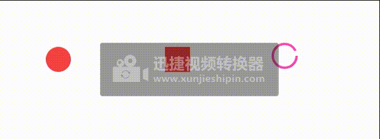


## 形状（Shape & ShapeSwirl）
   Shape和ShapeSwirl模块，它们可以帮助你引导运动效果。

### Shape
   在Mojs中创建形状，需要实例化mojs Shape对象以创建不同的形状。该对象将接收不同的参数，这些参数可用于控制所创建形状的颜色、大小、角度等。
   在默认的情况下，如果创建的形状没有指定的父元素的情况下，那么整个dom元素都将作为这个形状的父元素。有指定的元素的`className`会被赋给属性`parent`
   Mojs内置了八个不同的形状，因此您可以通过为shape属性设置一个值来直接创建它们。（Shape的属性： 'circle' | 'rect' | 'polygon' | 'line' | 'cross' | 'equal' | 'curve' | 'zigzag' | '自定义名称'）

### Shape的属性：
 ```js
const shape = new mojs.Shape({

  /* SHAPE PROPERTIES */

  // Parent of the module. {String, Object} [selector, HTMLElement]
  parent:           document.body,

  // Class name. {String}
  className:        '',

  // Shape name. {String} [ 'circle' | 'rect' | 'polygon' | 'line' | 'cross' | 'equal' | 'curve' | 'zigzag' | '*custom defined name*' ]
  shape:            'circle',

  // ∆ :: Stroke color. {String} [color name, rgb, rgba, hex]
  stroke:           'transparent',

  // ∆ :: Stroke Opacity. {Number} [ 0..1 ]
  strokeOpacity:    1,

  // Stroke Line Cap. {String} ['butt' | 'round' | 'square']
  strokeLinecap:    '',

  // ∆ :: Stroke Width. {Number} [ number ]
  strokeWidth:      2,

  // ∆ , Units :: Stroke Dash Array. {String, Number}
  strokeDasharray:  0,

  // ∆ , Units :: Stroke Dash Offset. {String, Number}
  strokeDashoffset: 0,

  // ∆ :: Fill Color. {String} [color name, rgb, rgba, hex]
  fill:             'deeppink',

  // ∆ :: Fill Opacity. {Number} [ 0..1 ]
  fillOpacity:      1,

  // ∆ , Units :: Left position of the module. {Number, String}
  left:             '50%',

  // ∆ , Units :: Top position of the module. {Number, String}
  top:              '50%',

  // ∆ , Units :: X shift. {Number, String}
  x:                0,

  // ∆ , Units :: Y shift. {Number, String}
  y:                0,

  // ∆ :: Angle. {Number, String}
  rotate:            0,

  // ∆ :: Scale of the module. {Number}
  scale:            1,

  // ∆ :: Explicit scaleX value (fallbacks to `scale`). {Number}
  scaleX:           null,

  // ∆ :: Explicit scaleX value (fallbacks to `scale`). {Number}
  scaleY:           null,

  // ∆ , Unit :: Origin for `x`, `y`, `scale`, `rotate` properties. {String}
  origin:           '50% 50%',

  // ∆ :: Opacity. {Number} [ 0..1 ]
  opacity:          1,

  // ∆ :: X border radius. {Number, String}
  rx:               0,

  // ∆ :: Y border radius. {Number, String}
  ry:               0,

  // ∆ :: Points count ( for polygon, zigzag, equal ). {Number, String}
  points:           3,

  // ∆ :: Radius of the shape. {Number, String}
  radius:           50,

  // ∆ :: Radius X of the shape (fallbacks to `radius`). {Number, String}
  radiusX:          null,

  // ∆ :: Radius Y of the shape (fallbacks to `radius`). {Number, String}
  radiusY:          null,

  // If should hide module with `transforms` instead of `display`. {Boolean}
  isSoftHide:       true,

  // If should trigger composite layer for the module. {Boolean}
  isForce3d:        false,

  // If should be shown before animation starts. {Boolean}
  isShowStart:      false,

  // If should stay shown after animation ends. {Boolean}
  isShowEnd:        true,

  // If refresh state on subsequent plays. {Boolean}
  isRefreshState:   true,

  // Context callbacks will be called with. {Object}
  callbacksContext: this,

  /* TWEEN PROPERTIES */
  // Duration {Number}
  duration:       350,
  // Delay {Number}
  delay:          0,
  // If should repeat after animation finished {Number} *(1)
  repeat:         0,
  // Speed of the tween {Number}[0..∞]
  speed:          1,
  // If the progress should be flipped on repeat animation end {Boolean}
  isYoyo:         false,
  // Easing function {String, Function}[ easing name, path coordinates, bezier string, easing function ]
  easing:         'sin.out',
  // Easing function for backward direction of the tween animation (fallbacks to `easing`) {String, Function}[ easing name, path coordinates, bezier string, easing function ]
  backwardEasing: null,

  /* TWEEN CALLBACKS */
  /*
    Fires on every update of the tween in any period (including delay periods). You probably want to use `onUpdate` method instead.
    @param p {Number} Normal (not eased) progress.
    @param isForward {Boolean} Direction of the progress.
    @param isYoyo {Boolean} If in `yoyo` period.
  */
  onProgress (p, isForward, isYoyo) {},
  /*
    Fires when tween's the entire progress reaches `0` point(doesn't fire in repeat periods).
    @param isForward {Boolean} If progress moves in forward direction.
    @param isYoyo {Boolean} If progress inside `yoyo` flip period.
  */
  onStart (isForward, isYoyo) {},
  /*
    Fires when tween's the progress reaches `0` point in normal or repeat period.
    @param isForward {Boolean} If progress moves in forward direction.
    @param isYoyo {Boolean} If progress inside `yoyo` flip period.
  */
  onFirstUpdate (isForward, isYoyo) {},
  /*
    Fires on first update of the tween in sufficiently active period (excluding delay periods).
    @param ep {Number} Eased progress.
    @param p {Number} Normal (not eased) progress.
    @param isForward {Boolean} Direction of the progress.
    @param isYoyo {Boolean} If in `yoyo` period.
  */
  onUpdate (ep, p, isForward, isYoyo) {},
  /*
    Fires when tween's the progress reaches `1` point in normal or repeat period.
    @param isForward {Boolean} If progress moves in forward direction.
    @param isYoyo {Boolean} If progress inside `yoyo` flip period.
  */
  onRepeatComplete (isForward, isYoyo) {},
  /*
    Fires when tween's the entire progress reaches `1` point(doesn't fire in repeat periods).
    @param isForward {Boolean} If progress moves in forward direction.
    @param isYoyo {Boolean} If progress inside `yoyo` flip period.
  */
  onComplete (isForward, isYoyo) {},
  /* Fires when the `.play` method called and tween isn't in play state yet. */
  onPlaybackStart () {},
  /* Fires when the `.pause` method called and tween isn't in pause state yet. */
  onPlaybackPause () {},
  /* Fires when the `.stop` method called and tween isn't in stop state yet. */
  onPlaybackStop () {},
  /* Fires when the tween end's animation (regardless progress) */
  onPlaybackComplete () {},

})
  /*
    Creates next state transition chain.
    @param options {Object} Next shape state.
  */
  .then({ /* next state options */ })
  /*
    Tunes start state with new options.
    @param options {Object} New start properties.
  */
  .tune({ /* new start properties */ })

  /*
    Regenerates all randoms in initial properties.
  */
  .generate()
  /*
    Starts playback.
    @param shift {Number} Start progress shift in milliseconds.
  */
  .play( shift = 0 )
  /*
    Starts playback in backward direction.
    @param shift {Number} Start progress shift in milliseconds.
  */
  .playBackward( shift = 0 )
  /*
    Pauses playback.
  */
  .pause()
  /*
    Restarts playback.
    @param shift {Number} Start progress shift in milliseconds.
  */
  .replay( shift = 0 )
  /*
    Restarts playback in backward direction.
    @param shift {Number} Start progress shift in milliseconds.
  */
  .replayBackward( shift = 0 )
  /*
    Resumes playback in direction it was prior to `pause`.
    @param shift {Number} Start progress shift in milliseconds.
  */
  .resume( shift = 0 )
  /*
    Sets progress of the tween.
    @param progress {Number} Progress to set [ 0..1 ].
  */
  .setProgress( progress )
  /*
    Sets speed of the tween.
    @param speed {Number} Progress to set [ 0..∞ ].
  */
  setSpeed ( speed )
  /* Stops and resets the tween. */
  reset ( speed )

 ```


 ####  Shape案例1

```js 
<html>
  <head>
    <title></title>
  </head>
  <style>
    .container {
      width: 100%;
      height: 100%;
      display: flex;
      flex-wrap: wrap;
      flex-direction: row;
      /* justify-content: space-between; */
    }

    .item {
      width: 300px;
      height: 300px;
    }
  </style>
  <body>
    <div class="container">
      <div id="circle" class="item">圆（随机位置）</div>
      <div id="circle1" class="item">空心圆</div>
      <div id="circle2" class="item">椭圆</div>
      <div id="rect" class="item">正方形</div>
      <div id="polygon" class="item">多边形(多边形一般默认为正三角形)</div>
      <div id="zigzag" class="item">折线</div>
      <div id="curve" class="item">曲线</div>
      <div id="cross" class="item">交叉</div>
    </div>

    <script src="http://cdn.jsdelivr.net/mojs/latest/mo.min.js"></script>
    <script>
      let circle = new mojs.Shape({
        // parent: "#circle",
        shape: "circle",
        top: "150",
        left: "150",
        x: "rand(-50,50)", //rand()随机数，在-250~250之间抽取
        isShowStart: true,
      });
      circle.play();

      let circle1 = new mojs.Shape({
        // parent: "#circle",
        shape: "circle", // shape 'circle' is default
        radius: 25, // shape radius
        top: "150",
        left: "450",
        fill: "transparent", // same as 'transparent'
        stroke: "#F64040", // or 'cyan'
        strokeWidth: 5, // width of the stroke
        isShowStart: true, // show before any animation starts
      });

      let circle2 = new mojs.Shape({
        // parent: "#circle2",
        fill: "none",
        top: "150",
        left: "750",
        shape: "circle",
        stroke: "#F9F0A3",
        isShowStart: true,
        strokeWidth: 5,
        radiusX: 80,
        radiusY: 30,
      });
      circle2.play();

      let rect = new mojs.Shape({
        // parent: "#rect",
        fill: "#F9D2A3",
        shape: "rect",
        top: 150,
        left: 1050,
        isShowStart: true,
      });
      rect.play();

      let polygon = new mojs.Shape({
        shape: "polygon",
        fill: "#A3C6F9",
        top: 150,
        left: 1350,
        isShowStart: true,
      });
      polygon.play();

      let zigzag = new mojs.Shape({
        shape: "zigzag",
        points: 20, //一般是折线的点数
        top: 150,
        left: 1650,
        fill: "none",
        stroke: "#0B68EE",
        strokeWidth: 3,
        isShowStart: true,
      });
      zigzag.play();

      let curve = new mojs.Shape({
        shape: "curve",
        top: 650,
        left: 150,
        radius: 80, //radius可以用来设置曲线的谷峰
        radiusX: 50, //radiusX设置曲线的两点的长度，radiusY设置两点之间的连线与曲线的谷的长度
        fill: "none",
        stroke: "#07295C",
        isShowStart: true,
      });
      curve.play();

      let cross = new mojs.Shape({
        shape: "cross",
        radiusX: 80,
        radiusY: 50,
        top: 650,
        left: 450,
        strokeWidth: 4,
        stroke: "#1AEE71",
        isShowStart: true,
      });

      cross.play();
    </script>
  </body>
</html>

 ```

效果：<br>
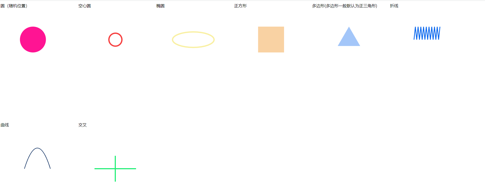

####  Shape案例2

 ```js
<html>
  <head>
    <title></title>
    <style>
      .containers {
        display: flex;
      }
      .item {
        width: 300px;
        height: 300px;
      }
    </style>
  </head>
  <body>
    <div class="containers">
      <div id="delta" class="item">改变形状(放大缩小)</div>
      <div id="Shape" class="item">图像</div>
      <div id="Shape1" class="item">三角形</div>
      <div id="Shape2" class="item">三角形缓和</div>
      <div id="Shape3" class="item">三角形曲线</div>
      <svg>
        <path
          width="200"
          fill="none"
          stroke="red"
          d="M0,100 C50,100 50,100 50,50 C50,0 50,0 100,0"
        ></path>

        <path
          width="200"
          fill="none"
          stroke="red"
          d="M0,100 C21.3776817,95.8051376 50,77.3262711 50,-700 C50,80.1708527 76.6222458,93.9449005 100,100"
        ></path>
      </svg>
    </div>
    <script src="http://cdn.jsdelivr.net/mojs/latest/mo.min.js"></script>

    <script>
      new mojs.Shape({
        parent: "#delta",
        shape: "circle",
        left: 150,
        top: 150,
        scale: { 0: 2 }, //放大缩小属性，只能有两个参数
        duration: 1000,
        delay: 500, //动画的延迟1s
        easing: "cubic.out",
        repeat: 2,
      })
        .then({
          shape: "rect",
          scale: { 0: 2 }, //放大缩小属性，只能有两个参数
          duration: 1000,
          fill: "none",
          stroke: "red",
          delay: 500, //动画的延迟1s
          easing: "cubic.out",
          repeat: 2,
        })
        .play();

      new mojs.Shape({
        parent: "#Shape",
        shape: "circle",
        left: 450,
        top: 150,
        scale: { 0: 1 }, //放大缩小属性，只能有两个参数
        duration: 1000,
        // delay: 500, //动画的延迟1s
        easing: "cubic.out",
        repeat: 2,
      }).play();
      new mojs.Shape({
        parent: "#Shape",
        shape: "rect",
        left: 490,
        top: 150,
        fill: "none",
        stroke: "#1AEE71",
        strokeWidth: 3,
        scale: { 0: 1 }, //放大缩小属性，只能有两个参数
        duration: 1000,
        delay: 500, //动画的延迟1s
        easing: "cubic.out",
        repeat: 2,
      }).play();

      new mojs.Shape({
        parent: "#Shape1",
        shape: "polygon",
        repeat: 10,
        left: 750,
        top: 150,
        fill: { "#E8EE1A": "#CF2C1A" },
        stroke: { "#E8EE1A": "#CF2C1A" },
        strokeWidth: 3,
        scaleX: { 0: 1.5 },
        x: { [-100]: 20 },
        y: { [50]: -20 },
        rotateZ: { 100: -150 },
        fillOpacity: { 0: 0.5 },
        easing: "sin.in",
        delay: 100,
        repeat: 2,
      }).play();

      new mojs.Shape({
        parent: "#Shape2",
        shape: "circle",
        left: 1050,
        scale: { 0: 1, easing: "cubic.out" }, //图形缓和放大
        top: 150,
        duration: 1000,
        fill: { "#E8EE1A": "#CF2C1A", easing: "cubic.in" }, //填充颜色缓和填充
        repeat: 2,
      }).play();

      const shiftCurve = mojs.easing.path(
        "M0,100 C50,100 50,100 50,50 C50,0 50,0 100,0"
      );
      const scaleCurveBase = mojs.easing.path(
        "M0,100 C21.3776817,95.8051376 50,77.3262711 50,-700 C50,80.1708527 76.6222458,93.9449005 100,100"
      );
      const scaleCurve = (p) => {
        return 1 + scaleCurveBase(p);
      };
      const nScaleCurve = (p) => {
        return 1 - scaleCurveBase(p) / 10;
      };

      const circle = new mojs.Shape({
        shape: "rect",
        fill: { "#F64040": "#F64040", curve: scaleCurve },
        radius: 10,
        rx: 3,
        x: { [-125]: 125, easing: shiftCurve },
        scaleX: { 1: 1, curve: scaleCurve },
        scaleY: { 1: 1, curve: nScaleCurve },
        origin: { "0 50%": "100% 50%", easing: shiftCurve },

        isYoyo: true,
        delay: 500,
        duration: 800,
        repeat: 999,
      }).play();
    </script>
  </body>
</html>

 ```

效果：<br>
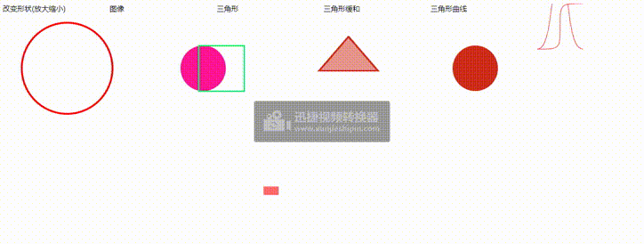

### then

```js

<html>
  <head>
    <title></title>
    <style>
      .container {
        display: flex;
        flex-direction: row;
        flex-wrap: wrap;
      }
    </style>
  </head>
  <body>
    <div class="container">
      <div id="rect" class="item"></div>
      <div id="newdeltainthen" class="item"></div>
      <div id="newdeltain" class="item"></div>
      <div class="item"></div>
      <div class="item"></div>
    </div>
    <script src="http://cdn.jsdelivr.net/mojs/latest/mo.min.js"></script>
    <script>
      let rect = new mojs.Shape({
        parent: "#rect",
        shape: "rect",
        top: "10%",
        left: "25%",
        fill: { "#3ACF1A": "#CF871A" },
        scale: { 0: 1 },
        duration: 1000,
        strokeWidth: 20,
        angle: { [-180]: 0 },
        isShowStart: true,
      })
        .then({
          fill: "none",
          scale: { to: 1, easing: "sin.in" },
          strokeWidth: 0,
          stroke: "3ACF1A",
          isShowStart: true,
        })
        .play();

      new mojs.Shape({
        parent: "#newdeltainthen",
        shape: "rect",
        fill: "none",
        stroke: "cyan",
        radius: 10,
        strokeWidth: 20,
        angle: {
          [-180]: 0, // 使用对象的形式设置，key为开始值，val为结束值(任何属性都可以设置过渡)
        },
        top: "10%",
        left: "50%",
        duration: 600,
        isShowStart: true,
      })
        .then({
          strokeWidth: { 50: 0 },
          stroke: { magenta: "yellow" },
        })
        .play();

      new mojs.Shape({
        parent: "#newdeltain",
        shape: "rect",
        angle: { [-180]: 0 },
        fill: "red",
        strokeWidth: 20,
        top: "10%",
        left: "70%",
        stroke: "red",
        duration: 600,
        delay: 100,
        isShowStart: true,
      })
        .then({
          angle: { 0: [-360] },
          strokeWidth: 2,
          fill: "none",
          stroke: { magenta: "yellow" },
        })
        .play();
    </script>
  </body>
</html>

```

效果：<br>
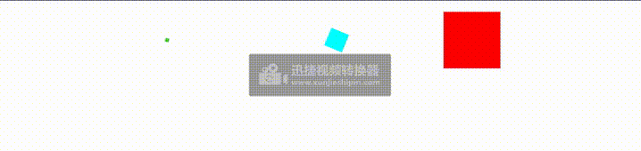

### Tweenable接口

###  Tune
   这个tune是作用在动画之前。例如，用户在点击一个div后，才出现mojs创建的形状和动画。
   你可以创建一个`tune`开始动画之前的任何属性。这个曲调当您想为动画添加一些交互性或播放有关用户输入的形状时，方法非常方便-该方法正是为此目的而设计的（单击某个位置查看）：
   
```js
<html>
  <head>
    <title></title>
  </head>
  <style>
    #container {
      height: 100%;
      width: 100%;
      display: flex;
      flex-direction: row;
    }

    .item {
      width: 300px;
      height: 300px;
      margin-right: 10px;
    }
    .no-pointer {
      cursor: pointer;
    }
    #tune1 {
      background-color: antiquewhite;
    }
    #tune2 {
      background-color: aqua;
    }
  </style>
  <body>
    <div id="container">
      <div id="tune1" class="item"></div>
      <div id="tune2" class="item"></div>
    </div>

    <script src="http://cdn.jsdelivr.net/mojs/latest/mo.min.js"></script>
    <script>
      const parent = document.getElementById("tune1");
      let data = {
        parent: parent,
        fill: "none",
        radius: 25,
        strokeWidth: { 50: 0 },
        scale: { 0: 1 },
        angle: { "rand(-35, -70)": 0 },
        duration: 500,
        left: 0,
        top: 0,
        easing: "cubic.out",
        className: "no-pointer",
      };
      let circle = new mojs.Shape({
        ...data,
        stroke: "cyan",
      });
      let circle1 = new mojs.Shape({
        ...data,
        radius: 10,
        stroke: "#CF2F1A",
      });

      //动画前的点击事件
      parent.addEventListener("click", function (e) {
        // console.log(e);
        circle.tune({ x: e.offsetX, y: e.offsetY }).replay();
        circle1.tune({ x: e.offsetX, y: e.offsetY }).replay();
      });

      const parent1 = document.getElementById("tune2");
      let data1 = {
        parent: parent1,
        fill: "pink",
        radius: 25,
        scale: { 0: 1 },
        duration: 500,
        easing: "cubic.out",
        strokeWidth: { 50: 0 },
        left: "450",
        top: "150",
      };
      let circle2 = new mojs.Shape({
        parent: parent1,
        ...data1,
        stroke: "#CF2F1A",
        x: { 100: 80 },
        y: { [-100]: 0 },
      }).then({
        y: 100,
      });
      let circle3 = new mojs.Shape({
        parent: parent1,
        ...data1,
        stroke: "#CFC31A",
      });

      parent1.addEventListener("click", function (e) {
        circle2.tune({ y: -100 }).replay();
        circle3.tune({ y: { [-100]: 0 } }).replay();
      });
    </script>
  </body>
</html>

```
效果：<br>
 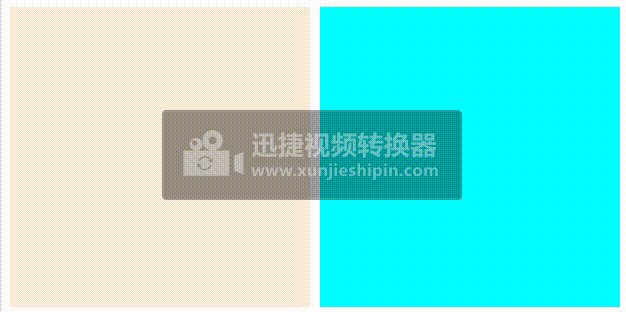

### Generate
 该方法旨在重新生成形状在初始化时具有的随机性。该方法是用来生成y一个形状的随机的大小。

```js
 <html>
  <head>
    <title></title>
  </head>
  <style>
    .container {
      width: 100%;
      height: 100%;
      display: flex;
      flex-direction: row;
    }

    .item {
      width: 300px;
      height: 300px;
    }
    #generate1 {
      background-color: aqua;
    }
  </style>
  <body>
    <div class="container">
      <div id="generate1" class="item"></div>
    </div>
    <script src="http://cdn.jsdelivr.net/mojs/latest/mo.min.js"></script>
    <script>
      const option = {
        shape: "circle",
        fill: "none",
        strokeWidth: { 50: 0 },
        duration: 1000,
        left: 20,
        width: "300",
        height: "300",
        top: 20,
        easing: "cubic.out",
        radius: 25,
      };
      const mainCircle = new mojs.Shape({
        // parent: "#generate1",
        ...option,
        stroke: "pink",
      });

      const smallCircle = [];
      const colors = ["#CD1400", "#CDC300", "#00CD5C", "#009BCD"];
      for (let i = 0; i < 4; i++) {
        smallCircle.push(
          new mojs.Shape({
            parent: mainCircle.el,
            ...option,
            stroke: colors[i],
            radius: { 0: 30 },
            strokeWidth: { 40: 0 },
            x: "rand(-50,50)",
            y: "rand(-50,50)",
            delay: "rand(0,350)",
            left: "50%",
            top: "50%",
          })
        );
      }
      document.getElementById("generate1").addEventListener("click", (e) => {
        mainCircle.tune({ x: e.pageX, y: e.pageY }).replay();
        for (let i = 0; i < smallCircle.length; i++) {
          smallCircle[i].generate().replay();
        }
      });
      console.log(mainCircle.el);
    </script>
  </body>
</html>

```
效果：<br>
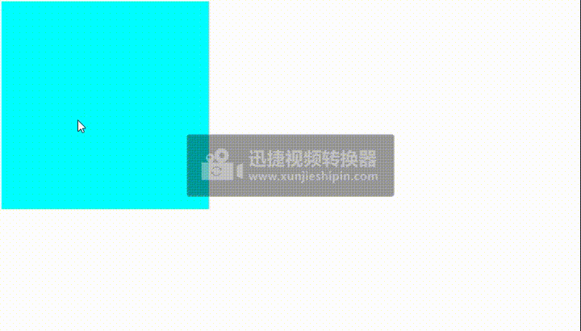

### Custom Shapes
   自定义样式。在mojs中，有默认样式circle,rect,polygon,line,cross,equal,curve、zigzag。可以自定义样式。
   您可能已经注意到mojs支持许多内置的形状。也就是说，他们是circle , 矩形 ,polygon ,线 ,cross ,平等的 ,curve和之字形的. 您可以通过为mojs提供一个符合您需要的自定义形状来扩展这组形状。为此：
  ** 在一个100x100在任何向量编辑器中的artboard（viewBox），并将形状另存为svg .

  ** 扩展创建mojs.CustomShape班级。

  ** 从svg文件中复制形状标记。。。


  ```js
<html>
  <head>
    <title></title>
  </head>
  <style>
    .contaier {
      width: 100%;
      height: 100%;
      display: flex;
      flex-direction: row;
    }

    .item {
      width: 300px;
      height: 300px;
    }
  </style>
  <body>
    <div class="contaier">
      <div id="Custom-Shapes1" class="item"></div>
    </div>
    <script src="http://cdn.jsdelivr.net/mojs/latest/mo.min.js"></script>
    <script>
      //创建一个心的形状的类，这个类继承mojs.CustomShape
      class Heart extends mojs.CustomShape {
        getShape() {
          return '<path d="M92.6 7.4c-10-9.9-26-9.9-35.9 0l-4.4 4.3a3.4 3.4 0 0 1-4.7 0l-4.3-4.3c-10-9.9-26-9.9-35.9 0a25 25 0 0 0 0 35.5l22.4 22.2 13.5 13.4a9.5 9.5 0 0 0 13.4 0L70.2 65 92.6 43a25 25 0 0 0 0-35.5z"/>';
        }
        getLength() {
          return 200;
        }
      }
      //把创建的类添加在mojs里面
      mojs.addShape("heart", Heart); // passing name and Bubble class(传递名称和泡泡类)

      /* USE CUSTOM SHAPE (使用自定义形状)*/
      // now it is available on mojs.Shape constructor as usual(现在它在mojs上可用。像往常一样构造形状)
      const heart = new mojs.Shape({
        shape: "heart", // 心的样式被使用
        fill: "none",
        stroke: "red",
        scale: { 0: 1 },
        strokeWidth: { 50: 0 },
        y: -20,
        width: 200,
        height: 200,
        duration: 1000,
      }).play();

      //创建一个新的形状的类，这个类继承mojs.CustomShape
      class Hearts extends mojs.CustomShape {
        getShape() {
          return `
    <path d="M475.19,274.75c-1.43-2.39-2.88-4.73-4.34-7C429.26,203,356.37,165.44,279.42,165c-165-.94-220.74,109.62-220.74,109.62l233.79,73.65S469.07,295.09,469.05,294,475.19,274.75,475.19,274.75Z" class="cls-1"></path>
    <path d="M292.47,349.14l-.25-.08L57.5,275.12l.43-.87c.15-.28,14.41-28.12,48.71-55.44,31.38-25,86.4-54.65,170.72-54.65h2.06c79.11.45,150.93,39,192.13,103.13q2.19,3.42,4.35,7l.19.32L476,275c-2.3,6.81-6,18-6.1,19.05,0,.89,0,1.24-88.86,28.28-44.15,13.42-88.3,26.72-88.3,26.72Zm-232.59-75,232.6,73.27c58.65-17.66,169.06-51.11,175.83-53.91.63-2.72,4.22-13.46,6-18.64q-2-3.41-4.13-6.65C429.26,204.55,358,166.28,279.41,165.83h-2.05c-83.81,0-138.45,29.43-169.62,54.23C77.08,244.45,62.56,269.24,59.88,274.13Z" class="cls-2"></path>
    <polygon points="63.82 122.03 173.17 70.54 304.38 307.91 194.09 358.44 63.82 122.03" class="cls-3"></polygon>
    <path d="M193.74,359.52l-.37-.68L62.66,121.66l.81-.38L173.52,69.45l132,238.84ZM65,122.41l129.48,235,108.77-49.84L172.82,71.62Z" class="cls-2"></path>
    <path d="M393.89,296C513.46,245.53,460,116.1,460,116.1L361.84,209l-81.16,53.18,12.13,32.65,15.86,32.65,19.59,3.73Z" class="cls-4"></path>
    <path d="M328.39,332.06l-20.29-3.87-16-33-12.39-33.34,81.72-53.54,98.92-93.62.46,1.12c.14.32,13.42,33,11.84,71.37-1.45,35.5-16.23,83.33-78.36,109.57Zm-19.16-5.34,18.9,3.6,65.43-35.1c61.37-25.9,76-73.1,77.39-108.13,1.4-34-9-63.49-11.27-69.54l-97.27,92-80.72,52.9,11.9,32Z" class="cls-2"></path>
    <path d="M124.16,149.86l-5.82-11L170,111.49l5.83,11Z" class="cls-2"></path>
    <path d="M102.07,132.57l11.2-5.45,15.65,30.19-11.2,5.45Z" class="cls-2"></path>
    <path d="M154.31,108.37l11-5.89,10.35,19.73-10.94,6Z" class="cls-2"></path>
    <path d="M206.9,191.47q7.71,14.57,3.16,24.71-3.88,8.61-15.66,14.84-14,7.42-24,4.08-8.91-3.12-15-14.59-8.13-15.34-3.12-26.33,3.81-8.18,15.28-14.24,13.24-7,22.83-4.2T206.9,191.47Zm-8.73,4.31a15,15,0,0,0-4.86-5.52,11.66,11.66,0,0,0-6.49-2.06,18.75,18.75,0,0,0-5.81.94,35.58,35.58,0,0,0-6.58,2.64,41,41,0,0,0-6.61,4.39,23.57,23.57,0,0,0-4.52,4.58q-4.06,6,.49,14.62,2.51,4.73,5.79,6.26a14.17,14.17,0,0,0,10.29.51,44.74,44.74,0,0,0,8.59-3.46,31.66,31.66,0,0,0,6.91-4.85,16.54,16.54,0,0,0,4.08-5.33,11.82,11.82,0,0,0,.76-6A19.44,19.44,0,0,0,198.17,195.78Z" class="cls-2"></path>
    <path d="M253.92,281.88q7.71,14.56,3.16,24.72-3.88,8.61-15.66,14.83-14,7.43-24,4.09-8.91-3.12-15-14.6-8.13-15.35-3.12-26.32,3.81-8.18,15.28-14.25,13.26-7,22.83-4.19T253.92,281.88Zm-8.72,4.32a15.1,15.1,0,0,0-4.86-5.52,11.64,11.64,0,0,0-6.51-2.06,18.39,18.39,0,0,0-5.8.93,35.88,35.88,0,0,0-6.58,2.65,40.34,40.34,0,0,0-6.61,4.39,23.56,23.56,0,0,0-4.52,4.57q-4.06,6,.49,14.62c1.67,3.16,3.6,5.24,5.8,6.27a14.12,14.12,0,0,0,10.29.5,44,44,0,0,0,8.58-3.45,32.68,32.68,0,0,0,6.92-4.85,16.74,16.74,0,0,0,4.07-5.33,11.75,11.75,0,0,0,.76-6A19.5,19.5,0,0,0,245.2,286.2Z" class="cls-2"></path>
    <path d="M286.6,274.69C412.54,266.23,451,161.35,461.09,126.78a13.65,13.65,0,0,0-7.31-16.25c-58.72-26.71-138.32,2.24-138.32,2.24l-58.1,90.62,4.67,28Z" class="cls-5"></path>
    <path d="M286.14,275.55l-.26-.45L261.2,231.51l-4.71-28.3.17-.27,58.25-90.85.26-.1a264.64,264.64,0,0,1,47.31-11.18c25-3.57,61.12-4.92,91.64,9A14.5,14.5,0,0,1,461.89,127c-6.53,22.27-19.46,54.92-44,84-33,39.13-77.12,60.82-131.25,64.45Zm-23.32-44.46,24.25,42.73c53.42-3.71,97-25.18,129.57-63.83,24.34-28.9,37.17-61.32,43.65-83.44a12.81,12.81,0,0,0-6.85-15.26c-30.15-13.71-66-12.37-90.73-8.84a264.82,264.82,0,0,0-46.71,11l-57.77,90.1Z" class="cls-2"></path>
    <path d="M267.25,237.63c87.54-18.1,87.54-75,83.45-98.8a22.08,22.08,0,0,0-11.33-15.63C250.19,75.1,220.1,155.43,220.1,155.43Z" class="cls-6"></path>
    <path d="M266.82,238.56l-.29-.52-47.35-82.53.14-.37c.12-.32,12.38-32.24,43.37-43.86,22-8.27,48-4.5,77.07,11.19a23.06,23.06,0,0,1,11.76,16.21c4.12,23.92,4.15,81.52-84.11,99.76ZM221,155.37l46.65,81.32c86.25-18.08,86.24-74.34,82.22-97.73a21.4,21.4,0,0,0-10.92-15c-28.64-15.45-54.11-19.19-75.68-11.1C234.77,123.51,222.45,151.85,221,155.37Z" class="cls-2"></path>
    <path d="M446.2,447.83l30.08-169.51a4.8,4.8,0,0,0-6.52-5.29C284,345.59,104.19,287.34,65,272.86a4.8,4.8,0,0,0-6.37,5.37l30.1,169.6Z" class="cls-7"></path>
    <path d="M446.9,448.65H88l-.12-.68L57.81,278.38A5.64,5.64,0,0,1,59.75,273a5.54,5.54,0,0,1,5.54-.95c34.71,12.83,217.38,73.13,404.17.18a5.6,5.6,0,0,1,5.67.88,5.54,5.54,0,0,1,2,5.32ZM89.42,447H445.5l30-168.82a3.87,3.87,0,0,0-1.38-3.74,4,4,0,0,0-4-.63c-79,30.84-165.67,41.81-257.73,32.61-72.9-7.28-127.52-25.35-147.62-32.77a3.89,3.89,0,0,0-3.89.66,4,4,0,0,0-1.37,3.79Z" class="cls-2"></path>
    <path d="M163.41,409.67a14.44,14.44,0,0,0,21.39-9.13c7.08-29.37,23.63-60.35,23.63-60.35s98.83-33.56,117.93,4.76c8.82,17.69,15,42.46,19,64a14.46,14.46,0,0,0,21.11,9.95C431,384.17,467.81,324,467.81,324l.53-1,7.94-44.71a4.8,4.8,0,0,0-6.52-5.28C284,345.59,104.19,287.34,65,272.86a4.8,4.8,0,0,0-6.37,5.37l9.21,51.9C101.3,366.08,133.24,391.94,163.41,409.67Z" class="cls-7"></path>
    <path d="M446.2,447.83,468.34,323l-.53,1S431,384.17,366.5,418.89a14.46,14.46,0,0,1-21.11-9.95c-4.06-21.53-10.21-46.3-19-64-19.1-38.32-117.93-4.76-117.93-4.76s-16.55,31-23.63,60.35a14.44,14.44,0,0,1-21.39,9.13c-30.17-17.73-62.11-43.59-95.57-79.54l20.89,117.7Z" class="cls-8"></path>
    <path d="M447.34,449.2H87.58L57.28,278.48a6.17,6.17,0,0,1,8.19-6.9c34.7,12.81,217.22,73,403.79.17a6.18,6.18,0,0,1,6.22,1,6.08,6.08,0,0,1,2.15,5.83ZM89.87,446.46H445.05l29.88-168.39a3.33,3.33,0,0,0-1.19-3.22,3.44,3.44,0,0,0-3.49-.54C282.76,347.54,99.38,287,64.52,274.15a3.35,3.35,0,0,0-3.36.57A3.44,3.44,0,0,0,60,278Z" class="cls-2"></path>
    <path d="M249.28,341.57a516.44,516.44,0,0,1-76.73-5.51c-66.38-10-102.47-30.15-102.83-30.35a.83.83,0,0,1,.82-1.45c.36.2,36.25,20.24,102.36,30.17,61,9.16,161,11.34,290.74-30.34a.84.84,0,0,1,1.05.54.83.83,0,0,1-.54,1C378.83,333.08,306.34,341.57,249.28,341.57Z" class="cls-2"></path>
    <ellipse ry="58.24" rx="59.15" cy="336.98" cx="264.16" class="cls-9"></ellipse>
    <path d="M264.16,399.12c-34.8,0-63.11-27.87-63.11-62.14s28.31-62.14,63.11-62.14,63.12,27.88,63.12,62.14S299,399.12,264.16,399.12Zm0-117c-30.73,0-55.73,24.62-55.73,54.87s25,54.87,55.73,54.87,55.73-24.61,55.73-54.87S294.89,282.11,264.16,282.11Z" class="cls-10"></path>
    <path d="M296.26,351.08c-3.75-1.23-8.77-3.12-14.36-5.1a73.36,73.36,0,0,0,7.8-19.36H271.27V320.1h22.58v-3.64H271.27V305.6h-9.22a1.55,1.55,0,0,0-1.62,1.56v9.3H237.59v3.64h22.84v6.52H241.57v3.64h36.58a62.92,62.92,0,0,1-5.27,12.64c-11.86-3.85-24.53-7-32.48-5-5.09,1.23-8.37,3.42-10.3,5.72-8.83,10.56-2.5,26.59,16.17,26.59,11,0,21.66-6,29.9-16,12.28,5.8,36.61,15.75,36.61,15.75l6.94-12.08s-10-2.35-23.46-6.77M244.52,364c-14.55,0-18.85-11.25-11.66-17.41,2.4-2.08,6.79-3.09,9.12-3.32,8.65-.84,16.65,2.4,26.09,6.92C261.43,358.72,253,364,244.52,364" class="cls-10"></path>
`;
        }
        getLength() {
          return 2000;
        }
      }
      //把创建的类添加在mojs里面
      mojs.addShape("hearts", Hearts); // passing name and Bubble class(传递名称和泡泡类)
      new mojs.Shape({
        parent: "#Custom-Shapes1",
        shape: "hearts", // 心的样式被使用
        fill: "none",
        stroke: "red",
        width: 1000,
        height: 1000,
        scale: { 0: 1 },
        strokeWidth: { 10: 1 },
        y: -20,
        duration: 1000,
        isYoyo: true, //动画在达到最终状态后向后播放,默认为false
        isShowStart: true,
      }).play();
    </script>
  </body>
</html>

```

效果：<br>
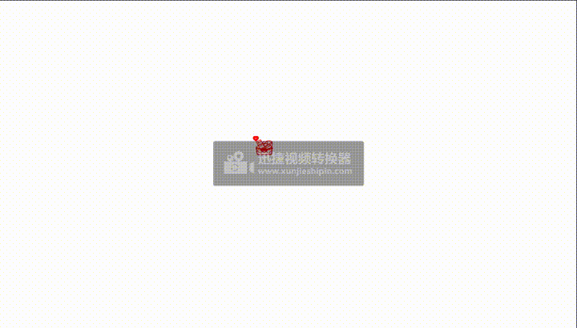


###  ShapeSwirl
   翻译为形状线，`ShapeSwirl`模块基本上是形状加上更多的功能。ShapeSwirl会自动计算形状的正弦x/y路径，使其易于通过正弦轨迹发送形状。

   `请注意`:ShapeSwirl的默认值为{ 1 : 0 }对于规模所以它会逐渐消失。
   为了触发动画，我们在容器中添加了一个单击事件侦听器，然后运行shapeswirl.replay() .
```js
<html>
  <head>
    <title></title>
  </head>
  <style>
    #container {
      width: 100%;
      height: 100%;
    }

    .item {
      width: 300px;
      height: 300px;
    }
    #shapeswirl1 {
      background-color: aquamarine;
    }
  </style>
  <body>
    <div id="container">
      <div id="shapeswirl1" class="item"></div>
    </div>
    <script src="http://cdn.jsdelivr.net/mojs/latest/mo.min.js"></script>
    <script src="http://libs.baidu.com/jquery/2.0.0/jquery.min.js"></script>
    <script>
      //创建形状
      class Start extends mojs.CustomShape {
        getShape() {
          return '<path d="M92.6 7.4c-10-9.9-26-9.9-35.9 0l-4.4 4.3a3.4 3.4 0 0 1-4.7 0l-4.3-4.3c-10-9.9-26-9.9-35.9 0a25 25 0 0 0 0 35.5l22.4 22.2 13.5 13.4a9.5 9.5 0 0 0 13.4 0L70.2 65 92.6 43a25 25 0 0 0 0-35.5z"/>';
        }
        getLength() {
          return 300;
        }
      }

      mojs.addShape("start", Start);
      const shapeswirl = new mojs.ShapeSwirl({
        parent: "#shapeswirl1",
        shape: "start",
        fill: "#F64040",
        y: { 0: -150 },
        duration: 1000,
        width: 100,
        height: 100,
        top: "15%",
        left: "10%",
      });

      document
        .getElementById("shapeswirl1")
        .addEventListener("click", function () {
          shapeswirl.replay();
        });
    </script>
  </body>
</html>

```
 效果：<br>
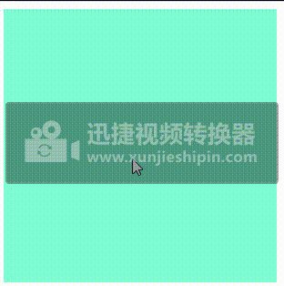

   为了让你控制这种行为，ShapeSwirl接受更多的属性，因此可以定义路径和其他支持参数的频率或大小：

```js
<html>
  <head>
    <title></title>
  </head>
  <style>
    #container {
      width: 100%;
      height: 100%;
    }

    .item {
      width: 300px;
      height: 300px;
    }
    #shapeswirl1 {
      background-color: aquamarine;
    }
  </style>
  <body>
    <div id="container">
      <div id="shapeswirl1" class="item"></div>
    </div>
    <script src="http://cdn.jsdelivr.net/mojs/latest/mo.min.js"></script>
    <script src="http://libs.baidu.com/jquery/2.0.0/jquery.min.js"></script>
    <script>
      //创建形状
      class Start extends mojs.CustomShape {
        getShape() {
          return '<path d="M92.6 7.4c-10-9.9-26-9.9-35.9 0l-4.4 4.3a3.4 3.4 0 0 1-4.7 0l-4.3-4.3c-10-9.9-26-9.9-35.9 0a25 25 0 0 0 0 35.5l22.4 22.2 13.5 13.4a9.5 9.5 0 0 0 13.4 0L70.2 65 92.6 43a25 25 0 0 0 0-35.5z"/>';
        }
        getLength() {
          return 300;
        }
      }

      mojs.addShape("start", Start);
      const shapeswirl = new mojs.ShapeSwirl({
        parent: "#shapeswirl1",
        shape: "start",
        fill: "#F64040",
        width: 100,
        height: 100,
        top: "15%",
        left: "10%",
        y: { 0: -150 },
        // other props:
        isSwirl: true, // sets if the shape should follow sinusoidal path, true by default
        swirlSize: 10, // defines amplitude of the sine
        swirlFrequency: 3, // defines frequency of the sine
        pathScale: "rand( .1, 1 )", // defines how much the total path length should be scaled
        direction: 1, // direction of the sine could be 1 or -1
        degreeShift: 45, // rotatation shift for the sinusoidal path
      });

      document
        .getElementById("shapeswirl1")
        .addEventListener("click", function () {
          shapeswirl.replay();
        });
    </script>
  </body>
</html>
```
 效果：<br>
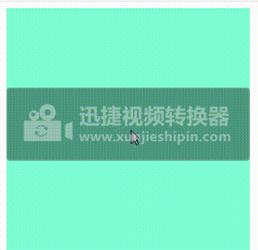


 #### 1. isSwirl
这个`isSwirl`财产(是的默认情况下）定义形状是否应遵循正弦路径（如果设置为）false它的行为和简单的一模一样形状 
```js
无
```
 #### 2. swirlSize
这个`swirlSize`财产( ten默认情况下）定义正弦的偏差或振幅。下面是一个例子`swirlSize: 35` :
```js
const swirl = new mojs.ShapeSwirl({
  fill:           '#F64040',
  y:              { 0: -150 },
  radius:         8,
  swirlSize:      35,
  swirlFrequency: 4,
  duration:       1000,
  direction:       -1,
});
```
 #### 3. 涡流频率
这个`swirlFrequency`财产( three默认情况下）定义正弦的频率，下面是一个swirlFrequency: 10 :
```js
const swirl = new mojs.ShapeSwirl({
  fill:           '#F64040',
  y:              { 0: -150 },
  radius:         8,
  swirlFrequency: 10,
  duration:       1000,
});

```
 ####  4方向
这个`direction`财产( one默认情况下）定义正弦振幅的方向-它的值为1或 -1. 以下是-1. 注意它是如何从左边开始而不是从右边开始的：
```js
const swirl = new mojs.ShapeSwirl({
  fill:           '#F64040',
  y:              { 0: -150 },
  radius:         8,
  direction:      -1,
  swirlSize:      35,
  swirlFrequency: 4,
  duration:       1000
});
```
#### 5 路径标度
这个pathScale财产( one默认情况下）定义正弦路径的缩放大小。下面是一个pathScale: .5-将正弦放大一半（原始半径）：
```js
const swirl = new mojs.ShapeSwirl({
  fill:           '#F64040',
  y:              { 0: -150 },
  radius:         8,
  pathScale:      .5,
  duration:       1000,
});
```
pathScale缩放漩涡的实际路径，例如，如果要为十属性，则路径比例将影响y和十-形状在移动时形成的实际路径
```js

const swirl = new mojs.ShapeSwirl({
  fill:           '#F64040',
  x:              { 0: -100 },
  y:              { 0: -150 },
  radius:         8,
  pathScale:      .5,
  duration:       1000,
});

```


#### 6 键盘标签
这个degreeShift财产( zero默认情况下）定义漩涡的旋转。当shapeSwirl用于其他模块（如爆裂)。现在它的作用就像正弦路径的旋转一样。下面是一个例子degreeShift: 90 :

```js
const swirl = new mojs.ShapeSwirl({
  fill:           '#F64040',
  y:              { 0: -150 },
  radius:         8,
  degreeShift:    90,
  duration:       1000,
});
```
 效果：<br>
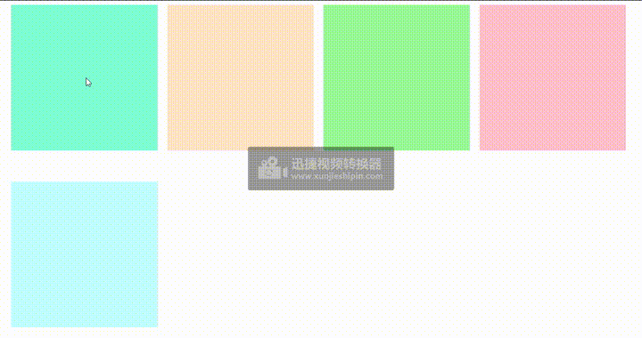

### 点击mojs创建的形状,修改形状

```js
<html>
  <head>
    <title></title>
    <style>
      #container {
        height: 600px;
      }
      #containers {
        height: 600px;
      }
    </style>
  </head>
  <body>
    <div id="container"></div>
    <div id="containers"></div>
    <script src="http://cdn.jsdelivr.net/mojs/latest/mo.min.js"></script>
    <script src="http://libs.baidu.com/jquery/2.0.0/jquery.min.js"></script>
    <script>
      var count = 1;
      let data = new mojs.Shape({
        shape: "rect",
        parent: "#containers",
        rotate: { [-180]: 260 },
        isShowStart: true,
        fill: "red",
        stroke: "red",
        repeat: 4,
        className: "svg-rect",
        onComplete() {
          this.el.addEventListener(
            "click",
            function (e) {
              let dataSvg = `<circle fill-opacity="1" stroke-linecap="" stroke-dashoffset="" fill="pink" stroke-dasharray="" stroke-opacity="1" stroke-width="2" r="100" stroke="pink" width="200" height="200" x="1" y="1" rx="0" ry="0"></circle>`;
              let dataSvgout = `<svg style=\"display: block; width: 100%; height: 100%; left: 0px; top: 0px;\">${dataSvg}</svg>`;

              let dataSvgs = `<rect fill-opacity=\"1\" stroke-linecap=\"\" stroke-dashoffset=\"\" fill=\"pink\" stroke-dasharray=\"\" stroke-opacity=\"1\" stroke-width=\"2\" r=\"100\" stroke=\"pink\" width=\"200\" height=\"200\" x=\"1\" y=\"1\" rx=\"0\" ry=\"0\"></rect>`;
              let dataSvgsout = `<svg style=\"display: block; width: 100%; height: 100%; left: 0px; top: 0px;\">${dataSvgs}</svg>`;
              if (count % 2 == 0) {
                e.path[1].outerHTML = dataSvgout;
                e.path[1].innerHTML = dataSvg;
              } else {
                e.path[1].outerHTML = dataSvgsout;
                e.path[1].innerHTML = dataSvgs;
              }
              count++;
              //   //修改样式
              new mojs.Shape({
                fill: "none",
                stroke: "pink",
                shape: "rect",
                parent: "#container",
                width: 100,
                height: 100,
                scale: { 0: 5 },
                duration: 1000,
                deplay: 500,
              }).play();
            },
            false
          );
        },
      }).play();

      //   $(".svg-rect").click(function () {
      //     console.log(333333333);
      //   });

      var molinkEl = document.getElementById("container"),
        moTimeline = new mojs.Timeline(),
        moburst1 = new mojs.Burst({
          parent: molinkEl,
          duration: 1300,
          shape: "circle",
          fill: [
            "#988ADE",
            "#DE8AA0",
            "#8AAEDE",
            "#8ADEAD",
            "#DEC58A",
            "#8AD1DE",
          ],
          x: "0%",
          y: "-50%",
          radius: { 0: 60 },
          count: 6,
          isRunLess: true,
          easing: mojs.easing.bezier(0.1, 1, 0.3, 1),
        }),
        moburst2 = new mojs.Burst({
          parent: molinkEl,
          duration: 1600,
          delay: 100,
          shape: "circle",
          fill: [
            "#988ADE",
            "#DE8AA0",
            "#8AAEDE",
            "#8ADEAD",
            "#DEC58A",
            "#8AD1DE",
          ],
          x: "-400%",
          y: "-420%",
          radius: { 0: 120 },
          count: 14,
          isRunLess: true,
          easing: mojs.easing.bezier(0.1, 1, 0.3, 1),
        }),
        moburst3 = new mojs.Burst({
          parent: molinkEl,
          duration: 1500,
          delay: 200,
          shape: "circle",
          fill: [
            "#988ADE",
            "#DE8AA0",
            "#8AAEDE",
            "#8ADEAD",
            "#DEC58A",
            "#8AD1DE",
          ],
          x: "130%",
          y: "-70%",
          radius: { 0: 90 },
          count: 8,
          isRunLess: true,
          easing: mojs.easing.bezier(0.1, 1, 0.3, 1),
        }),
        moburst4 = new mojs.Burst({
          parent: molinkEl,
          duration: 2000,
          delay: 300,
          shape: "circle",
          fill: [
            "#988ADE",
            "#DE8AA0",
            "#8AAEDE",
            "#8ADEAD",
            "#DEC58A",
            "#8AD1DE",
          ],
          x: "-20%",
          y: "-150%",
          radius: { 0: 60 },
          count: 14,
          isRunLess: true,
          easing: mojs.easing.bezier(0.1, 1, 0.3, 1),
        }),
        moburst5 = new mojs.Burst({
          parent: molinkEl,
          duration: 1400,
          delay: 400,
          shape: "circle",
          fill: [
            "#988ADE",
            "#DE8AA0",
            "#8AAEDE",
            "#8ADEAD",
            "#DEC58A",
            "#8AD1DE",
          ],
          x: "30%",
          y: "-100%",
          radius: { 0: 60 },
          count: 12,
          isRunLess: true,
          easing: mojs.easing.bezier(0.1, 1, 0.3, 1),
        });

      moTimeline.add(moburst1, moburst2, moburst3, moburst4, moburst5);
      molinkEl.addEventListener("click", function () {
        moTimeline.play();
      });
      //   moburst1.addEventListener("click", function () {});
    </script>
  </body>
</html>

 ```

 效果：<br>
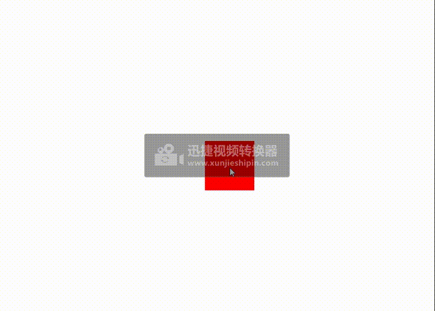


实例的方法：
.play() // 执行动画

.pause() // 暂停动画

.stop() // 结束动画

.replay() // 重播动画，相当于stop + play

##  Burst(爆破)
`Burst`是一个高阶模块，可以在屏幕的任何部分创建复杂的视觉效果。你能想到爆裂作为一个粒子发射器`ShapeSwirl`在一起，形成一个粒子圈。

### API参考：
```js

const burst = new mojs.Burst({

  /* BURST PROPERTIES */

  // Parent of the module. {String, Object} [selector, HTMLElement]
  parent:           document.body,

  // Class name. {String}
  className:        '',

  // ∆ , Units :: Left position of the module. {Number, String}
  left:             '50%',

  // ∆ , Units :: Top position of the module. {Number, String}
  top:              '50%',

  // ∆ , Units :: X shift. {Number, String}
  x:                0,

  // ∆ , Units :: Y shift. {Number, String}
  y:                0,

  // ∆ :: Angle. {Number, String}
  rotate:            0,

  // ∆ :: Scale of the module. {Number}
  scale:            1,

  // ∆ :: Explicit scaleX value (fallbacks to `scale`). {Number}
  scaleX:           null,

  // ∆ :: Explicit scaleX value (fallbacks to `scale`). {Number}
  scaleY:           null,

  // ∆ , Unit :: Origin for `x`, `y`, `scale`, `rotate` properties. {String}
  origin:           '50% 50%',

  // ∆ :: Opacity. {Number} [ 0..1 ]
  opacity:          1,

  /*
    Radius of the radial shape that child particles form. Note that it has different meaning compared to shape-swirl. Burst `radius` defines radius of the children module
  */
  radius:       null,

  // Quantity of Burst particles. {Number} [ > 0 ]
  count:    5,

  // Degree of circlular shape that the particles form. {Number} [ > 0 ]
  degree:   360,

  // ∆ :: Radius of the Burst. {Number}
  radius:   { 0: 50 },

  // ∆ :: Radius X of the Burst (fallbacks to `radius`). {Number}
  radiusX:  null,

  // ∆ :: Radius Y of the Burst (fallbacks to `radius`). {Number}
  radiusY:  null,

  // If should hide module with `transforms` instead of `display`. {Boolean}
  isSoftHide:       true,

  // If should trigger composite layer for the module. {Boolean}
  isForce3d:        false,

  // If should be shown before animation starts. {Boolean}
  isShowStart:      false,

  // If should stay shown after animation ends. {Boolean}
  isShowEnd:        true,

  // If refresh state on subsequent plays. {Boolean}
  isRefreshState:   true,

  /*
    Options for each children ShapeSwirl element. {Object}
    Supports `Stagger` strings for numeric values and `Property Maps` overall.
    see `Stagger Strings` and `Property Maps` section for more info.
  */
  children: {
    /* (+) SHAPE SWIRL PROPERTIES AND CALLBACKS (excluding `x` and `y`) - see ShapeSwirl API */
  }

  // Options for timeline that controls all child and main Shape Swirls. {Object}
  timeline: {
   /* (+) TIMELINE PROPERTIES AND CALLBACKS - see Tween API */
  }

})

  /*
    Creates next state transition chain.
    @param options {Object} Next shape state.
  */
  .then({ /* next state options */ })

  /*
    Tunes start state with new options.
    @param options {Object} New start properties.
  */
  .tune({ /* new start properties */ })

  /*
    Regenerates all randoms in initial properties.
  */
  .generate()

  /*
    Starts playback.
    @param shift {Number} Start progress shift in milliseconds.
  */
  .play( shift = 0 )
  /*
    Starts playback in backward direction.
    @param shift {Number} Start progress shift in milliseconds.
  */
  .playBackward( shift = 0 )
  /*
    Pauses playback.
  */
  .pause()
  /*
    Restarts playback.
    @param shift {Number} Start progress shift in milliseconds.
  */
  .replay( shift = 0 )
  /*
    Restarts playback in backward direction.
    @param shift {Number} Start progress shift in milliseconds.
  */
  .replayBackward( shift = 0 )
  /*
    Resumes playback in direction it was prior to `pause`.
    @param shift {Number} Start progress shift in milliseconds.
  */
  .resume( shift = 0 )
  /*
    Sets progress of the tween.
    @param progress {Number} Progress to set [ 0..1 ].
  */
  .setProgress( progress )
  /*
    Sets speed of the tween.
    @param speed {Number} Progress to set [ 0..∞ ].
  */
  setSpeed ( speed )

  /* Stops and resets the tween. */
  reset ( speed )

  ```
默认情况下的代码：
```js
const burst = new mojs.Burst();
document.addEventListener( 'click', function (e) {
  burst.replay();
});
```
完成代码：
```js
<html>
  <head>
    <title></title>
  </head>
  <body>
    <script src="http://libs.baidu.com/jquery/2.0.0/jquery.min.js"></script>
    <script src="http://cdn.jsdelivr.net/mojs/latest/mo.min.js"></script>

    <script>
      const burst = new mojs.Burst({
          radius: { 0: 44440 },
          count:    30
      });
      document.addEventListener("click", function (e) {
        burst.replay();
      });
    </script>
  </body>
</html>
```

效果：<br>
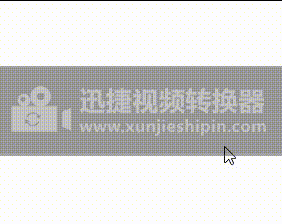

就像和`Shape`，`mojs`负责所有的引导工作，为爆发创建尽可能窄的容器，并为您定位效果。

radius属性：代表控制粒子的径向形状的半径。
count属性:   代表多少个粒子数

```js
<html>
  <head>
    <title></title>
  </head>
  <body>
    <script src="http://libs.baidu.com/jquery/2.0.0/jquery.min.js"></script>
    <script src="http://cdn.jsdelivr.net/mojs/latest/mo.min.js"></script>

    <script>
      const burst = new mojs.Burst({
        radius: { 0: 460 },
        count: 30,
      });
      document.addEventListener("click", function (e) {
        burst.replay();
      });
    </script>
  </body>
</html>
```
效果：<br>
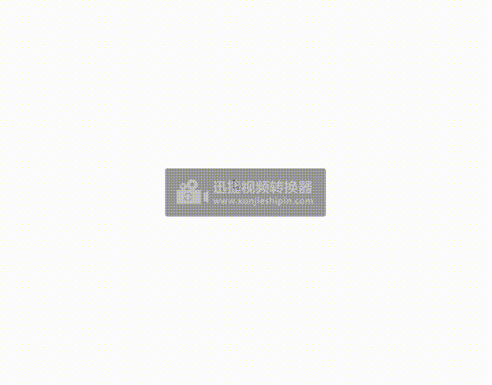

在默认属性中，爆炸的粒子均匀地分布在一个360度的圆圈里，你可以用`degree`属性可以分配粒子的范围（相当于把所有的粒子都集中在一个角度范围内显示）：

```js
<html>
  <head>
    <title></title>
  </head>
  <body>
    <script src="http://libs.baidu.com/jquery/2.0.0/jquery.min.js"></script>
    <script src="http://cdn.jsdelivr.net/mojs/latest/mo.min.js"></script>

    <script>
      const burst = new mojs.Burst({
        radius: { 0: 100 },
        count: 10,
        degree: 30,
      });
      document.addEventListener("click", function (e) {
        burst.replay();
      });
    </script>
  </body>
</html>
```
效果：<br>
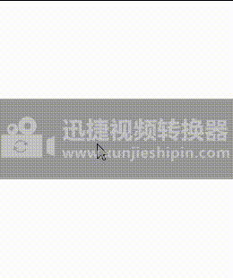


angle代表爆炸的粒子的在扩散的旋转运行
```js
<html>
  <head>
    <title></title>
  </head>
  <body>
    <script src="http://libs.baidu.com/jquery/2.0.0/jquery.min.js"></script>
    <script src="http://cdn.jsdelivr.net/mojs/latest/mo.min.js"></script>

    <script>
      const burst = new mojs.Burst({
        radius: { 0: 100 },
        count: 10,
        angle: { 0: 90 },
      });
      document.addEventListener("click", function (e) {
        burst.replay();
      });
    </script>
  </body>
</html>

```
效果：<br>
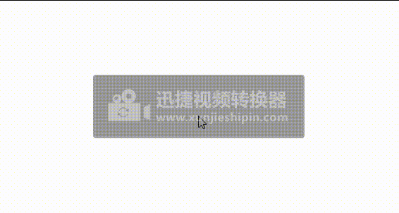

### Children Options
burst有一个属性`children`，这个属性好像下面有关于`fill`、`stroek`等等基本属性，可以控制粒子在扩散中的颜色，形状的变化

基本默认样式：
```js

<html>
  <head>
    <title></title>
  </head>
  <body>
    <script src="http://libs.baidu.com/jquery/2.0.0/jquery.min.js"></script>
    <script src="http://cdn.jsdelivr.net/mojs/latest/mo.min.js"></script>

    <script>
      const burst = new mojs.Burst({
        radius: { 0: 100 },
        count: 10,
        angle: { 0: 90 },
        children: {
          fill: { magenta: "cyan" },
          duration: 2000,
        },
      });
      document.addEventListener("click", function (e) {
        burst.replay();
      });
    </script>
  </body>
</html>

```
效果：<br>
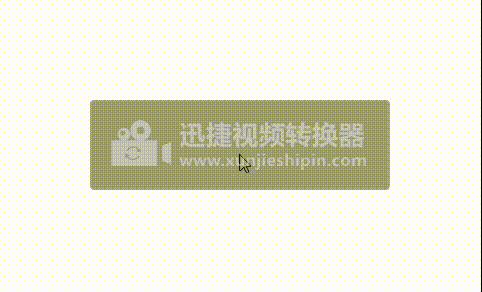


关于burst可以把`Shape`当自己的子元素使用相当于children，dhildren该属性可以使用Shape的所有预属性。


```js

<html>
  <head>
    <title></title>
  </head>
  <body>
    <script src="http://libs.baidu.com/jquery/2.0.0/jquery.min.js"></script>
    <script src="http://cdn.jsdelivr.net/mojs/latest/mo.min.js"></script>

    <script>
      const burst = new mojs.Burst({
        radius: { 0: 100 },
        count: 10,
        angle: { 0: 90 },
        children: {
          fill: { magenta: "cyan" },
          duration: 2000,
          shape: "polygon",
          radius: 20,
          angle: { 360: 0 },
          duration: 2000,
          points: 5,
        },
      });
      document.addEventListener("click", function (e) {
        burst.replay();
      });
    </script>
  </body>
</html>
```
效果：<br>
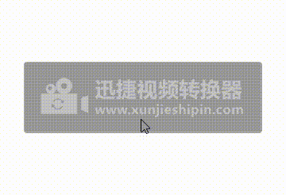

#### Stagger Strings
`Stagger Strings`用于表示具有某些已定义步骤的连续数值(相当于多个相同形状连续的放大，扩散等)（请参见子级的延迟属性）：
```js
<html>
  <head>
    <title></title>
  </head>
  <body>
    <script src="http://libs.baidu.com/jquery/2.0.0/jquery.min.js"></script>
    <script src="http://cdn.jsdelivr.net/mojs/latest/mo.min.js"></script>

    <script>
      const burst = new mojs.Burst({
        radius: { 0: 100 },
        count: 10,
        angle: { 0: 90 },
        children: {
          fill: { magenta: "cyan" },
          duration: 2000,
          shape: "polygon",
          radius: 20,
          angle: { 360: 0 },
          duration: 2000,
          points: 5,
          delay: "stagger(0, 100)",
        },
      });
      document.addEventListener("click", function (e) {
        burst.replay();
      });
    </script>
  </body>
</html>
```
效果：<br>
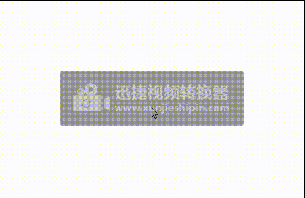


`stagger(0, 100)` k开始值为0 每隔100就出现一个形状，第一个参数：初始值，第二个参数：步履（步数，秒数）。每个数值都可以用交错刺来表示。此外，交错刺里面的参数还可使用rand()随机函数。

```js

<html>
  <head>
    <title></title>
  </head>
  <body>
    <script src="http://libs.baidu.com/jquery/2.0.0/jquery.min.js"></script>
    <script src="http://cdn.jsdelivr.net/mojs/latest/mo.min.js"></script>

    <script>
      const burst = new mojs.Burst({
        radius: { 0: 100 },
        count: 10,
        angle: { 0: 90 },
        children: {
          fill: { magenta: "cyan" },
          duration: 2000,
          shape: "polygon",
          radius: 20,
          angle: { 360: 0 },
          duration: 2000,
          points: 5,
          delay: "stagger(rand(0,200))",
        },
      });
      document.addEventListener("click", function (e) {
        burst.replay();
      });
    </script>
  </body>
</html>
 ```
效果：<br>

 
::: warning 注意
如果你运行.generate()函数在播放突发之前，每次播放突发时都将重新计算所有随机值。这样地：
```js
burst.generate();
burst.replay();
```
:::

#### Property Maps
属性映射被设计用来表示顺序值。您可以使用它来生成重复但映射到子长度的值。基本上，它只是一个数组，它将它的值映射到子索引mod功能。 类似于给每个孩子添加不同的属性值，如fill,storke,而且这些属性是通过数组来设置。
```js
<html>
  <head>
    <title></title>
  </head>
  <body>
    <script src="http://libs.baidu.com/jquery/2.0.0/jquery.min.js"></script>
    <script src="http://cdn.jsdelivr.net/mojs/latest/mo.min.js"></script>

    <script>
      const burst = new mojs.Burst({
        radius: { 0: 100 },
        count: 10,
        angle: { 0: 90 },
        children: {
          fill: [
            { deeppink: "#F505C9" },
            { cyan: "#11E3F8" },
            { yellow: "#F89C11" },
            { red: "#AE11F8" },
          ],
          duration: 2000,
          shape: "polygon",
          radius: 20,
          angle: { 360: 0 },
          duration: 2000,
          points: 5,
          delay: "stagger(rand(0,200))",
        },
      });
      document.addEventListener("click", function (e) {
        burst.replay();
      });
    </script>
  </body>
</html>

```
效果：<br>
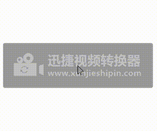

属性映射可以处理任何属性和属性形式，事实上，它只是一个棱镜（或多路复用器），它通过模函数向子对象提供属性。如果您想显式地为child设置一些属性，这是一个很好的帮助。

### then, tune, generate and play

可以使用then、tune、generate、busrt做类似Shape或者ShapeSwirl。也可以使用tween接口公共方法如play,serProgress、replay.

```js
<html>
  <head>
    <title></title>
    <style>
      .container {
        width: 100%;
        height: 100%;
      }
    </style>
  </head>
  <body>
    <div class="container"></div>
    <script src="http://libs.baidu.com/jquery/2.0.0/jquery.min.js"></script>
    <script src="http://cdn.jsdelivr.net/mojs/latest/mo.min.js"></script>
    <script>
      let burst = new mojs.Burst({
        parent: ".container",
        radius: { 0: 50 },
        angle: { 360: 0 },
        x: 0,
        y: 0,
        left: "0%",
        top: "0%",
        width: 300,
        height: 300,
        children: {
          fill: [
            { deeppink: "#F505C9" },
            { cyan: "#11E3F8" },
            { yellow: "#F89C11" },
            { red: "#AE11F8" },
          ],
          duration: 2000,
          shape: "polygon",
          radius: 20,
          angle: { 360: 0 },
          duration: 2000,
          points: 5,
          delay: "stagger(rand(0,200))",
        },
      });

      document.addEventListener("click", function (e) {
        burst.tune({ x: e.pageX, y: e.pageY }).setSpeed(3).replay();
      });
    </script>
  </body>
</html>

```
效果：<br>
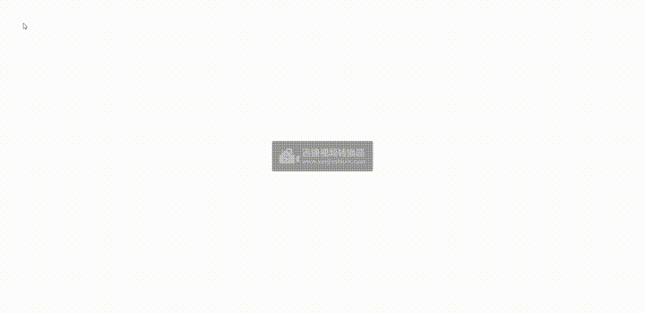


案例1：
点击界面，形成一个线段组成的图片；
```js
<html>
  <head>
    <title></title>
    <style>
      .container {
        width: 100%;
        height: 100%;
      }
    </style>
  </head>
  <body>
    <div class="container"></div>
    <script src="http://libs.baidu.com/jquery/2.0.0/jquery.min.js"></script>
    <script src="http://cdn.jsdelivr.net/mojs/latest/mo.min.js"></script>
    <script>
      let burst = new mojs.Burst({
        parent: ".container",
        radius: { 0: 10 },
        left: "0%",
        top: "0%",
        width: 300,
        height: 300,
        children: {
          fill: [
            { deeppink: "#F505C9" },
            { cyan: "#11E3F8" },
            { yellow: "#F89C11" },
            { red: "#AE11F8" },
          ],
          duration: 2000,
          shape: "line",
          strokeWidth: 1,
          stroke: "#FD7932",
          radius: 20,
          angle: { 360: 0 },
          duration: 2000,
          points: 5,
          delay: "stagger(rand(0,200))",
        },
      });

      document.addEventListener("click", function (e) {
        console.log(e);
        burst.tune({ x: e.pageX, y: e.pageY }).setSpeed(3).replay();
      });
    </script>
  </body>
</html>
```
效果：<br>
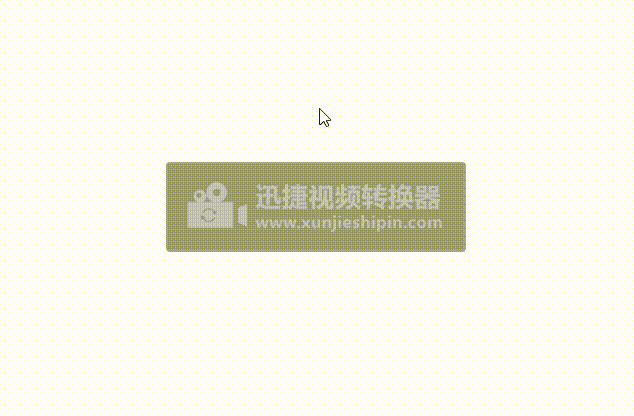


####  案例2
```js

<html>
  <head>
    <title></title>
  </head>

  <body>
    <script src="http://libs.baidu.com/jquery/2.0.0/jquery.min.js"></script>
    <script src="http://cdn.jsdelivr.net/mojs/latest/mo.min.js"></script>
    <script>
      class Start extends mojs.CustomShape {
        getShape() {
          return `<path d="M5.51132201,34.7776271 L33.703781,32.8220808 L44.4592855,6.74813038 C45.4370587,4.30369752 47.7185293,3 50,3 C52.2814707,3 54.5629413,4.30369752 55.5407145,6.74813038 L66.296219,32.8220808 L94.488678,34.7776271 C99.7034681,35.1035515 101.984939,41.7850013 97.910884,45.2072073 L75.9109883,63.1330483 L82.5924381,90.3477341 C83.407249,94.4217888 80.4739296,97.6810326 77.0517236,97.6810326 C76.0739505,97.6810326 74.9332151,97.3551083 73.955442,96.7032595 L49.8370378,81.8737002 L26.044558,96.7032595 C25.0667849,97.3551083 23.9260495,97.6810326 22.9482764,97.6810326 C19.3631082,97.6810326 16.2668266,94.4217888 17.4075619,90.3477341 L23.9260495,63.2960105 L2.08911601,45.2072073 C-1.98493875,41.7850013 0.296531918,35.1035515 5.51132201,34.7776271 Z" />`;
        }
        getLength() {
          return 500;
        }
      }
      mojs.addShape("start", Start);

      let startLine = new mojs.Burst({
        top: 0,
        left: 0,
        width: 100,
        height: 100,
        radius: { 0: 50 },
        count: 5,
        angle: { 360: 0 },
        children: {
          shape: "start",
          fill: [
            { deeppink: "#F505C9" },
            { cyan: "#11E3F8" },
            { yellow: "#F89C11" },
            { red: "#AE11F8" },
          ],
          duration: 2000,
          radius: 20,
          //   angle: { 360: 0 },
          duration: 2000,
          delay: "stagger(rand(0,200))",
        },
      });

      let start = new mojs.Shape({
        top: 0,
        left: 0,
        opacity: { 0: 0.8 },
        shape: "start",
        fill: "#F89C11",
        duration: 2000,
        radius: 20,
        duration: 2000,
        delay: "stagger(rand(0,200))",
      });

      let circle = new mojs.Shape({
        shape: "circle",
        top: 0,
        left: 0,
        width: 80,
        height: 80,
        fill: "none",
        stroke: "#AE11F8",
        angle: { 360: 0 },
        scale: { 0: 0.8 },
        strokeWidth: { 50: 0 },
        duration: 3000,
      });
      const timeline = new mojs.Timeline({ speed: 1.5 });
      timeline.add(start, startLine, circle);
      document.addEventListener("click", function (e) {
        startLine.tune({ x: e.pageX, y: e.pageY });
        start.tune({ x: e.pageX, y: e.pageY });
        circle.tune({ x: e.pageX, y: e.pageY });
        timeline.play();
      });
    </script>
  </body>
</html>
```
效果：<br>
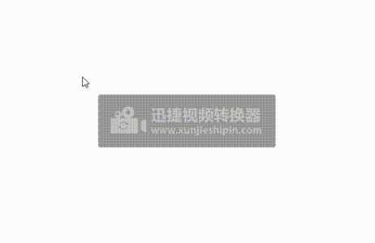

## HTML模块
   HTML模块可用于为网页上的不同HTML元素设置动画。
   为dom元素设置动画

```js
<html>
  <head>
    <title>mojs-svg</title>
  </head>
  <style>
    html,
    body {
      margin: 0 auto;
      padding: 0;
    }
    #container {
      width: 100%;
      height: 100%;
    }
  </style>
  <body>
    <div id="container">
      <div class="shape1">
        <div class="a"></div>
      </div>
    </div>
    <script src="http://libs.baidu.com/jquery/2.0.0/jquery.min.js"></script>
    <script src="http://cdn.jsdelivr.net/mojs/latest/mo.min.js"></script>

    <script>
      var htmlA = new mojs.Html({
        el: ".a",
        x: {
          0: 400,
        },
        angleZ: {
          0: 720,
        },
        background: {
          red: "black",
        },
        width: 200,
        height: 200,
        duration: 1000,
        repeat: 4,
        isYoyo: true,
      });

      document.querySelector(".shape1").addEventListener("click", function () {
        htmlA.play();
      });
    </script>
  </body>
</html>

```
 效果：<br>
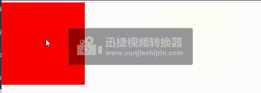

#### APi参考
模块有`transforms`/`opacity` (`十` ,`y` ,`opacity`等）下面列出的预定义属性。浏览器可以很容易地处理这些属性的动画，所以理想情况下您不应该使用预定义集之外的属性。


```js

const html = new mojs.Html({
  // HTMLElement to animate. {String, Object} [selector, HTMLElement]
  el:           null,
  // ∆ :: translateX property. {String, Number, Object} [value, delta]
  x:          0,
  // ∆ :: translateY property. {String, Number, Object} [value, delta]
  y:          0,
  // ∆ :: translateZ property. {String, Number, Object} [value, delta]
  z:          0,
  // ∆ :: skewX property. {String, Number, Object} [value, delta]
  skewX:      0,
  // ∆ :: skewY property. {String, Number, Object} [value, delta]
  skewY:      0,
  // ∆ :: rotateX property. {String, Number, Object} [value, delta]
  rotateX:     0,
  // ∆ :: rotateY property. {String, Number, Object} [value, delta]
  rotateY:     0,
  // ∆ :: rotateZ property. {String, Number, Object} [value, delta]
  rotateZ:     0,
  // ∆ :: scale property. {String, Number, Object} [value, delta]
  scale:      1,
  // ∆ :: scaleX property. {String, Number, Object} [value, delta]
  scaleX:     1,
  // ∆ :: scaleY property. {String, Number, Object} [value, delta]
  scaleY:     1,
  // ∆ :: opacity property. {String, Number, Object} [value, delta]
  opacity:    1,
  /*
    For other CSS properties please see `Other CSS properties` section.
  */

  // Custom properties to alter mojs behaviour (see `Teach mojs with customProperties` section). {Object}
  customProperties: null,
  // If should be shown before animation starts. {Boolean}
  isShowStart:      true,
  // If should stay shown after animation ends. {Boolean}
  isShowEnd:        true,
  // If should trigger composite layer for the module. {Boolean}
  isForce3d:        false,
  // If should hide module with `transforms` instead of `display`. {Boolean}
  isSoftHide:       true,
  // If refresh state on subsequent plays. {Boolean}
  isRefreshState:   true,
  // Context callbacks will be called with. {Object}
  callbacksContext: this

  /* TWEEN PROPERTIES */
  // Duration {Number}
  duration:       350,
  // Delay {Number}
  delay:          0,
  // If should repeat after animation finished {Number} *(1)
  repeat:         0,
  // Speed of the tween {Number}[0..∞]
  speed:          1,
  // If the progress should be flipped on repeat animation end {Boolean}
  isYoyo:         false,
  // Easing function {String, Function}[ easing name, path coordinates, bezier string, easing function ]
  easing:         'sin.out',
  // Easing function for backward direction of the tween animation (fallbacks to `easing`) {String, Function}[ easing name, path coordinates, bezier string, easing function ]
  backwardEasing: null,
  // properties fro entire timeline
  timeline: {
   /* (+) TIMELINE PROPERTIES AND CALLBACKS - see Tween API */
  },

  /* TWEEN CALLBACKS */
  /*
    Fires on every update of the tween in any period (including delay periods). You probably want to use `onUpdate` method instead.
    @param p {Number} Normal (not eased) progress.
    @param isForward {Boolean} Direction of the progress.
    @param isYoyo {Boolean} If in `yoyo` period.
  */
  onProgress (p, isForward, isYoyo) {},
  /*
    Fires when tween's the entire progress reaches `0` point(doesn't fire in repeat periods).
    @param isForward {Boolean} If progress moves in forward direction.
    @param isYoyo {Boolean} If progress inside `yoyo` flip period.
  */
  onStart (isForward, isYoyo) {},
  /*
    Fires when tween's the progress reaches `0` point in normal or repeat period.
    @param isForward {Boolean} If progress moves in forward direction.
    @param isYoyo {Boolean} If progress inside `yoyo` flip period.
  */
  onFirstUpdate (isForward, isYoyo) {},
  /*
    Fires on first update of the tween in sufficiently active period (excluding delay periods).
    @param ep {Number} Eased progress.
    @param p {Number} Normal (not eased) progress.
    @param isForward {Boolean} Direction of the progress.
    @param isYoyo {Boolean} If in `yoyo` period.
  */
  onUpdate (ep, p, isForward, isYoyo) {},
  /*
    Fires when tween's the progress reaches `1` point in normal or repeat period.
    @param isForward {Boolean} If progress moves in forward direction.
    @param isYoyo {Boolean} If progress inside `yoyo` flip period.
  */
  onRepeatComplete (isForward, isYoyo) {},
  /*
    Fires when tween's the entire progress reaches `1` point(doesn't fire in repeat periods).
    @param isForward {Boolean} If progress moves in forward direction.
    @param isYoyo {Boolean} If progress inside `yoyo` flip period.
  */
  onComplete (isForward, isYoyo) {},
  /* Fires when the `.play` method called and tween isn't in play state yet. */
  onPlaybackStart () {},
  /* Fires when the `.pause` method called and tween isn't in pause state yet. */
  onPlaybackPause () {},
  /* Fires when the `.stop` method called and tween isn't in stop state yet. */
  onPlaybackStop () {},
  /* Fires when the tween end's animation (regardless progress) */
  onPlaybackComplete () {},

})
  /*
    Creates next state transition chain.
    @param options {Object} Next shape state.
  */
  .then({ /* next state options */ })

  /*
    Starts playback.
    @param shift {Number} Start progress shift in milliseconds.
  */
  .play( shift = 0 )
  /*
    Starts playback in backward direction.
    @param shift {Number} Start progress shift in milliseconds.
  */
  .playBackward( shift = 0 )
  /*
    Resumes playback in direction it was prior to `pause`.
    @param shift {Number} Start progress shift in milliseconds.
  */
  .resume( shift = 0 )
  /*
    Pauses playback.
  */
  .pause()
  /*
    Stops playback.
    @param {Number} Progress to set after the stop [0...1].
  */
  .stop( progress = 0 )
  /*
    Restarts playback.
    @param shift {Number} Start progress shift in milliseconds.
  */
  .replay( shift = 0 )
  /*
    Restarts playback in backward direction.
    @param shift {Number} Start progress shift in milliseconds.
  */
  .replayBackward( shift = 0 )
  /*
    Sets progress of the tween.
    @param progress {Number} Progress to set [ 0..1 ].
  */
  .setProgress( progress )
  /*
    Sets speed of the tween.
    @param speed {Number} Progress to set [ 0..∞ ].
  */
  .setSpeed ( speed )

  /* Stops and resets the tween. */
  .reset ( speed )
```

那么，如何使用mojs的html模块的属性呢？？

1.使用属性创建HTML模块,创建一个放大缩小的dom元素
```js
<html>
  <head>
    <title></title>
    <style>
      .box {
        background-color: aquamarine;
      }
    </style>
  </head>
  <body>
    <div class="box"></div>
    <script src="http://libs.baidu.com/jquery/2.0.0/jquery.min.js"></script>
    <script src="http://cdn.jsdelivr.net/mojs/latest/mo.min.js"></script>

    <script>
      var allBoxes = document.querySelectorAll(".box");
      var animations = new Array();
      var easings = [
        "ease.in",
        "sin.in",
        "quad.in",
        "cubic.in",
        "quart.in",
        "quint.in",
        "expo.in",
        "circ.in",
        "back.in",
        "elastic.in",
      ];
      allBoxes.forEach(function (box, index) {
        var animation = new mojs.Html({
          el: box,
          width: {
            0: 550,
            duration: 4000,
            repeat: 8,
            isYoyo: true,
            easing: easings[index],
          },
          height: {
            0: 250,
            duration: 4000,
            repeat: 8,
            isYoyo: true,
            easing: easings[index],
          },
        });
        animations.push(animation);
      });

      document.addEventListener("click", function () {
        animations.forEach(function (anim) {
          anim.play();
        });
      });
    </script>
  </body>
</html>

```
 效果：<br>
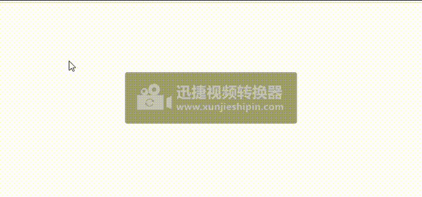

2.点击页面,旋转html
```js
<html>
  <head>
    <title></title>
    <style>
      .a {
        background-color: aquamarine;
      }
    </style>
  </head>
  <body>
    <div class="a"></div>
    <script src="http://libs.baidu.com/jquery/2.0.0/jquery.min.js"></script>
    <script src="http://cdn.jsdelivr.net/mojs/latest/mo.min.js"></script>

    <script>
      var htmlA = new mojs.Html({
        el: ".a",
        left: 0,
        top: 0,
        width: 100,
        height: 100,
        fill: "red",
        x: {
          0: 400,
          duration: 1000,
          repeat: 8,
          isYoyo: true,
        },
        angleY: {
          0: 360,
          delay: 500,
          duration: 1000,
          repeat: 4,
          isYoyo: true,
        },
        angleZ: {
          0: 720,
          delay: 1000,
          duration: 1000,
          repeat: 4,
          isYoyo: true,
        },
      });

      document.addEventListener("click", function () {
        htmlA.play();
      });
    </script>
  </body>
</html>

```
 效果：<br>
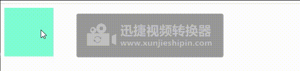

 ## [Mojs完整案例](./mojsCase.md)

