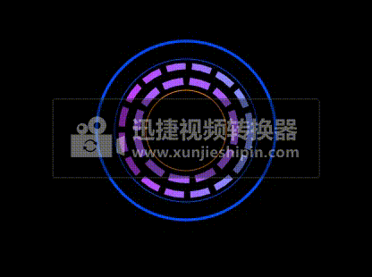
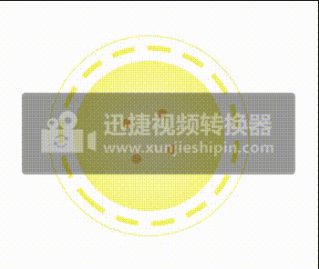
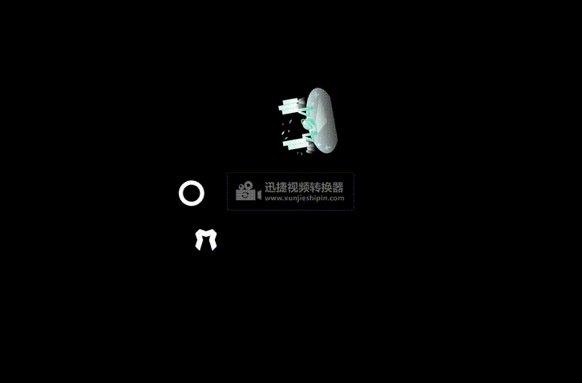

## 案例1

1.使用shape,tween stagger模块创建一个动画

```js
<html>
  <head>
    <title>动图</title>
  </head>
  <link rel="stylesheet" href="./css/demo.css" />
  <body>
    <div id="container">
      <div class="circle">
        <div class="circle1"></div>
        <div class="circle2"></div>
        <div class="circle3"></div>
        <div class="circle4"></div>
        <div class="circle5"></div>
        <div class="circle6"></div>
      </div>
    </div>
    <script src="http://libs.baidu.com/jquery/2.0.0/jquery.min.js"></script>
    <script src="http://cdn.jsdelivr.net/mojs/latest/mo.min.js"></script>
    <script>
      //创建水平线性渐变
      class CircleGradual extends mojs.CustomShape {
        getShape() {
          return `
          <defs>
             <linearGradient id="orange_red" x1="0%" y1="0%" x2="100%" y2="0%">
             <stop offset="0%" style="stop-color:rgb(198,57,255);
             stop-opacity:1"/>
             <stop offset="100%" style="stop-color:rgb(130,152,255);
             stop-opacity:1"/>
             </linearGradient>
          </defs>
          <circle  cx="50" cy="50" r="50"  stroke-dasharray='15,5'stroke-width='5' style="stroke:url(#orange_red); "/>
                      `;
        }
        getLength() {
          return 300;
        }
      }

      mojs.addShape("circlegradual", CircleGradual);

      let circle1 = new mojs.Shape({
        parent: ".circle1",
        shape: "circle",
        width: 230,
        height: 230,
        radius: 100,
        fill: "none",
        stroke: "#004EFF",
        strokeWidth: 3,
      }).play();

      let circle2 = new mojs.Shape({
        parent: ".circle2",
        shape: "circle",
        width: 230,
        height: 230,
        radius: 80,
        fill: "none",
        stroke: "#004EFF",
        strokeWidth: 0.9,
      }).play();

      let circle3 = new mojs.Shape({
        parent: ".circle3",
        shape: "circlegradual",
        width: 230,
        height: 230,
        radius: 72,
        fill: "none",
        stroke: "none",
      }).play();

      let circle4 = new mojs.Shape({
        parent: ".circle4",
        shape: "circle",
        width: 230,
        height: 230,
        radius: 55,
        fill: "none",
        stroke: "#AD5CFF",
        strokeWidth: 8,
        strokeDasharray: 15,
        strokeLinecap: "square",
        angle: { 0: [-360], easing: "cubic.out" },
        repeat: 1000000,
        easing: "cubic.out",
        duration: 80000,
      }).play();

      let circle5 = new mojs.Shape({
        parent: ".circle5",
        shape: "circle",
        width: 230,
        height: 230,
        radius: 45,
        fill: "none",
        stroke: "#FF8400",
        strokeWidth: 1,
        easing: "cubic.in",
        isShowEnd: true,
      }).play();

      // wrap shape in stagger
      const Shapes = mojs.stagger(mojs.Shape);
      // now you can have staggered syntax on the shape and create multiple shapes at once. the next code will produce 5 shapes
      const shapes = new Shapes({
        // quantifier defines number of modules to create
        quantifier: 4,
        shape: "circle",
        width: 230,
        height: 230,
        radius: [{ 0: 38 }, { 0: 30 }, { 0: 25 }, { 0: 18 }],
        fill: "#FF8400",
        fillOpacity: [{ 0.1: 0.2 }, { 0.1: 0.3 }, { 0.1: 0.4 }, { 0.1: 0.5 }],
        scale: [{ 0.1: 1, easing: "cubic.in" }],
        strokeWidth: 1,
        easing: "cubic.in",
        duration: 2000,
      }).then({
        radius: [{ 38: 0 }, { 30: 0 }, { 25: 0 }, { 18: 0 }],
        fillOpacity: [{ 0.2: 0.1 }, { 0.3: 0.1 }, { 0.4: 0.1 }, { 0.5: 0.1 }],
      });

      //
      const tween = new mojs.Tween({
        duration: 1000,
      });

      timeline = new mojs.Timeline({
        repeat: 10000000,
      });
      timeline.add(shapes, tween);
      //   document.body.addEventListener("mouseenter", function () {
      timeline.play();
      //   });
    </script>
  </body>
</html>
```

 效果：<br>


  在这个案例中，使用`CustomShape`创建一个新的形状, `stagger`模块使用可以使用创建多个一样`shape`的属性的且每个形状都可以编辑形状、颜色，大小等属性。，可以通过数数组编辑对应的顺序的形状。如下所示：
```js
  const Shapes = mojs.stagger(mojs.Shape);
      // now you can have staggered syntax on the shape and create multiple shapes at once. the next code will produce 5 shapes
      const shapes = new Shapes({
        // quantifier defines number of modules to create
        quantifier: 4,
        shape: "circle",
        width: 230,
        height: 230,
        radius: [{ 0: 38 }, { 0: 30 }, { 0: 25 }, { 0: 18 }],
        fill: "#FF8400",
        fillOpacity: [{ 0.1: 0.2 }, { 0.1: 0.3 }, { 0.1: 0.4 }, { 0.1: 0.5 }],
        scale: [{ 0.1: 1, easing: "cubic.in" }],
        strokeWidth: 1,
        easing: "cubic.in",
        duration: 2000,
      }).then({
        radius: [{ 38: 0 }, { 30: 0 }, { 25: 0 }, { 18: 0 }],
        fillOpacity: [{ 0.2: 0.1 }, { 0.3: 0.1 }, { 0.4: 0.1 }, { 0.5: 0.1 }],
      });

```

如果需要一个完成的动画（包括then）重复,使用`repeat`属性不能有想要的效果。那么，就要使用`mojs.tween()`,时间线`mojs.Timeline()`两个模块。`Timeline`不能设置形状的创建从0 到有的时间，所所以使用`tween`来创建时间,`Timeline`添加`tween`.如下所示：
```js
      const tween = new mojs.Tween({
        duration: 1000,
      });

      timeline = new mojs.Timeline({
        repeat: 10000000,
      });
      timeline.add(shapes, tween);
      //   document.body.addEventListener("mouseenter", function () {
      timeline.play();
      //   });
```

## 案例2
 创建一个轮盘正方向旋转，中间有四个放大缩小的圆。
  ```js
<html>
  <head>
    <title></title>
    <style>
      html,
      body {
        /* background-color: black; */
      }
    </style>
  </head>
  <body>
    <script src="http://libs.baidu.com/jquery/2.0.0/jquery.min.js"></script>
    <script src="http://cdn.jsdelivr.net/mojs/latest/mo.min.js"></script>
    <script>
      //创建圆形高斯模糊
      class Vague extends mojs.CustomShape {
        getShape() {
          return `
          <defs>
            <radialGradient id="grad1" cx="50%" cy="50%" r="50%" fx="50%" fy="50%">
              <stop offset="10%" style="stop-color:rgb(246,241,93);stop-opacity:0.4" />
              <stop offset="100%" style="stop-color:rgb(246,241,93);stop-opacity:0.8" />
            </radialGradient>
          </defs>
         <ellipse cx="50" cy="50" rx="50" ry="50" fill="url(#grad1)"/>   `;
        }
      }

      mojs.addShape("vague", Vague);
      let circle1 = new mojs.Shape({
        shape: "circle",
        width: 250,
        height: 250,
        radius: 100,
        fill: "none",
        stroke: "#F6F15D",
        strokeWidth: 1,
      });

      let circle2 = new mojs.Shape({
        shape: "circle",
        width: 250,
        height: 250,
        radius: 88,
        fill: "none",
        stroke: "#F6F15D",
        strokeWidth: 5,
        strokeLinecap: "square",
        strokeDasharray: 18,
        angle: { 0: 360 },
        duration: 20000,
      });

      let circle3 = new mojs.Shape({
        shape: "vague",
        width: 250,
        height: 250,
        radius: 75,
        duration: 20000,
      });

      let burst1 = new mojs.Burst({
        width: 100,
        height: 100,
        count: 4,
        radius: { 0: 50 },
        angle: { 0: 90 },
        children: {
          shape: "circle",
          radius: 10,
          isYoyo: true,
          fill: "#F6C25D",
          repeat: 10,
          duration: 2000,
        },
      });

      let timeline = new mojs.Timeline({
        repeat: 1000,
      });
      timeline.add(circle1, circle2, circle3, burst1);
      timeline.replay();
    </script>
  </body>
</html>
  ```
效果：<br>


## 案例3

类似于雷达扫描

```js
<html>
  <head>
    <title>类似与雷达扫描</title>
    <style>
      html,
      body {
        background-color: #05173d;
      }
    </style>
  </head>
  <body>
    <script src="http://libs.baidu.com/jquery/2.0.0/jquery.min.js"></script>
    <script src="http://cdn.jsdelivr.net/mojs/latest/mo.min.js"></script>
    <script>
      //创建扇形渐变透明
      class Sector extends mojs.CustomShape {
        getShape() {
          return `
               <defs>
                   <linearGradient id="grad1" x1="0%" y1="0%" x2="100%" y2="0%">
                   <stop offset="0%" style="stop-color:rgb(2,193,209);stop-opacity:0.4" />
                   <stop offset="100%" style="stop-color:rgb(2,193,209);stop-opacity:1" />
                   </linearGradient>

                   <linearGradient id="grad2" x1="0%" y1="0%" x2="100%" y2="0%">
                   <stop offset="0%" style="stop-color:rgb(2,193,209);stop-opacity:0.1" />
                   <stop offset="100%" style="stop-color:rgb(2,193,209);stop-opacity:0.4" />
                   </linearGradient>
               </defs>
               <circle cx="50" cy="50" r="90" stroke-width="1"  />
               <path d="M50 50 L5 129  V-29Z" fill="url(#grad1)"/>
               <path d="M5 129 Q-90 57 5 -29"  fill="url(#grad2)"/>
              
                `;
        }
      }

      mojs.addShape("sector", Sector);
      let circle = new mojs.Shape({
        shpae: "circle",
        width: 200,
        height: 200,
        radius: 90,
        stroke: "#13A1D0",
        strokeWidth: 2,
        fill: "none",
      });

      let sector = new mojs.Shape({
        shape: "sector",
        width: 200,
        height: 200,
        fill: "none",
        isForce3d: true,
        duration: 1500,
        angle: { 360: 0 },
      });

      //创建多个圆形的
      let circles = [];
      for (let i = 0; i < 20; i++) {
        circles.push(
          new mojs.Shape({
            parent: circle.el,
            shape: "circle",
            width: 200,
            height: 200,
            radius: 2,
            fill: "#06CC60",
            left: "rand(18%,70%)",
            top: "rand(18%,70%)",
          })
        );
      }
      let tween = new mojs.Tween({
        duration: 1500,
      });
      let timeline = new mojs.Timeline({ repeat: 1000 });
      timeline.add(circle, sector, tween);
      circles.forEach((item) => {
        timeline.add(item);
      });
      timeline.play();
    </script>
  </body>
</html>

```
  效果：<br>


## 案例4 
 使用mojs的播放器，渲染出svg路径动画

 ```js
  <div id="app">
     <svg
      >
      <!--路径  path-->
      </svg>
    </div>
    <script src="http://cdn.jsdelivr.net/mojs/latest/mo.min.js"></script>
    <script src="http://cdn.jsdelivr.net/mojs-player/latest/mojs-player.min.js"></script>

    <script>
      //做路径动画之前，我们先要收集路径下的信息
      let whiteColor = "white";
      let path = document.querySelectorAll("path");
      let fillData = [];
      let strokeColorData = [];
      let strokeWidthData = [];

      Array.from(path).forEach((item) => {
        //获取所有的路径path,在路径path获取到填充色
        let fillColor = item.getAttribute("fill");
        console.log(fillColor);
        console.log(item);
        //把颜色push在一个数组里面
        fillData.push({
          fill: fillColor || whiteColor,
        });

        console.log(fillData);
        //用来判断
        strokeWidthData.push(fillColor ? 0.5 : 1);
        strokeColorData.push(fillColor || whiteColor);
      });

      const HtmlStagger = mojs.stagger(mojs.Html);
      let avocado = new HtmlStagger({
        el: path,
        fillData,
        stroke: strokeColorData, //显示线是粗度
        strokeWidth: strokeWidthData, //显示线是宽度
        strokeDasharray: "3000",
        strokeDashoffset: { 3000: "0" },
        duration: 38000,
        delay: "stagger(100)",
        opacity: { 0: 1 },
      });
      avocado.play();
      //动画播放器
      new MojsPlayer({
        add: avocado,
        isRepeat: false,
        isPlaying: false,
        isSaveState: true,
      });
    </script>

 ```

  效果：<br>


## 案例5
这个案例时显示图和使用外部svg。目前，好像没有方法同时引入外部svg,只用通过创建形状使用。

```js
<html>
  <head>
    <title>案例1</title>
    <style>
      body,
      html {
        background-color: black;
      }

      .st0 {
        fill: url(#SVGID_1_);
      }
      .st1 {
        fill: url(#SVGID_2_);
      }
      .st2 {
        fill: url(#SVGID_3_);
      }
      .st3 {
        fill: url(#SVGID_4_);
      }
      .st4 {
        fill: url(#SVGID_5_);
      }
      .st5 {
        fill: url(#SVGID_6_);
      }
      .st6 {
        fill: url(#SVGID_7_);
      }
      .st7 {
        fill: url(#SVGID_8_);
      }
      .st8 {
        fill: url(#SVGID_9_);
      }
      .st9 {
        fill: url(#SVGID_10_);
      }
      .st10 {
        fill: url(#SVGID_11_);
      }
      .st11 {
        fill: url(#SVGID_12_);
      }
      .st12 {
        fill: url(#SVGID_13_);
      }
      .st13 {
        fill: url(#SVGID_14_);
      }
      .st14 {
        fill: url(#SVGID_15_);
      }
      .st15 {
        fill: url(#SVGID_16_);
      }
      .st16 {
        fill: url(#SVGID_17_);
      }
      .st17 {
        fill: url(#SVGID_18_);
      }
      .st18 {
        fill: url(#SVGID_19_);
      }
      .st19 {
        fill: url(#SVGID_20_);
      }
      .st20 {
        fill: url(#SVGID_21_);
      }
      .st21 {
        fill: url(#SVGID_22_);
      }
      .st22 {
        fill: url(#SVGID_23_);
      }
      .st23 {
        fill: url(#SVGID_24_);
      }
      .st24 {
        fill: url(#SVGID_25_);
      }
      .st25 {
        fill: url(#SVGID_26_);
      }
      .st26 {
        fill: url(#SVGID_27_);
      }
      .st27 {
        fill: url(#SVGID_28_);
      }
      .st28 {
        fill: url(#SVGID_29_);
      }
      .st29 {
        fill: url(#SVGID_30_);
      }
      .st30 {
        fill: url(#SVGID_31_);
      }
      .st31 {
        fill: url(#SVGID_32_);
      }
      .st32 {
        fill: url(#SVGID_33_);
      }
      .st33 {
        fill: url(#SVGID_34_);
      }
      .st34 {
        fill: url(#SVGID_35_);
      }
      .st35 {
        fill: none;
      }
    </style>
  </head>
  <body>
    <div id="app"></div>
    <script src="http://cdn.jsdelivr.net/mojs/latest/mo.min.js"></script>
    <script src="http://cdn.jsdelivr.net/mojs-player/latest/mojs-player.min.js"></script>
    <script>
      //创建字母
      class Mletter extends mojs.CustomShape {
        getShape() {
          return `
                   <path d="M 20 0 L 0 20 L 10 50 L 0 80 L 20 100 L 35 50 Z" class="left"></path>
                   <path d="M 80 0 L 100 20 L 90 50 L 100 80 L 80 100 L 65 50 Z" class="right"></path>
                   <path d="M 0 20 L 20 0 L 50 10 L 80 0 L 100 20 L 50 35 Z" class="top"></path>
                `;
        }
        getLength() {
          return 300;
        }
      }
      //
      class Error extends mojs.CustomShape {
        getShape() {
          return `
            <g>
	<g>
		
			<linearGradient gradientTransform="matrix(1 0 0 -1 0 196)" y2="134.8" x2="88.65" y1="-15" x1="88.65" gradientUnits="userSpaceOnUse" id="SVGID_1_">
			<stop style="stop-color:#FFFFFF" offset="0"></stop>
			<stop style="stop-color:#CFF4EE" offset="1"></stop>
		</linearGradient>
		<rect height="149.8" width="33.9" class="st0" y="61.2" x="71.7"></rect>
		
			<linearGradient gradientTransform="matrix(1 0 0 -1 0 196)" y2="167.4" x2="122.55" y1="-2" x1="122.55" gradientUnits="userSpaceOnUse" id="SVGID_2_">
			<stop style="stop-color:#FFFFFF" offset="0"></stop>
			<stop style="stop-color:#CFF4EE" offset="1"></stop>
		</linearGradient>
		<rect height="169.4" width="33.9" class="st1" y="28.6" x="105.6"></rect>
	</g>
	<g>
		
			<linearGradient gradientTransform="matrix(1 0 0 -1 0 196)" y2="133.6" x2="348.9" y1="17.6" x1="348.9" gradientUnits="userSpaceOnUse" id="SVGID_3_">
			<stop style="stop-color:#FFFFFF" offset="0"></stop>
			<stop style="stop-color:#CFF4EE" offset="1"></stop>
		</linearGradient>
		<rect height="116" width="33.4" class="st2" y="62.4" x="332.2"></rect>
		
			<linearGradient gradientTransform="matrix(1 0 0 -1 0 196)" y2="153" x2="382.3" y1="17.6" x1="382.3" gradientUnits="userSpaceOnUse" id="SVGID_4_">
			<stop style="stop-color:#FFFFFF" offset="0"></stop>
			<stop style="stop-color:#CFF4EE" offset="1"></stop>
		</linearGradient>
		<rect height="135.4" width="33.4" class="st3" y="43" x="365.6"></rect>
		
			<linearGradient gradientTransform="matrix(1 0 0 -1 0 196)" y2="115.6" x2="415.9" y1="7.4" x1="415.9" gradientUnits="userSpaceOnUse" id="SVGID_5_">
			<stop style="stop-color:#FFFFFF" offset="0"></stop>
			<stop style="stop-color:#CFF4EE" offset="1"></stop>
		</linearGradient>
		<rect height="108.2" width="33.4" class="st4" y="80.4" x="399.2"></rect>
	</g>
	
		<linearGradient gradientTransform="matrix(1 0 0 -1 0 196)" y2="-31.4" x2="240" y1="-255.4" x1="240" gradientUnits="userSpaceOnUse" id="SVGID_6_">
		<stop style="stop-color:#FFFFFF;stop-opacity:0.2" offset="0"></stop>
		<stop style="stop-color:#DEFFFD" offset="1"></stop>
	</linearGradient>
	<ellipse ry="112" rx="240" cy="339.4" cx="240" class="st5"></ellipse>
	
		<linearGradient gradientTransform="matrix(1 0 0 -1 0 196)" y2="-111" x2="40.3" y1="-168.6" x1="40.3" gradientUnits="userSpaceOnUse" id="SVGID_7_">
		<stop style="stop-color:#F0FFFA" offset="0"></stop>
		<stop style="stop-color:#72C2BA;stop-opacity:0.3" offset="1"></stop>
	</linearGradient>
	<polygon points="40.3,307 20,342.2 37.3,342.2 37.3,364.6 43.2,364.6 43.2,342.2 60.6,342.2" class="st6"></polygon>
	
		<linearGradient gradientTransform="matrix(1 0 0 -1 0 196)" y2="-66.2" x2="71.45" y1="-107.8" x1="71.45" gradientUnits="userSpaceOnUse" id="SVGID_8_">
		<stop style="stop-color:#F0FFFA" offset="0"></stop>
		<stop style="stop-color:#BDEFE3" offset="1"></stop>
	</linearGradient>
	<polygon points="71.4,262.2 56.8,287.6 69.3,287.6 69.3,303.8 73.6,303.8 73.6,287.6 86.1,287.6" class="st7"></polygon>
	
		<linearGradient gradientTransform="matrix(1 0 0 -1 0 196)" y2="-69.9129" x2="287.3816" y1="-184.0863" x1="307.5132" gradientUnits="userSpaceOnUse" id="SVGID_9_">
		<stop style="stop-color:#FFFFFF;stop-opacity:0" offset="0"></stop>
		<stop style="stop-color:#BDEFE3" offset="1"></stop>
	</linearGradient>
	<polygon points="153.8,289.5 226.2,371.4 441.1,356.5 242.4,289.1" class="st8"></polygon>
	<g>
		
			<linearGradient gradientTransform="matrix(1 0 0 -1 0 196)" y2="7.4" x2="403.0329" y1="-47.7736" x1="403.0329" gradientUnits="userSpaceOnUse" id="SVGID_10_">
			<stop style="stop-color:#FFFFFF;stop-opacity:0" offset="0"></stop>
			<stop style="stop-color:#CFF4EE" offset="1"></stop>
		</linearGradient>
		<path d="M430.1,234.7c-5.9-22.4-5-46.1-25.8-46.1c-14.4,0-27.4,45.9-28.5,50.2C374.9,243.3,433.9,248.9,430.1,234.7z" class="st9"></path>
		
			<linearGradient gradientTransform="matrix(1 0 0 -1 0 196)" y2="29.8" x2="366.1195" y1="-50.9524" x1="366.1195" gradientUnits="userSpaceOnUse" id="SVGID_11_">
			<stop style="stop-color:#FFFFFF;stop-opacity:0" offset="0"></stop>
			<stop style="stop-color:#CFF4EE" offset="1"></stop>
		</linearGradient>
		<path d="M405.6,233.6c-8.8-32.6-7.2-67.4-37.6-67.4c-21.1,0-40,67.2-41.6,73.6S411.2,254.5,405.6,233.6z" class="st10"></path>
	</g>
	<g>
		
			<linearGradient gradientTransform="matrix(1 0 0 -1 0 196)" y2="2.3895" x2="59.6986" y1="-60.6" x1="59.6986" gradientUnits="userSpaceOnUse" id="SVGID_12_">
			<stop style="stop-color:#FFFFFF;stop-opacity:0" offset="0"></stop>
			<stop style="stop-color:#CFF4EE" offset="1"></stop>
		</linearGradient>
		<path d="M90.4,246.2c-6.7-25.4-13.1-49.9-29.3-52.5S30.1,246,28.8,251C27.5,256,94.9,262.5,90.4,246.2z" class="st11"></path>
		
			<linearGradient gradientTransform="matrix(1 0 0 -1 0 196)" y2="11.6829" x2="38.1626" y1="-33.3587" x1="38.1626" gradientUnits="userSpaceOnUse" id="SVGID_13_">
			<stop style="stop-color:#FFFFFF;stop-opacity:0" offset="0"></stop>
			<stop style="stop-color:#CFF4EE" offset="1"></stop>
		</linearGradient>
		<path d="M60.2,221.9c-4.8-18.2-9.3-35.7-21-37.6C27.5,182.4,17,221.9,16,225.4C15.2,228.9,63.2,233.6,60.2,221.9z" class="st12"></path>
		
			<linearGradient gradientTransform="matrix(1 0 0 -1 0 196)" y2="20.3058" x2="100.5195" y1="-60.5524" x1="100.5195" gradientUnits="userSpaceOnUse" id="SVGID_14_">
			<stop style="stop-color:#FFFFFF;stop-opacity:0" offset="0"></stop>
			<stop style="stop-color:#CFF4EE" offset="1"></stop>
		</linearGradient>
		<path d="M140,243.2c-8.8-32.6-16.8-64.2-37.6-67.4s-40,67.2-41.6,73.6C59.2,255.8,145.6,264.1,140,243.2z" class="st13"></path>
	</g>
	
		<linearGradient gradientTransform="matrix(1 0 0 -1 0 196)" y2="-103" x2="431.0076" y1="-154.2" x1="431.0076" gradientUnits="userSpaceOnUse" id="SVGID_15_">
		<stop style="stop-color:#F0FFFA" offset="0"></stop>
		<stop style="stop-color:#72C2BA;stop-opacity:0.3" offset="1"></stop>
	</linearGradient>
	<path d="M453.9,314.8c-0.5-3.7-5.3-4.5-9.8-8.8c-4.5-4.5-5.9-7-11.5-7c-10.6,0-10.6,9.8-13.3,9.8
		c-8.3,0-11.5,9.8-11.5,12.3s3.5,5.3,8.8,8.8c3.5,2.4,9.1,2.4,12.3,2.1v18.2h4.5v-18.4c2.4-0.3,3.7-2.2,11.5,0.8
		C449.4,334.4,455.7,327.3,453.9,314.8z" class="st14"></path>
	
		<linearGradient gradientTransform="matrix(0.7012 0.713 0.713 -0.7012 -683.8461 861.7198)" y2="1169.7305" x2="19.2266" y1="1158.9734" x1="19.2266" gradientUnits="userSpaceOnUse" id="SVGID_16_">
		<stop style="stop-color:#FFFFFF" offset="0"></stop>
		<stop style="stop-color:#CFF4EE" offset="1"></stop>
	</linearGradient>
	<path d="M164,70.8c0,0-11.4-12.6-10.1-20.6c1.3-8,8.8,5.4,10.2,10.4C165.8,66.8,164,70.8,164,70.8z" class="st15"></path>
	
		<linearGradient gradientTransform="matrix(0.9394 0.3429 0.3429 -0.9394 -221.2311 534.2348)" y2="613.0653" x2="228.6433" y1="598.7776" x1="228.6433" gradientUnits="userSpaceOnUse" id="SVGID_17_">
		<stop style="stop-color:#FFFFFF" offset="0"></stop>
		<stop style="stop-color:#CFF4EE" offset="1"></stop>
	</linearGradient>
	<path d="M213,55.3c0,0-20.8-8.6-23.8-18.9c-3-10.2,13.8,1.4,18.1,6.6C212.8,49.6,213,55.3,213,55.3z" class="st16"></path>
	
		<linearGradient gradientTransform="matrix(0.9394 0.3429 0.3429 -0.9394 -221.2311 534.2348)" y2="621.0851" x2="290.0884" y1="613.6268" x1="290.0884" gradientUnits="userSpaceOnUse" id="SVGID_18_">
		<stop style="stop-color:#FFFFFF" offset="0"></stop>
		<stop style="stop-color:#CFF4EE" offset="1"></stop>
	</linearGradient>
	<path d="M269.1,60c0,0-10.9-4.5-12.5-9.9s7.2,0.8,9.4,3.5C269,56.9,269.1,60,269.1,60z" class="st17"></path>
	
		<linearGradient gradientTransform="matrix(0.9825 -0.1864 -0.1864 -0.9825 73.1605 -6.7168)" y2="-112.1284" x2="114.5024" y1="-121.9685" x1="114.5024" gradientUnits="userSpaceOnUse" id="SVGID_19_">
		<stop style="stop-color:#FFFFFF" offset="0"></stop>
		<stop style="stop-color:#CFF4EE" offset="1"></stop>
	</linearGradient>
	<path d="M218.6,89.9c0,0-15.4,2.1-20.8-2.9c-5.4-5,8.6-4,13-2.4C216.5,86.5,218.6,89.9,218.6,89.9z" class="st18"></path>
	
		<linearGradient gradientTransform="matrix(0.9514 0.3079 0.3079 -0.9514 -183.4358 487.0605)" y2="508.8987" x2="317.3436" y1="492.2589" x1="317.3436" gradientUnits="userSpaceOnUse" id="SVGID_20_">
		<stop style="stop-color:#F0FFFA" offset="0"></stop>
		<stop style="stop-color:#72C2BA;stop-opacity:0.3" offset="1"></stop>
	</linearGradient>
	<path d="M286.7,121.9c0,0-24.5-9.3-28.5-21c-4-11.8,16,1.1,21.3,6.9C286.4,115.2,286.7,121.9,286.7,121.9z" class="st19"></path>
	
		<linearGradient gradientTransform="matrix(1 0 0 1 0 -286)" y2="441.8038" x2="28.7" y1="429.3238" x1="28.7" gradientUnits="userSpaceOnUse" id="SVGID_21_">
		<stop style="stop-color:#58CCB0" offset="0"></stop>
		<stop style="stop-color:#E5F9F4" offset="0.9851"></stop>
	</linearGradient>
	<path d="M29.3,148.8c0,0-8.6-3.7-16.3-1.3c0,0,14.2,2.7,15.7,8.3c0,0,9.4-9.8,15.7-12.5
		C44.3,143.3,33.4,146.7,29.3,148.8z" class="st20"></path>
	
		<linearGradient gradientTransform="matrix(1 0 0 1 0 -286)" y2="413.3704" x2="40.3" y1="404.0904" x1="40.3" gradientUnits="userSpaceOnUse" id="SVGID_22_">
		<stop style="stop-color:#58CCB0" offset="0"></stop>
		<stop style="stop-color:#E5F9F4" offset="0.9851"></stop>
	</linearGradient>
	<path d="M40.8,122c0,0-6.4-2.7-12.2-1c0,0,10.6,1.9,11.7,6.2c0,0,7-7.4,11.7-9.3C51.8,118,43.8,120.6,40.8,122z" class="st21"></path>
	<g>
		
			<linearGradient gradientTransform="matrix(1 0 0 1 0 -286)" y2="545.6511" x2="362.3732" y1="583.2333" x1="362.3732" gradientUnits="userSpaceOnUse" id="SVGID_23_">
			<stop style="stop-color:#E9FFFD" offset="0"></stop>
			<stop style="stop-color:#63D0B5" offset="0.9851"></stop>
		</linearGradient>
		<path d="M365.3,293.9c-4.5-16.3-7.7-23.2-15.5-34.2c0,0,26.4,26.9,25.1,34.2C373.6,301.4,365.3,293.9,365.3,293.9z" class="st22"></path>
		
			<linearGradient gradientTransform="matrix(1 0 0 1 0 -286)" y2="550.8524" x2="376.5371" y1="586.9574" x1="376.5371" gradientUnits="userSpaceOnUse" id="SVGID_24_">
			<stop style="stop-color:#E9FFFD" offset="0"></stop>
			<stop style="stop-color:#63D0B5" offset="0.9851"></stop>
		</linearGradient>
		<path d="M369.8,293.9c0,0,6.7-26.4,13.8-29.1c0,0-10.2,30.9-8.6,34.2C376.5,302.5,367.7,301.6,369.8,293.9z" class="st23"></path>
	</g>
	<g>
		<linearGradient y2="176.8723" x2="140.0437" y1="289.0781" x1="140.0437" gradientUnits="userSpaceOnUse" id="SVGID_25_">
			<stop style="stop-color:#58CCB0" offset="0"></stop>
			<stop style="stop-color:#E5F9F4" offset="0.9851"></stop>
		</linearGradient>
		<path d="M181,260h-13.3v29.1h-20.8V260H99.1v-15.2l41.8-67.9h26.7V243H181V260z M146.9,243v-22.9
			c0-6.5,0.6-16.7,0.9-23.2h-0.6c-2.7,5.9-5.8,12.1-8.9,18.2L120.8,243H146.9z" class="st24"></path>
	</g>
	<g>
		<linearGradient y2="176.8723" x2="324.5643" y1="289.0781" x1="324.5643" gradientUnits="userSpaceOnUse" id="SVGID_26_">
			<stop style="stop-color:#58CCB0" offset="0"></stop>
			<stop style="stop-color:#E5F9F4" offset="0.9851"></stop>
		</linearGradient>
		<path d="M365.5,260h-13.3v29.1h-20.8V260h-47.8v-15.2l41.9-67.9h26.7V243h13.3V260z M331.4,243v-22.9
			c0-6.5,0.6-16.7,0.9-23.2h-0.6c-2.7,5.9-5.8,12.1-8.9,18.2L305.3,243H331.4z" class="st25"></path>
	</g>
	<g>
		<linearGradient y2="192.9397" x2="211.678" y1="279.1109" x1="211.678" gradientUnits="userSpaceOnUse" id="SVGID_27_">
			<stop style="stop-color:#58CCB0" offset="0"></stop>
			<stop style="stop-color:#E5F9F4" offset="0.9851"></stop>
		</linearGradient>
		<path d="M232.8,193c-23.3,0.4-42.1,19.3-42.3,42.6C199.8,217.6,215.8,201.1,232.8,193z" class="st26"></path>
		<g>
			<linearGradient y2="192.9397" x2="229.5953" y1="279.1109" x1="229.5953" gradientUnits="userSpaceOnUse" id="SVGID_28_">
				<stop style="stop-color:#58CCB0" offset="0"></stop>
				<stop style="stop-color:#E5F9F4" offset="0.9851"></stop>
			</linearGradient>
			<path d="M249.4,195.9c-2.4,0.6-5.1,1.5-7.9,2.5c-21,7.6-41.3,30.1-48.3,52.5c2.1,5.8,5.4,10.9,9.7,15.2
				c6.5-2.6,16.9-8.2,33.2-19.6c12.7-8.9,25.7-26.6,30-38.9C261.5,202.5,255.8,198.5,249.4,195.9z" class="st27"></path>
			<linearGradient y2="192.9397" x2="243.4067" y1="279.111" x1="243.4067" gradientUnits="userSpaceOnUse" id="SVGID_29_">
				<stop style="stop-color:#58CCB0" offset="0"></stop>
				<stop style="stop-color:#E5F9F4" offset="0.9851"></stop>
			</linearGradient>
			<path d="M271.8,216c-6.8,14.5-20.5,30.1-30.9,37.4c-12.5,8.8-22.6,14.9-30.7,18.7c6.8,4.4,14.8,7,23.5,7
				c23.8,0,43.1-19.3,43.1-43.1C276.7,228.8,274.9,222,271.8,216z" class="st28"></path>
			<linearGradient y2="256.0879" x2="275.9313" y1="256.0879" x1="182.4489" gradientUnits="userSpaceOnUse" id="SVGID_30_">
				<stop style="stop-color:#E7F9F6" offset="0"></stop>
				<stop style="stop-color:#77D6BF" offset="1"></stop>
			</linearGradient>
			<path d="M202.8,266.2c-7.1,2.8-9.7,2.2-10.6,1.6c-1.1-0.7-1.9-3.5-0.8-9.5c0.4-2.4,1-4.9,1.8-7.4
				c-1.7-4.6-2.7-9.7-2.7-14.9c0-0.2,0-0.3,0-0.5c-3.6,7-6.2,14.2-7.4,21.3c-0.6,3.4-2.4,13.6,4.6,18c1.8,1.2,4,1.8,6.7,1.8
				c4.1,0,9.3-1.5,15.8-4.5C207.5,270.4,205,268.4,202.8,266.2z" class="st29"></path>
			<linearGradient y2="200.9766" x2="275.9313" y1="200.9766" x1="182.4489" gradientUnits="userSpaceOnUse" id="SVGID_31_">
				<stop style="stop-color:#E7F9F6" offset="0"></stop>
				<stop style="stop-color:#77D6BF" offset="1"></stop>
			</linearGradient>
			<path d="M249.4,195.9c4.2-1.1,7.7-1.7,10.6-1.7c3.6,0,6,0.9,6.9,2.7c1.2,2.3,0.8,6.1-0.8,10.7
				c2.2,2.5,4.2,5.4,5.7,8.4c4-8.7,5.6-17,2.5-22.9c-4.5-8.6-16.5-9.5-35.7-2.6c-1.9,0.7-3.9,1.5-5.8,2.4c0.3,0,0.5,0,0.8,0
				C239.2,192.9,244.5,194,249.4,195.9z" class="st30"></path>
			<linearGradient y2="239.9093" x2="275.9313" y1="239.9093" x1="182.4489" gradientUnits="userSpaceOnUse" id="SVGID_32_">
				<stop style="stop-color:#E7F9F6" offset="0"></stop>
				<stop style="stop-color:#77D6BF" offset="1"></stop>
			</linearGradient>
			<path d="M271.8,216c-1.6-3-3.5-5.8-5.7-8.4c-4.3,12.3-17.3,30-30,38.9c-16.3,11.4-26.7,17-33.2,19.6
				c2.2,2.2,4.7,4.3,7.3,6c8.1-3.8,18.2-9.9,30.7-18.7C251.3,246.1,265,230.6,271.8,216z" class="st31"></path>
		</g>
		<linearGradient y2="192.9397" x2="219.9394" y1="279.1109" x1="219.9394" gradientUnits="userSpaceOnUse" id="SVGID_33_">
			<stop style="stop-color:#58CCB0" offset="0"></stop>
			<stop style="stop-color:#E5F9F4" offset="0.9851"></stop>
		</linearGradient>
		<path d="M193.2,250.9c7-22.4,27.3-44.9,48.3-52.5c2.8-1,5.5-1.8,7.9-2.5c-4.9-1.9-10.2-3-15.8-3c-0.3,0-0.5,0-0.8,0
			c-17.1,8.2-33,24.6-42.3,42.6c0,0.2,0,0.3,0,0.5C190.5,241.3,191.5,246.3,193.2,250.9z" class="st32"></path>
	</g>
	<linearGradient y2="208.0583" x2="256.1299" y1="208.0583" x1="242.4" gradientUnits="userSpaceOnUse" id="SVGID_34_">
		<stop style="stop-color:#FFFFFF" offset="0"></stop>
		<stop style="stop-color:#CFF4EE" offset="1"></stop>
	</linearGradient>
	<circle r="6.9" cy="208.1" cx="249.3" class="st33"></circle>
	<linearGradient y2="252.1956" x2="211.3202" y1="235.0141" x1="211.3202" gradientUnits="userSpaceOnUse" id="SVGID_35_">
		<stop style="stop-color:#E9FFFD" offset="0"></stop>
		<stop style="stop-color:#63D0B5" offset="0.9851"></stop>
	</linearGradient>
	<circle r="8.6" cy="243.6" cx="211.3" class="st34"></circle>
	<path d="M266.8,193.9c-0.9-1.8-3.3-2.7-6.9-2.7c-2.8,0-6.4,0.6-10.6,1.7c6.5,2.5,12.2,6.6,16.7,11.7
		C267.6,200.1,268,196.3,266.8,193.9z" class="st35"></path>
	<path d="M191.3,255.2c-1,5.9-0.2,8.8,0.8,9.5c0.9,0.6,3.5,1.2,10.6-1.6c-4.2-4.3-7.5-9.5-9.7-15.2
		C192.4,250.3,191.8,252.8,191.3,255.2z" class="st35"></path>
</g>
            
            
            
            `;
        }
      }
      mojs.addShape("mletter", Mletter);
      mojs.addShape("error", Error);
      //字母M
      let mletter = new mojs.Shape({
        shape: "mletter",
        width: 100,
        height: 100,
        left: "40%",
        stroke: "#fff",
        fill: "#fff",
        scale: { 0: 0.5 },
        y: { "rand(-100%, -200%)": 110 },
        angle: { [-120]: 720 },
      }).then({
        delay: 200,
        y: 0,
        scale: { 0.5: 0.9 },
        fill: "#B2E9DC",
        stroke: "#B2E9DC",
      });
      //字母O
      let oletter = new mojs.Shape({
        shape: "circle",
        width: 120,
        height: 120,
        stroke: "#fff",
        fill: "none",
        strokeWidth: 20,
        left: "48%",
        scale: { 0: 0.5 },
        x: { 0: "rand(-100%, -200%)" },
      }).then({
        delay: 200,
        x: 0,
        scale: { 0.5: 0.9 },
        stroke: "#B2E9DC",
      });

      let error = new mojs.Shape({
        shape: "error",
        width: 1500,
        height: 750,
        left: "50%",
        top: "40%",
        fill: "#fff",
        scale: { 0: 0.9 },
        angle: { 0: 720 },
        duration: 2000,
      });

      let timeline = new mojs.Timeline();
      timeline.add(mletter, oletter, error);
      timeline.play();
      //   curvel.play();
      //   mletter.play();
    </script>
  </body>
</html>

```

  效果：<br>


## 案例6 

```js
<html>
  <head>
    <title>动图1</title>
    <style>
      body,
      html {
        background-color: black;
        position: relative;
      }
      #js-el {
        position: absolute;
        right: 0;
        bottom: 0;
        left: 0;
        top: 0;
        width: 95px;
        height: 94px;
        margin: auto;
        border-radius: 50%;
        background: -webkit-radial-gradient(
          circle at 50% -60%,
          #0266c4 60%,
          #0dcbee
        ); /* Safari 5.1 - 6.0 */
        background: -o-radial-gradient(
          circle at 50% -60%,
          #0266c4 60%,
          #0dcbee
        ); /* Opera 11.1 - 12.0 */
        background: -moz-radial-gradient(
          circle at 50% -60%,
          #0266c4 60%,
          #0dcbee
        ); /* Firefox 3.6 - 15 */
        background: radial-gradient(
          circle at 50% -60%,
          #0266c4 60%,
          #0dcbee
        ); /* 标准的语法 */
      }
    </style>
  </head>
  <body>
    <div id="app"></div>
    <div id="js-el">
      
    </div>
    <script src="http://cdn.jsdelivr.net/mojs/latest/mo.min.js"></script>
    <script src="http://cdn.jsdelivr.net/mojs-player/latest/mojs-player.min.js"></script>
    <script>
      //创建水平线性渐变
      class CircleGradual extends mojs.CustomShape {
        getShape() {
          return `
            <defs>
               <linearGradient id="orange_red" x1="0%" y1="0%" x2="100%" y2="0%">
               <stop offset="0%" style="stop-color:rgb(34,189,253);
               stop-opacity:1"/>
               <stop offset="100%" style="stop-color:rgb(23,60,94);
               stop-opacity:1"/>
               </linearGradient>
            </defs>
            <circle  cx="50" cy="50" r="50"  stroke-dasharray='15,1'stroke-width='12' style="stroke:url(#orange_red); "/>
                        `;
        }
        getLength() {
          return 300;
        }
      }

      //创建圆径向渐变色
      class Circleone extends mojs.CustomShape {
        getShape() {
          return `
            <defs>
                  <radialGradient id="radia" cx="50%" cy="50%" r="40%" fx="50%" fy="50%">
                      <stop offset="0%"  style="stop-color:rgb(2,39,77);stop-opacity:1 " />
                      <stop offset="1%"  style="stop-color:rgb(2,39,77); stop-opacity:1"/>
                  </radialGradient>
              </defs>
              <circle fill="url(#radia)" cx="50" cy="50" r="50" />              `;
        }
        getLength() {
          return 300;
        }
      }
      //创建一个圆渐变色
      class Circletwo extends mojs.CustomShape {
        getShape() {
          return `
            <defs>
                  <radialGradient id="radias" cx="50%" cy="20%" r="40%" fx="50%" fy="50%">
                      <stop offset="50%"  style="stop-color:rgb(17,44,221); "/>
                      <stop offset="70%"  style="stop-color:rgb(33,189,254); "/>

                  </radialGradient>
              </defs>
              <circle fill="url(#radias)" cx="50" cy="50" r="50" />              `;
        }
        getLength() {
          return 300;
        }
      }
      mojs.addShape("circleone", Circleone);
      mojs.addShape("circlegradual", CircleGradual);
      mojs.addShape("circletwo", Circletwo);
      let circle1 = new mojs.Shape({
        shape: "circle",
        width: 200,
        height: 200,
        radius: 97,
        stroke: "#0076EF",
        strokeWidth: "3",
        fill: "none",
      });

      let circle3 = new mojs.Shape({
        shape: "circle",
        width: 200,
        height: 200,
        radius: 81,
        stroke: "#0076EF",
        strokeWidth: "1",
        fill: "none",
      });

      let circle4 = new mojs.Shape({
        shape: "circle",
        width: 200,
        height: 200,
        radius: 55,
        stroke: "#0076EF",
        strokeWidth: 10,
        strokeDasharray: 1.5,
        strokeLinecap: "butt",
        fill: "none",
        angle: { 0: 360 },
        repeat: 2000,
        duration: 11000,
        delay: 0,
      });

      let circle2 = new mojs.Shape({
        shape: "circleone",
        width: 200,
        height: 200,
        radius: 90,
        stroke: "#022951",
        strokeWidth: "3",
        fill: "#022951",
        fillOpacity: 0.2,
      });
      let circle5 = new mojs.Shape({
        shape: "circle",
        width: 200,
        height: 200,
        radius: 40,
        fill: "none",
      });

      let html = new mojs.Html({
        el: "#js-el",
        shape: "circle",
        borderWidth: { 2: 12 },
        width: 122,
        x: "0%",
        y: "0%",
        height: 120,
        scale: 0.78,
        opacity: 1,
      });
      let circlegradual = new mojs.Shape({
        shape: "circlegradual",
        width: 200,
        height: 200,
        fill: "none",
        radius: 70,
        angle: { 0: 360 },
        repeat: 2000,
        duration: 11000,
      });

      let timeline = new mojs.Timeline();
      timeline.add(
        circlegradual,
        circle1,
        circle2,
        circle3,
        circle4,
        circle5,
        html
      );
      timeline.play();
    </script>
  </body>
</html>
```
  效果：<br>
