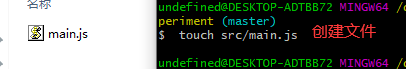
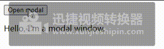

# Vue3学习

## 创建Vue3项目
### 创建一个最小的Webpack设置（包括Vue 3）
```js
$ git clone https://github.com/vuejs/vue-next-webpack-preview.git vue3-experiment
$ cd vue3-experiment
$ npm i
```
效果：<br>


   删除项目中模板，也就是文件src下面的内容，然后运行项目 

```js
$ rm -rf src/*
$ touch src/main.js
```
效果：<br>



在src文件下面的main.js文件中引入createApp函数，这个函数是用来创建vue3的应用。createApp中的参数选项使用于配置根组件。然后在使用mount()挂载应用.把应用挂载一个dom元素上去。
代码中mount()函数就是把应用挂载在`#app`。App是整个项目的根组件。
```js
// src/main.js
import { createApp } from "vue";
import App from "./App.vue";
const app = createApp(App);
app.mount("#app");
```
在App.vue文件中写入
```js
<template>
  <button @click="toggleModalState">Open modal</button>
  <modal v-if="modalOpen">
    <p>Hello, I'm a modal window.</p>
  </modal>
</template>
<script>
import Modal from "./view/Modal.vue";
export default {
  components: {
    Modal,
  },
  data: () => ({
    modalOpen: true,
  }),
  methods: {
    toggleModalState() {
      this.modalOpen = !this.modalOpen;
    },
  },
};
</script>
```
Modal.vue
```js
<template>
  <div class="modal">
    <slot></slot>
  </div>
</template>
```

效果：<br>



### Vue3 模板语法
Vue 使用了基于 HTML 的模板语法，允许开发者声明式地将 DOM 绑定至底层 Vue 实例的数据。
Vue 的核心是一个允许你采用简洁的模板语法来声明式的将数据渲染进 DOM 的系统。
结合响应系统，在应用状态改变时， Vue 能够智能地计算出重新渲染组件的最小代价并应用到 DOM 操作上。

#### 插值
文本 <br>
vue3的数据绑定的常见的类型是`{{}}`(双大括号)的文本插值。当然，也有指令插值`v-text`.如下所示：
```js
<template>
  <button @click="toggleModalState">Open modal</button>
  <modal v-if="modalOpen">
    <p>{{ message }}</p>
    <p v-text="message"></p>
  </modal>
</template>
<script>
import Modal from "./view/Modal.vue";
export default {
  components: {
    Modal,
  },
  data: () => ({
    modalOpen: true,
    message: "Hello, I'm a modal window.",
  }),
  methods: {
    toggleModalState() {
      this.modalOpen = !this.modalOpen;
    },
  },
};
</script>
```
效果：<br>


#### v-html指令 
v-html指令是用于输出html代码：
```js
<template>
  <button @click="toggleModalState">Open modal</button>
  <modal v-if="modalOpen">
    <div v-html="htmlMeaages"></div>
  </modal>
</template>
<script>
import Modal from "./view/Modal.vue";
export default {
  components: {
    Modal,
  },
  data: () => ({
    modalOpen: true,
    htmlMeaages: `<span>Hello, I'm a modal window.</span>`,
  }),
  methods: {
    toggleModalState() {
      this.modalOpen = !this.modalOpen;
    },
  },
};
</script>
```
效果：<br>


#### 属性 绑定指令v-bind(简写 : )
对于布尔属性，常规值为 true 或 false，如果属性值为 null 或 undefined，则该属性不会显示出来。所以`:`可以用来添加属性，比如，添加很多个class类名。
