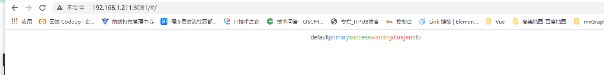
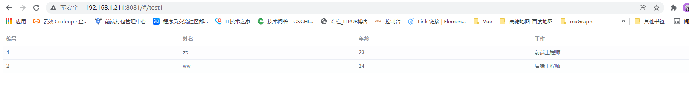
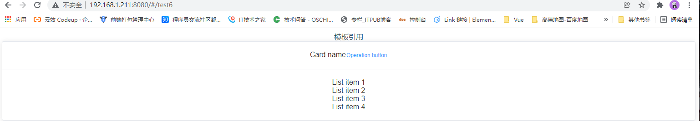
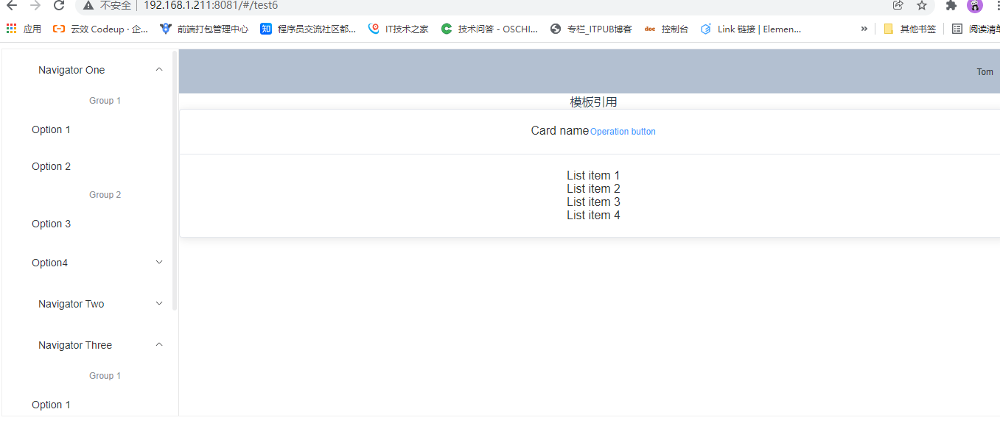
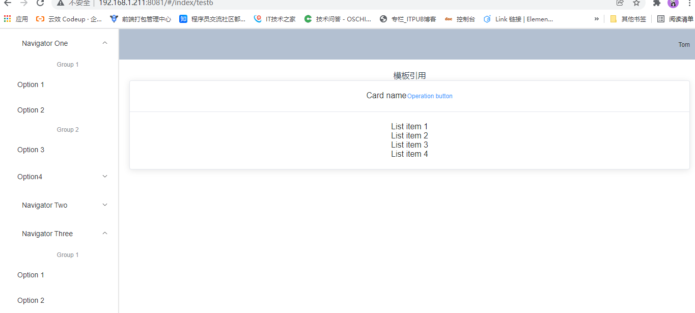
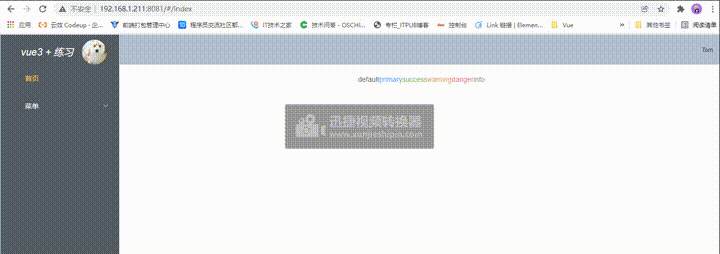
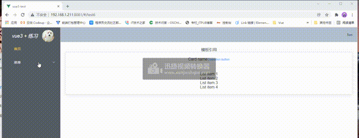

# Vue3学习

## 创建Vue3项目
### 创建一个最小的Webpack设置（包括Vue 3）
```js
$ git clone https://github.com/vuejs/vue-next-webpack-preview.git vue3-experiment
$ cd vue3-experiment
$ npm i
```
效果：<br>


   删除项目中模板，也就是文件src下面的内容，然后运行项目 

```js
$ rm -rf src/*
$ touch src/main.js
```
效果：<br>


在src文件下面的main.js文件中引入createApp函数，这个函数是用来创建vue3的应用。createApp中的参数选项使用于配置根组件。然后在使用mount()挂载应用.把应用挂载一个dom元素上去。
代码中mount()函数就是把应用挂载在`#app`。App是整个项目的根组件。
```js
// src/main.js
import { createApp } from "vue";
import App from "./App.vue";
const app = createApp(App);
app.mount("#app");
```
在App.vue文件中写入

```js

<template>
  <button @click="toggleModalState"> Open modal </button>
  <modal v-if="modalOpen">
    <p>Hello, I'm a modal window.</p>
  </modal>
</template>
<script>
import Modal from "./view/Modal.vue";
export default {
  components: {
    Modal,
  },
  data: () => ({
    modalOpen: true,
  }),
  methods: {
    toggleModalState() {
      this.modalOpen = !this.modalOpen;
    },
  },
};
</script>
```
Modal.vue
```js
<template>
  <div class="modal">
    <slot></slot>
  </div>
</template>
```

效果：<br>


### Vue3 模板语法
Vue 使用了基于 HTML 的模板语法，允许开发者声明式地将 DOM 绑定至底层 Vue 实例的数据。
Vue 的核心是一个允许你采用简洁的模板语法来声明式的将数据渲染进 DOM 的系统。
结合响应系统，在应用状态改变时， Vue 能够智能地计算出重新渲染组件的最小代价并应用到 DOM 操作上。

#### 插值
文本 <br>
vue3的数据绑定的常见的类型是`{{}}`(双大括号)的文本插值。当然，也有指令插值`v-text`.如下所示：
```js
<template>
  <button @click="toggleModalState">Open modal</button>
  <modal v-if="modalOpen">
    <p>{{ message }}</p>
    <p v-text="message"></p>
  </modal>
</template>
<script>
import Modal from "./view/Modal.vue";
export default {
  components: {
    Modal,
  },
  data: () => ({
    modalOpen: true,
    message: "Hello, I'm a modal window.",
  }),
  methods: {
    toggleModalState() {
      this.modalOpen = !this.modalOpen;
    },
  },
};
</script>
```
效果：<br>


#### v-html指令 
v-html指令是用于输出html代码：
```js
<template>
  <button  @click="toggleModalState" >Open modal </button>
  <modal v-if="modalOpen">
    <div v-html="htmlMeaages"></div>
  </modal>
</template>
<script>
import Modal from "./view/Modal.vue";
export default {
  components: {
    Modal,
  },
  data: () => ({
    modalOpen: true,
    htmlMeaages: `<span>Hello, I'm a modal window.</span>`,
  }),
  methods: {
    toggleModalState() {
      this.modalOpen = !this.modalOpen;
    },
  },
};
</script>
```
效果：<br>


#### 属性 绑定指令v-bind(简写 : )
对于布尔属性，常规值为 true 或 false，如果属性值为 null 或 undefined，则该属性不会显示出来。所以`:`可以用来添加属性，比如，添加很多个class类名。


::: tip 提示
vue 3 有很多基本知识点和vue 2的基本知识点相同。只不过vue 3是在vue 2基本上更新
:::

## 组合式API
在一个页面中引入开了很多个组件，每个组件的功能需要在这个页面写上，那么这个页面的组件功能就很多，而且杂，一个组件的功能这一块，东一块，让人看的眼花缭乱，直接找不到头绪，那么组合式API就是用来把一个组件的功能整合一块，以便于阅读和理解。

### 组合式API基础

#### setup组件选项
 新的setup选项在组件创建之前被使用。一旦`props`被解析，就将作为组合式API的入口。
::: warning 注意
在 setup 中你应该避免使用 this，因为它不会找到组件实例。setup 的调用发生在 data property、computed property 或 methods 被解析之前，所以它们无法在 setup 中被获取。
:::
例如：父组件传值个子组件，子组件通过setup可以组合或者筛选数据，也可以使用仓库里面的数据筛选、组合。<br>
父组件
```js
<template>
  <index :index="{ name: '李佳' }" />
</template>
<script>
import index from "./views/index.vue";
export default {
  name: "App",
  components: {
    HelloWorld: HelloWorldVue,
    index: index,
  },
};
</script>
```
子组件
```js
<template>
  <div>{{ name }}</div>
  <div>
    <input type="text" v-model="num" />
  </div>
  <div>{{ a }}</div>
  <div>{{ num }}</div>
  <button @click="f">点击</button>
</template>
<script>
export default {
  props: ["index"],
  data() {
    return {
      a: 0,
      num: null,
      time: null,
    };
  },
  setup(props) {
    console.log(props);
    console.log("setup ....");
    return {
      b: 2,
      f: function () {
        console.log("点击事件的函数");
      },
    };
  },
  created() {
    console.log("created ....");
    console.log(this.a);
    console.log(this.b);
    setTimeout(() => (this.b = 100), 2000);
    this.time = setInterval(() => {
      this.a++;
    }, 1000);
    this.f();
  },
};
</script>
```
代码的执行顺序是：


```js
<template>
  <div class="page-wrapper">
    <div>
      <span>count 点击次数: </span>
      <span>{{ count }}</span>
      <button @click="addCount" > 点击增加 </button>
    </div>
    <div>
      <span>num 点击次数: </span>
      <span>{{ num }}</span>
      <button @click="addNum">点击增加</button>
    </div>
  </div>
</template>

<script>
import { reactive, ref, toRefs } from 'vue'

export default {
  name: 'Test',
  setup () {
    const state = reactive({
      count: 0
    })
    const num = ref(0)

    const addCount = function () {
      state.count++
    }
    const addNum = function () {
      num.value++
    }

    return {
      // 这样展开后state property会失去响应式，因为是取值返回，不是引用
      // ...state,
      ...toRefs(state),
      num,
      addCount,
      addNum
    }
  }
}
</script>
```

#### 带 ref 的响应式变量
在 Vue 3.0 中，我们可以通过一个新的 ref 函数使任何响应式变量在任何地方起作用，
```js
import { ref } from 'vue'
const counter = ref(0)
```
[ref](https://v3.cn.vuejs.org/guide/composition-api-introduction.html#%E5%B8%A6-ref-%E7%9A%84%E5%93%8D%E5%BA%94%E5%BC%8F%E5%8F%98%E9%87%8F) 接收参数并将其包裹在一个带有 value property 的对象中返回，然后可以使用该 property 访问或更改响应式变量的值：
#### 在 setup 内注册生命周期钩子
为了使组合式 API 的功能和选项式 API 一样完整，我们还需要一种在 setup 中注册生命周期钩子的方法。这要归功于 Vue 导出的几个新函数。组合式 API 上的生命周期钩子与选项式 API 的名称相同，但前缀为 on：即 `mounted` 看起来会像 `onMounted`。  
这些函数接受一个回调，当钩子被组件调用时，该回调将被执行。
其实，它的生命周期就和vue的生命周期是一样的，只不过是在前面添加`on`。  
子组件：test1.vue
```js
<template>
  <div>
    <div>声明周期</div>
    <div v-for="(item, i) in repositories" :key="i">
      <div>{{ item.age }}</div>
      <div>{{ item.job }}</div>
      <div>{{ item.name }}</div>
      <div>{{ item.id }}</div>
    </div>
  </div>
</template>
<script>
import { getDemo } from "../api/index";
import { ref, onMounted } from "vue";
export default {
  data() {
    return {
      datas: null,
      value: null,
    };
  },

  setup() {
    const repositories = ref([]);
    const getUserRepositories = async () => {
      let { data } = await getDemo();
      repositories.value = data;
    };
    onMounted(getUserRepositories); //代表页面执行到mounted生命周期就执行
    console.log(repositories);
    return {
      repositories,
      getUserRepositories,
    };
  },
  created() {},
  methods: {},
  mounted() {},
};
</script>

<style>
.pi {
  width: 10px;
  height: 10px;
}
</style>
```
效果：


### watch响应式更改

watch的使用相当vue2中watch监听事件，它是用来 user property 上设置侦听器一样，与vue2的watch函数执行相同的操作。它接受3个参数：
+ 一个想要侦听的响应式引用或 getter 函数
+ 一个回调
+ 可选的配置选项

```js
<template>
  <!-- watch响应式更改 -->
  <div>
    <div>{{ repositories }}</div>
  </div>
</template>
<script>
import { ref, watch, onMounted, toRefs } from "vue";
export default {
  props: ["alltime"], //proprs可以是对象，数组，数字等
  setup(props) {
    // 使用 `toRefs` 创建对 `props` 中的 `alltime` property 的响应式引用
    const { alltime } = toRefs(props);
    const repositories = ref([]);
    const getUserRepositories = async () => {
      // 更新 `prop.alltime` 到 `alltime` 访问引用值
      repositories.value = alltime;
    };

    onMounted(getUserRepositories);
    // 在 alltime prop 的响应式引用上设置一个侦听器
    watch(alltime, getUserRepositories);
    return {
      repositories,
      getUserRepositories,
    };
  },
  created() {},
  methods: {},
  mounted() {},
};
</script>

```
效果：

`setup` 的顶部使用了`toRefs`。这是为了确保我们的侦听器能够根据 user prop 的变化做出反应。

### 独立的 computed 属性
与 `ref` 和 `watch` 类似，也可以使用从 Vue 导入的 `computed` 函数在 Vue 组件外部创建计算属性。让我们回到 counter 的例子

当前使用`computed`无效，不能读取、或者是获取转换的数据。

##  setup
参数有两个
* props
* context

### Props
setup 函数中的第一个参数是 props。正如在一个标准组件中所期望的那样，setup 函数中的 props 是响应式的，当传入新的 prop 时，它将被更新。所以，如果要使用setup的第一个参数，那么在这页面中必须引入props,获取父组件的传过来的值。

```js
import { ref, watch, onMounted, toRefs } from "vue";
export default {
  props: ["alltime"], //proprs可以是对象，数组，数字等
  setup(props) {
   console.log(props.alltime)
   
  },
  created() {},
  methods: {},
  mounted() {},
};

```
::: tip 注意
但是，因为 props 是响应式的，你不能使用 ES6 解构，它会消除 prop 的响应性。
:::  
如果需要解构props,可以在`setup`函数中使用`toRefs`函数来完成此操作：
```js
import { ref, watch, onMounted, toRefs } from "vue";
export default {
  props: ["alltime"], //proprs可以是对象，数组，数字等
  setup(props) {
    // 使用 `toRefs` 创建对 `props` 中的解构
    const { alltime } = toRefs(props);
  },
  created() {},
  methods: {},
  mounted() {},
};

```
当然，如果`alltime`是可选项，当父组件传给子组件中没有`alltime`的字段，在这种情况，`toRefs`将不会为`alltime`创建一个ref,所以，需要使用`toRefs`替代它：
```js

import { toRef } from "vue";
export default {
  data() {
    return {};
  },
  setup(props) {
    const title = toRef(props, "title");
    console.log(title.value);
  },
  mounted() {},
  methods: {},
};
```
不过，这里的输出就是一个undefind的值。


### Context

传递给 setup 函数的第二个参数是 context。context 是一个普通 JavaScript 对象，暴露了其它可能在 setup 中有用的值：
[Context](https://v3.cn.vuejs.org/guide/composition-api-setup.html#context)

# 目前Context不知道如何案例

## 访问组件的 property
执行 setup 时，你只能访问以下 property：
 * props
 * attrs
 * slots 
 * emit
换句话说，你将无法访问以下组件选项：
 * data
 * computed
 * methods
 * refs (模板 ref)


 ## 生命周期钩子

 一般，在组合式API中的生命周期钩子和vue2的生命周期钩子一样的功能，只不过组合式API在前面添加`on`。  
 选项API和组合式API的的生命周期的名称区别：  
|  选项式 API   | Hook inside `setup`  |
|  ----  | ----  |
| `beforeCreate`  | `Not needed*` |
| `created`  | `Not needed*` |
| `beforeMount`  | `onBeforeMount` |
| `mounted`  | `onMounted` |
| `beforeUpdate`  | `onBeforeUpdate` |
| `updated`  | `onUpdated` |
| `beforeUnmount`  | `onBeforeUnmount` |
| `unmounted`  | `onUnmounted` |
| `errorCaptured`  | `onErrorCaptured` |
| `renderTracked`  | `onRenderTracked` |
| `renderTriggered`  | `onRenderTriggered` |
| `activated`  | `onActivated` |
| `deactivated`  | `onDeactivated` |

:::  warning 注意
因为 `setup` 是围绕 `beforeCreate` 和 `created` 生命周期钩子运行的，所以不需要显式地定义它们。换句话说，在这些钩子中编写的任何代码都应该直接在 `setup` 函数中编写。
:::  
这些函数接受一个回调函数，当钩子被组件调用时将会被执行:  
```js
import { onMounted } from "vue";
export default {
  data() {
    return {};
  },
  setup() {
    // mounted
    onMounted(() => {
      console.log("Component is mounted!");
    });
  },
  mounted() {},
  methods: {},
};
```  
输出`Component is mounted!`

## Provide / Inject (看不懂)
组合式 API 中使用 provide/inject。两者都只能在当前活动实例的 setup() 期间调用。

## 模板引用

模板引用：为了获得对模板内元素或组件实例的引用。  
在使用组合式 API 时，响应式引用和模板引用的概念是统一的。可以像往常一样声明 ref 并从 setup() 返回：


## 路由
### 路由使用
[vue3](https://router.vuejs.org/zh/installation.html#npm) 的路由大多使用和vue2有一些相似用法。

在项目中下载vue-router
```js
 npm install vue-router@4
```
新建一个router文件，在新建一个index.js,引入依赖路由
```js
import { createRouter, createWebHashHistory } from "vue-router";
const test1 = () => import("../views/demo/test1");
const test2 = () => import("../views/demo/test2");
const test6 = () => import("../views/demo/test6");
const index = () => import("../views/index");
const routes = [
  { path: "/", name: "index", component: index },
  {
    path: "/test1",
    name: "test1",
    component: test1,
  },
  {
    path: "/test2",
    name: "test2",
    component: test2,
  },
  {
    path: "/test6",
    name: "test6",
    component: test6,
  },
];

export const router = createRouter({
  history: createWebHashHistory(),
  routes: routes,
});
```

在main.js
```js
import { createApp } from "vue";
import App from "./App.vue";
import ElementPlus from "element-plus";
import "element-plus/dist/index.css";
import zhCn from "element-plus/es/locale/lang/zh-cn";
//引入路由
import { router } from "./router";
// import "./permission";
// import store from './store'
// 引入mock.js
require("./mock");

const app = createApp(App);

app
  .use(ElementPlus, { size: "small", zIndex: 3000, locale: zhCn })
  .use(router)
  .mount("#app");
```
在App.vue

```js
<template>
  <!-- 路由出口 -->
  <!-- 路由匹配到的组件将渲染在这里 -->
  <router-view></router-view>
</template>

<script>
export default {
  name: "App",
  components: {},
  data() {
    return {};
  },
  mounted() {},
};
</script>

<style>
#app {
  font-family: Avenir, Helvetica, Arial, sans-serif;
  -webkit-font-smoothing: antialiased;
  -moz-osx-font-smoothing: grayscale;
  text-align: center;
  color: #2c3e50;
  /* margin-top: 60px; */
}
</style>
```
效果：  
根目录：

test1路由:

test6路由:


### 嵌套式路由
是一个路由下面可以嵌套另一个路由地址，想要显示路由，直接输入子路由的地址就行。
一些应用程序的 UI 由多层嵌套的组件组成。在这种情况下，URL 的片段通常对应于特定的嵌套组件结构，例如：
```js
/user/johnny/profile                     /user/johnny/posts
+------------------+                  +-----------------+
| User             |                  | User            |
| +--------------+ |                  | +-------------+ |
| | Profile      | |  +------------>  | | Posts       | |
| |              | |                  | |             | |
| +--------------+ |                  | +-------------+ |
+------------------+                  +-----------------+
```
如果要使[嵌套路由](https://router.vuejs.org/zh/guide/essentials/nested-routes.html)，是使用`children`字段，这字段用数组的形式显示，如下所示：  
```js
 {
    path: "",
    name: "index",
    component: Layout,
    children: [
      {
        path: "/test6",
        component: test6,
      },
    ],
  },
```
`Layout`代表页面的整体的布局，而子路由的的布局是模板引用的样式。在拥有嵌套路由的情况下，所有的`children`的的内容渲染在空白部分(右边的的主页面部分)。  
嵌套路由:


### 命令视图
如果想要展示多个视图，例如一个页面有侧边栏(silder)，主页面(main)，那么在一个页面就可以使用命令视图。一个界面就可以拥有多个单独命令的视图，如果`router-view`没有设置名称，默认为`default`。
```js
<router-view class="view left-sidebar" name="LeftSidebar"></router-view>
<router-view class="view main-content"></router-view>
<router-view class="view right-sidebar" name="RightSidebar"></router-view>
```
一个视图使用一个组件渲染，因此对于同个路由，多个视图就需要多个组件。确保正确使用`components`配置 (带上 s)：
```js
const router = createRouter({
  history: createWebHashHistory(),
  routes: [
    {
      path: '/',
      components: {
        default: Home,
        // LeftSidebar: LeftSidebar 的缩写
        LeftSidebar,
        // 它们与 `<router-view>` 上的 `name` 属性匹配
        RightSidebar,
      },
    },
  ],
})
```
案例1：  
```js
{
    path: "/index",
    name: "index",
    component: Layout,
    children: [
      {
        path: "test1",
        component: test1,
      },
      {
        path: "test6",
        components: {
          default: test6,
          LeftSidebar,
        },
      },
    ],
},
```
效果：  

案例2：  
layout.vue:
```js
<template>
  <el-container class="layout-container-demo" style="border: 1px solid #eee">
    <el-aside width="200px" style="background-color: rgb(238, 241, 246)">
      <router-view class="view left-sidebar" name="LeftSidebar"></router-view>
    </el-aside>
    <el-container>
      <el-header style="text-align: right; font-size: 12px">
        <router-view class="view top-navbar" name="TopNavbar"></router-view>
      </el-header>
      <el-main>
        <router-view class="view main-content"></router-view>
      </el-main>
    </el-container>
  </el-container>
</template>

<script>
export default {
  data() {
    return {};
  },

  setup() {},
  created() {},
  methods: {},
  mounted() {},
};
</script>

<style scoped>
.layout-container-demo {
  height: 100%;
  position: absolute;
  top: 0;
  left: 0;
  right: 0;
  bottom: 0;
}
.layout-container-demo .el-header {
  position: relative;
  background-color: #b3c0d1;
  color: var(--el-text-color-primary);
}
.layout-container-demo .el-aside {
  width: 240px;
  color: var(--el-text-color-primary);
  background: #fff !important;
  border-right: solid 1px #e6e6e6;
  box-sizing: border-box;
}
.layout-container-demo .el-menu {
  border-right: none;
}
.layout-container-demo .el-main {
  padding: 20px;
}
</style>
```
路由文件 index.js：  
```js
import { createRouter, createWebHashHistory } from "vue-router";
const test1 = () => import("@/views/demo/test1");
const test6 = () => import("@/views/demo/test6");
const index = () => import("@/views/index");

import Layout from "@/layout";
import LeftSidebar from "@/layout/components/silder";
import TopNavbar from "@/layout/components/navbar";
const routes = [
  {
    path: "/",
    name: "index",
    component: Layout,
    redirect: "index",
    children: [
      {
        path: "index",
        name: "index",
        components: {
          default: index,
          LeftSidebar,
          TopNavbar,
        },
      },
      {
        path: "test1",
        components: {
          default: test1,
          LeftSidebar,
          TopNavbar,
        },
      },
      {
        path: "test6",
        components: {
          default: test6,
          LeftSidebar,
          TopNavbar,
        },
      },
    ],
  },
];
export const router = createRouter({
  history: createWebHashHistory(),
  routes: routes,
});
```
侧边栏的路由：
silder.vue:  
```js
<template>
  <el-scrollbar>
    <el-menu
      :router="true"
      :default-active="activeIndex"
      active-text-color="#ffd04b"
      background-color="#545c64"
      class="el-menu-vertical-demo"
      text-color="#fff"
    >
      <div class="class-logo">
        <el-icon><icon-menu /> vue3 + 练习 </el-icon>
        <el-avatar :src="avatar"></el-avatar>
      </div>
      <el-menu-item index="index">
        <el-icon><icon-menu /></el-icon>
        <span>首页</span>
      </el-menu-item>
      <el-sub-menu index="2">
        <template #title>
          <el-icon><message /></el-icon>菜单
        </template>
        <el-menu-item-group>
          <el-menu-item index="test1">Option 1</el-menu-item>
          <el-menu-item index="test6">Option 2</el-menu-item>
        </el-menu-item-group>
      </el-sub-menu>
    </el-menu>
  </el-scrollbar>
</template>

<script>
import avatar from "../../../assets/dog.jpg";
import { ref } from "vue";
export default {
  data() {
    return { avatar };
  },
  setup() {
    const activeIndex = ref("index");

    return {
      activeIndex,
      avatar,
    };
  },
};
</script>

<style scoped>
.el-scrollbar {
  background: #545c64 !important;
}
.demo-type {
  display: flex;
}
.demo-type > div {
  flex: 1;
  text-align: center;
}
::v-deep .el-avatar > img {
  width: 50px;
  height: 50px;
}

.class-logo {
  padding-top: 10px;
  display: flex;
  justify-content: center;
  align-items: center;
  color: #fff;
  font-size: 20px;
}

.el-menu-vertical-demo {
  --el-menu-border-color: #545c64 !important;
}

.class-logo .el-icon {
  width: 140px;
  display: inline-block;
}

.demo-type > div:not(:last-child) {
  border-right: 1px solid var(--el-border-color-base);
}
</style>
```
效果：  


## 导航路由
vue3的[导航路由](https://router.vuejs.org/zh/guide/advanced/navigation-guards.html)和vue2的导航路由的概念是大不多的。vue-router 提供的导航守卫主要用来通过跳转或取消的方式守卫导航。这里有很多方式植入路由导航中：全局的，单个路由独享的，或者组件级的。
### 全局前置守卫
可以使用`router.beforeEach`z注册一个全局前置守卫：
```js
const router = createRouter({ ... })
router.beforeEach((to, from) => {
  // ...
  // 返回 false 以取消导航
  return false
})
```
当一个导航触发时，全局前置守卫按照创建顺序调用。守卫是异步解析执行，此时导航在所有守卫 resolve 完之前一直处于等待中。
每个守卫方法接收两个参数：  
* to: 即将要进入的目标 用一种标准化的方式
* from: 当前导航正要离开的路由 用一种标准化的方式
可以返回的值如下:  
* false: 取消当前的导航。如果浏览器的 URL 改变了(可能是用户手动或者浏览器后退按钮)，那么 URL 地址会重置到 from 路由对应的地址。
* 一个路由地址: 通过一个路由地址跳转到一个不同的地址，就像你调用 router.push() 一样，你可以设置诸如 replace: true 或 name: 'home' 之类的配置。当前的导航被中断，然后进行一个新的导航，就和 from 一样。
案例：  
```js
import NProgress from "nprogress";
import "nprogress/nprogress.css";
import { router } from "./router";
NProgress.configure({
  showSpinner: false,
});
// const whiteList = ["/login"];
router.beforeEach((to, from, next) => {
  NProgress.start();
  if (from.path === "/login" && (to.path === "/" || to.path === "/index")) {
    sessionStorage.setItem("backPage", "1");
  }
  //   if (whiteList.indexOf(to.path) !== -1) {
  // 在免登录白名单，直接进入
  next();
  //   } else {
  //     next(`${to.fullPath}`); // 否则全部重定向到登录页
  //     NProgress.done();
  //   }
});

router.afterEach(() => {
  //   if (!failure) sendToAnalytics(to.fullPath);
  NProgress.done();
});
```
效果:(注意:页面中的进度条)

### 全局后置钩子
你也可以注册全局后置钩子，然而和守卫不同的是，这些钩子不会接受 next 函数也不会改变导航本身(如上)