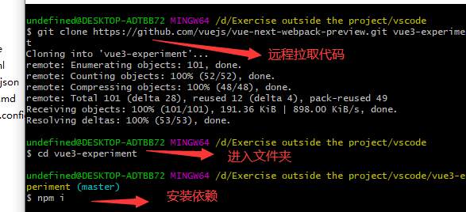
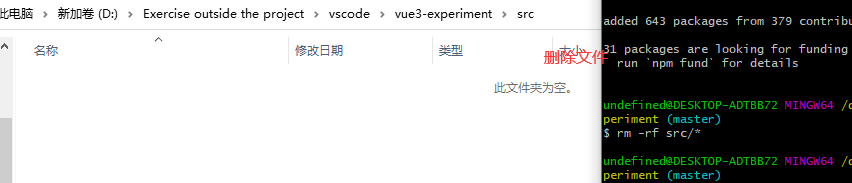
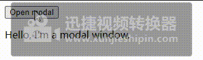
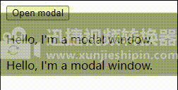
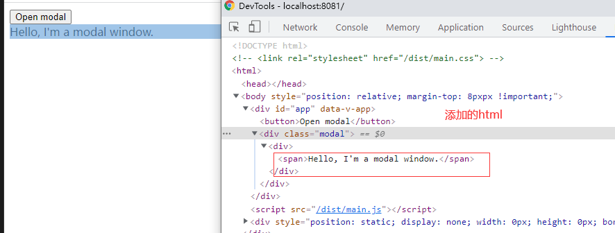
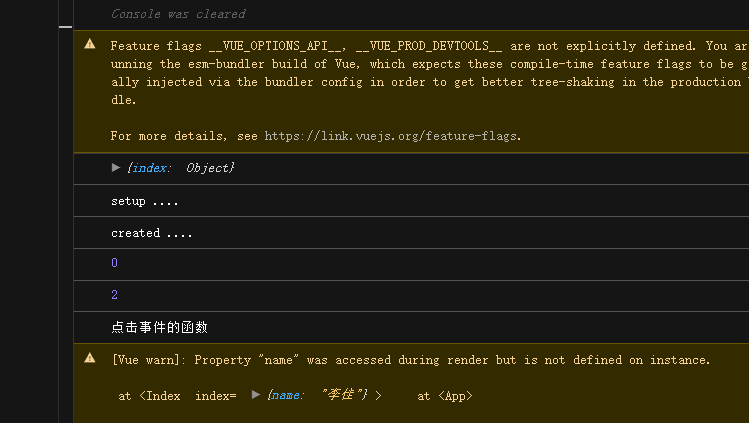
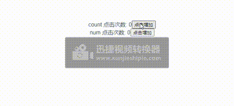
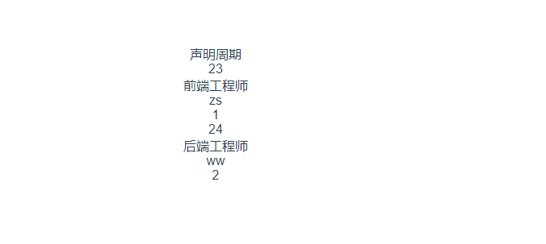
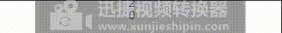

# Vue3学习

## 创建Vue3项目
### 创建一个最小的Webpack设置（包括Vue 3）
```js
$ git clone https://github.com/vuejs/vue-next-webpack-preview.git vue3-experiment
$ cd vue3-experiment
$ npm i
```
效果：<br>


   删除项目中模板，也就是文件src下面的内容，然后运行项目 

```js
$ rm -rf src/*
$ touch src/main.js
```
效果：<br>



在src文件下面的main.js文件中引入createApp函数，这个函数是用来创建vue3的应用。createApp中的参数选项使用于配置根组件。然后在使用mount()挂载应用.把应用挂载一个dom元素上去。
代码中mount()函数就是把应用挂载在`#app`。App是整个项目的根组件。
```js
// src/main.js
import { createApp } from "vue";
import App from "./App.vue";
const app = createApp(App);
app.mount("#app");
```
在App.vue文件中写入

```js

<template>
  <button @click="toggleModalState"> Open modal </button>
  <modal v-if="modalOpen">
    <p>Hello, I'm a modal window.</p>
  </modal>
</template>
<script>
import Modal from "./view/Modal.vue";
export default {
  components: {
    Modal,
  },
  data: () => ({
    modalOpen: true,
  }),
  methods: {
    toggleModalState() {
      this.modalOpen = !this.modalOpen;
    },
  },
};
</script>
```
Modal.vue
```js
<template>
  <div class="modal">
    <slot></slot>
  </div>
</template>
```

效果：<br>



### Vue3 模板语法
Vue 使用了基于 HTML 的模板语法，允许开发者声明式地将 DOM 绑定至底层 Vue 实例的数据。
Vue 的核心是一个允许你采用简洁的模板语法来声明式的将数据渲染进 DOM 的系统。
结合响应系统，在应用状态改变时， Vue 能够智能地计算出重新渲染组件的最小代价并应用到 DOM 操作上。

#### 插值
文本 <br>
vue3的数据绑定的常见的类型是`{{}}`(双大括号)的文本插值。当然，也有指令插值`v-text`.如下所示：
```js
<template>
  <button @click="toggleModalState">Open modal</button>
  <modal v-if="modalOpen">
    <p>{{ message }}</p>
    <p v-text="message"></p>
  </modal>
</template>
<script>
import Modal from "./view/Modal.vue";
export default {
  components: {
    Modal,
  },
  data: () => ({
    modalOpen: true,
    message: "Hello, I'm a modal window.",
  }),
  methods: {
    toggleModalState() {
      this.modalOpen = !this.modalOpen;
    },
  },
};
</script>
```
效果：<br>


#### v-html指令 
v-html指令是用于输出html代码：
```js
<template>
  <button  @click="toggleModalState" >Open modal </button>
  <modal v-if="modalOpen">
    <div v-html="htmlMeaages"></div>
  </modal>
</template>
<script>
import Modal from "./view/Modal.vue";
export default {
  components: {
    Modal,
  },
  data: () => ({
    modalOpen: true,
    htmlMeaages: `<span>Hello, I'm a modal window.</span>`,
  }),
  methods: {
    toggleModalState() {
      this.modalOpen = !this.modalOpen;
    },
  },
};
</script>
```
效果：<br>


#### 属性 绑定指令v-bind(简写 : )
对于布尔属性，常规值为 true 或 false，如果属性值为 null 或 undefined，则该属性不会显示出来。所以`:`可以用来添加属性，比如，添加很多个class类名。


::: tip 提示
vue 3 有很多基本知识点和vue 2的基本知识点相同。只不过vue 3是在vue 2基本上更新
:::

## 组合式API
在一个页面中引入开了很多个组件，每个组件的功能需要在这个页面写上，那么这个页面的组件功能就很多，而且杂，一个组件的功能这一块，东一块，让人看的眼花缭乱，直接找不到头绪，那么组合式API就是用来把一个组件的功能整合一块，以便于阅读和理解。

### 组合式API基础

#### setup组件选项
 新的setup选项在组件创建之前被使用。一旦`props`被解析，就将作为组合式API的入口。
::: warning 注意
在 setup 中你应该避免使用 this，因为它不会找到组件实例。setup 的调用发生在 data property、computed property 或 methods 被解析之前，所以它们无法在 setup 中被获取。
:::
例如：父组件传值个子组件，子组件通过setup可以组合或者筛选数据，也可以使用仓库里面的数据筛选、组合。<br>
父组件
```js
<template>
  <index :index="{ name: '李佳' }" />
</template>
<script>
import index from "./views/index.vue";
export default {
  name: "App",
  components: {
    HelloWorld: HelloWorldVue,
    index: index,
  },
};
</script>
```
子组件
```js
<template>
  <div>{{ name }}</div>
  <div>
    <input type="text" v-model="num" />
  </div>
  <div>{{ a }}</div>
  <div>{{ num }}</div>
  <button @click="f">点击</button>
</template>
<script>
export default {
  props: ["index"],
  data() {
    return {
      a: 0,
      num: null,
      time: null,
    };
  },
  setup(props) {
    console.log(props);
    console.log("setup ....");
    return {
      b: 2,
      f: function () {
        console.log("点击事件的函数");
      },
    };
  },
  created() {
    console.log("created ....");
    console.log(this.a);
    console.log(this.b);
    setTimeout(() => (this.b = 100), 2000);
    this.time = setInterval(() => {
      this.a++;
    }, 1000);
    this.f();
  },
};
</script>
```
代码的执行顺序是：



```js
<template>
  <div class="page-wrapper">
    <div>
      <span>count 点击次数: </span>
      <span>{{ count }}</span>
      <button @click="addCount" > 点击增加 </button>
    </div>
    <div>
      <span>num 点击次数: </span>
      <span>{{ num }}</span>
      <button @click="addNum">点击增加</button>
    </div>
  </div>
</template>

<script>
import { reactive, ref, toRefs } from 'vue'

export default {
  name: 'Test',
  setup () {
    const state = reactive({
      count: 0
    })
    const num = ref(0)

    const addCount = function () {
      state.count++
    }
    const addNum = function () {
      num.value++
    }

    return {
      // 这样展开后state property会失去响应式，因为是取值返回，不是引用
      // ...state,
      ...toRefs(state),
      num,
      addCount,
      addNum
    }
  }
}
</script>
```

#### 带 ref 的响应式变量
在 Vue 3.0 中，我们可以通过一个新的 ref 函数使任何响应式变量在任何地方起作用，
```js
import { ref } from 'vue'
const counter = ref(0)
```
[ref](https://v3.cn.vuejs.org/guide/composition-api-introduction.html#%E5%B8%A6-ref-%E7%9A%84%E5%93%8D%E5%BA%94%E5%BC%8F%E5%8F%98%E9%87%8F) 接收参数并将其包裹在一个带有 value property 的对象中返回，然后可以使用该 property 访问或更改响应式变量的值：
#### 在 setup 内注册生命周期钩子
为了使组合式 API 的功能和选项式 API 一样完整，我们还需要一种在 setup 中注册生命周期钩子的方法。这要归功于 Vue 导出的几个新函数。组合式 API 上的生命周期钩子与选项式 API 的名称相同，但前缀为 on：即 `mounted` 看起来会像 `onMounted`。  
这些函数接受一个回调，当钩子被组件调用时，该回调将被执行。
其实，它的生命周期就和vue的生命周期是一样的，只不过是在前面添加`on`。  
子组件：test1.vue
```js
<template>
  <div>
    <div>声明周期</div>
    <div v-for="(item, i) in repositories" :key="i">
      <div>{{ item.age }}</div>
      <div>{{ item.job }}</div>
      <div>{{ item.name }}</div>
      <div>{{ item.id }}</div>
    </div>
  </div>
</template>
<script>
import { getDemo } from "../api/index";
import { ref, onMounted } from "vue";
export default {
  data() {
    return {
      datas: null,
      value: null,
    };
  },

  setup() {
    const repositories = ref([]);
    const getUserRepositories = async () => {
      let { data } = await getDemo();
      repositories.value = data;
    };
    onMounted(getUserRepositories); //代表页面执行到mounted生命周期就执行
    console.log(repositories);
    return {
      repositories,
      getUserRepositories,
    };
  },
  created() {},
  methods: {},
  mounted() {},
};
</script>

<style>
.pi {
  width: 10px;
  height: 10px;
}
</style>
```
效果：



### watch响应式更改

watch的使用相当vue2中watch监听事件，它是用来 user property 上设置侦听器一样，与vue2的watch函数执行相同的操作。它接受3个参数：
+ 一个想要侦听的响应式引用或 getter 函数
+ 一个回调
+ 可选的配置选项

```js
<template>
  <!-- watch响应式更改 -->
  <div>
    <div>{{ repositories }}</div>
  </div>
</template>
<script>
import { ref, watch, onMounted, toRefs } from "vue";
export default {
  props: ["alltime"], //proprs可以是对象，数组，数字等
  setup(props) {
    // 使用 `toRefs` 创建对 `props` 中的 `alltime` property 的响应式引用
    const { alltime } = toRefs(props);
    const repositories = ref([]);
    const getUserRepositories = async () => {
      // 更新 `prop.alltime` 到 `alltime` 访问引用值
      repositories.value = alltime;
    };

    onMounted(getUserRepositories);
    // 在 alltime prop 的响应式引用上设置一个侦听器
    watch(alltime, getUserRepositories);
    return {
      repositories,
      getUserRepositories,
    };
  },
  created() {},
  methods: {},
  mounted() {},
};
</script>

```
效果：

`setup` 的顶部使用了`toRefs`。这是为了确保我们的侦听器能够根据 user prop 的变化做出反应。

### 独立的 computed 属性
与 `ref` 和 `watch` 类似，也可以使用从 Vue 导入的 `computed` 函数在 Vue 组件外部创建计算属性。让我们回到 counter 的例子

当前使用`computed`无效，不能读取、或者是获取转换的数据。

##  setup
参数有两个
* props
* context

### Props
setup 函数中的第一个参数是 props。正如在一个标准组件中所期望的那样，setup 函数中的 props 是响应式的，当传入新的 prop 时，它将被更新。所以，如果要使用setup的第一个参数，那么在这页面中必须引入props,获取父组件的传过来的值。

```js
import { ref, watch, onMounted, toRefs } from "vue";
export default {
  props: ["alltime"], //proprs可以是对象，数组，数字等
  setup(props) {
   console.log(props.alltime)
   
  },
  created() {},
  methods: {},
  mounted() {},
};

```
::: tip 注意
但是，因为 props 是响应式的，你不能使用 ES6 解构，它会消除 prop 的响应性。
:::  
如果需要解构props,可以在`setup`函数中使用`toRefs`函数来完成此操作：
```js
import { ref, watch, onMounted, toRefs } from "vue";
export default {
  props: ["alltime"], //proprs可以是对象，数组，数字等
  setup(props) {
    // 使用 `toRefs` 创建对 `props` 中的解构
    const { alltime } = toRefs(props);
  },
  created() {},
  methods: {},
  mounted() {},
};

```
当然，如果`alltime`是可选项，当父组件传给子组件中没有`alltime`的字段，在这种情况，`toRefs`将不会为`alltime`创建一个ref,所以，需要使用`toRefs`替代它：
```js

import { toRef } from "vue";
export default {
  data() {
    return {};
  },
  setup(props) {
    const title = toRef(props, "title");
    console.log(title.value);
  },
  mounted() {},
  methods: {},
};
```
不过，这里的输出就是一个undefind的值。


### Context

传递给 setup 函数的第二个参数是 context。context 是一个普通 JavaScript 对象，暴露了其它可能在 setup 中有用的值：
[Context](https://v3.cn.vuejs.org/guide/composition-api-setup.html#context)

# 目前Context不知道如何案例

## 访问组件的 property
执行 setup 时，你只能访问以下 property：
 * props
 * attrs
 * slots 
 * emit
换句话说，你将无法访问以下组件选项：
 * data
 * computed
 * methods
 * refs (模板 ref