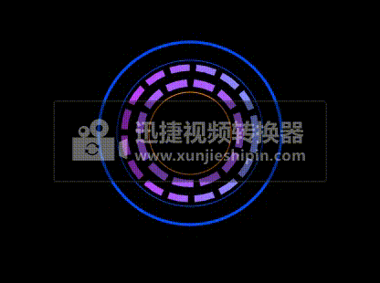

## 案例1

1.使用shape,tween stagger模块创建一个动画

```js
<html>
  <head>
    <title>动图</title>
  </head>
  <link rel="stylesheet" href="./css/demo.css" />
  <body>
    <div id="container">
      <div class="circle">
        <div class="circle1"></div>
        <div class="circle2"></div>
        <div class="circle3"></div>
        <div class="circle4"></div>
        <div class="circle5"></div>
        <div class="circle6"></div>
      </div>
    </div>
    <script src="http://libs.baidu.com/jquery/2.0.0/jquery.min.js"></script>
    <script src="http://cdn.jsdelivr.net/mojs/latest/mo.min.js"></script>
    <script>
      //创建水平线性渐变
      class CircleGradual extends mojs.CustomShape {
        getShape() {
          return `
          <defs>
             <linearGradient id="orange_red" x1="0%" y1="0%" x2="100%" y2="0%">
             <stop offset="0%" style="stop-color:rgb(198,57,255);
             stop-opacity:1"/>
             <stop offset="100%" style="stop-color:rgb(130,152,255);
             stop-opacity:1"/>
             </linearGradient>
          </defs>
          <circle  cx="50" cy="50" r="50"  stroke-dasharray='15,5'stroke-width='5' style="stroke:url(#orange_red); "/>
                      `;
        }
        getLength() {
          return 300;
        }
      }

      mojs.addShape("circlegradual", CircleGradual);

      let circle1 = new mojs.Shape({
        parent: ".circle1",
        shape: "circle",
        width: 230,
        height: 230,
        radius: 100,
        fill: "none",
        stroke: "#004EFF",
        strokeWidth: 3,
      }).play();

      let circle2 = new mojs.Shape({
        parent: ".circle2",
        shape: "circle",
        width: 230,
        height: 230,
        radius: 80,
        fill: "none",
        stroke: "#004EFF",
        strokeWidth: 0.9,
      }).play();

      let circle3 = new mojs.Shape({
        parent: ".circle3",
        shape: "circlegradual",
        width: 230,
        height: 230,
        radius: 72,
        fill: "none",
        stroke: "none",
      }).play();

      let circle4 = new mojs.Shape({
        parent: ".circle4",
        shape: "circle",
        width: 230,
        height: 230,
        radius: 55,
        fill: "none",
        stroke: "#AD5CFF",
        strokeWidth: 8,
        strokeDasharray: 15,
        strokeLinecap: "square",
        angle: { 0: [-360], easing: "cubic.out" },
        repeat: 1000000,
        easing: "cubic.out",
        duration: 80000,
      }).play();

      let circle5 = new mojs.Shape({
        parent: ".circle5",
        shape: "circle",
        width: 230,
        height: 230,
        radius: 45,
        fill: "none",
        stroke: "#FF8400",
        strokeWidth: 1,
        easing: "cubic.in",
        isShowEnd: true,
      }).play();

      // wrap shape in stagger
      const Shapes = mojs.stagger(mojs.Shape);
      // now you can have staggered syntax on the shape and create multiple shapes at once. the next code will produce 5 shapes
      const shapes = new Shapes({
        // quantifier defines number of modules to create
        quantifier: 4,
        shape: "circle",
        width: 230,
        height: 230,
        radius: [{ 0: 38 }, { 0: 30 }, { 0: 25 }, { 0: 18 }],
        fill: "#FF8400",
        fillOpacity: [{ 0.1: 0.2 }, { 0.1: 0.3 }, { 0.1: 0.4 }, { 0.1: 0.5 }],
        scale: [{ 0.1: 1, easing: "cubic.in" }],
        strokeWidth: 1,
        easing: "cubic.in",
        duration: 2000,
      }).then({
        radius: [{ 38: 0 }, { 30: 0 }, { 25: 0 }, { 18: 0 }],
        fillOpacity: [{ 0.2: 0.1 }, { 0.3: 0.1 }, { 0.4: 0.1 }, { 0.5: 0.1 }],
      });

      //
      const tween = new mojs.Tween({
        duration: 1000,
      });

      timeline = new mojs.Timeline({
        repeat: 10000000,
      });
      timeline.add(shapes, tween);
      //   document.body.addEventListener("mouseenter", function () {
      timeline.play();
      //   });
    </script>
  </body>
</html>
```

 效果：<br>


  在这个案例中，使用`CustomShape`创建一个新的形状, `stagger`模块使用可以使用创建多个一样`shape`的属性的且每个形状都可以编辑形状、颜色，大小等属性。，可以通过数数组编辑对应的顺序的形状。如下所示：
```js
  const Shapes = mojs.stagger(mojs.Shape);
      // now you can have staggered syntax on the shape and create multiple shapes at once. the next code will produce 5 shapes
      const shapes = new Shapes({
        // quantifier defines number of modules to create
        quantifier: 4,
        shape: "circle",
        width: 230,
        height: 230,
        radius: [{ 0: 38 }, { 0: 30 }, { 0: 25 }, { 0: 18 }],
        fill: "#FF8400",
        fillOpacity: [{ 0.1: 0.2 }, { 0.1: 0.3 }, { 0.1: 0.4 }, { 0.1: 0.5 }],
        scale: [{ 0.1: 1, easing: "cubic.in" }],
        strokeWidth: 1,
        easing: "cubic.in",
        duration: 2000,
      }).then({
        radius: [{ 38: 0 }, { 30: 0 }, { 25: 0 }, { 18: 0 }],
        fillOpacity: [{ 0.2: 0.1 }, { 0.3: 0.1 }, { 0.4: 0.1 }, { 0.5: 0.1 }],
      });

```

如果需要一个完成的动画（包括then）重复,使用`repeat`属性不能有想要的效果。那么，就要使用`mojs.tween()`,时间线`mojs.Timeline()`两个模块。`Timeline`不能设置形状的创建从0 到有的时间，所所以使用`tween`来创建时间,`Timeline`添加`tween`.如下所示：
```js
      const tween = new mojs.Tween({
        duration: 1000,
      });

      timeline = new mojs.Timeline({
        repeat: 10000000,
      });
      timeline.add(shapes, tween);
      //   document.body.addEventListener("mouseenter", function () {
      timeline.play();
      //   });
```

## 案例2
 创建一个轮盘正方向旋转，中间有四个放大缩小的圆。
  ```js
<html>
  <head>
    <title></title>
    <style>
      html,
      body {
        /* background-color: black; */
      }
    </style>
  </head>
  <body>
    <script src="http://libs.baidu.com/jquery/2.0.0/jquery.min.js"></script>
    <script src="http://cdn.jsdelivr.net/mojs/latest/mo.min.js"></script>
    <script>
      //创建圆形高斯模糊
      class Vague extends mojs.CustomShape {
        getShape() {
          return `
          <defs>
            <radialGradient id="grad1" cx="50%" cy="50%" r="50%" fx="50%" fy="50%">
              <stop offset="10%" style="stop-color:rgb(246,241,93);stop-opacity:0.4" />
              <stop offset="100%" style="stop-color:rgb(246,241,93);stop-opacity:0.8" />
            </radialGradient>
          </defs>
         <ellipse cx="50" cy="50" rx="50" ry="50" fill="url(#grad1)"/>   `;
        }
      }

      mojs.addShape("vague", Vague);
      let circle1 = new mojs.Shape({
        shape: "circle",
        width: 250,
        height: 250,
        radius: 100,
        fill: "none",
        stroke: "#F6F15D",
        strokeWidth: 1,
      });

      let circle2 = new mojs.Shape({
        shape: "circle",
        width: 250,
        height: 250,
        radius: 88,
        fill: "none",
        stroke: "#F6F15D",
        strokeWidth: 5,
        strokeLinecap: "square",
        strokeDasharray: 18,
        angle: { 0: 360 },
        duration: 20000,
      });

      let circle3 = new mojs.Shape({
        shape: "vague",
        width: 250,
        height: 250,
        radius: 75,
        duration: 20000,
      });

      let burst1 = new mojs.Burst({
        width: 100,
        height: 100,
        count: 4,
        radius: { 0: 50 },
        angle: { 0: 90 },
        children: {
          shape: "circle",
          radius: 10,
          isYoyo: true,
          fill: "#F6C25D",
          repeat: 10,
          duration: 2000,
        },
      });

      let timeline = new mojs.Timeline({
        repeat: 1000,
      });
      timeline.add(circle1, circle2, circle3, burst1);
      timeline.replay();
    </script>
  </body>
</html>
  ```
  效果：<br>


## 案例3

